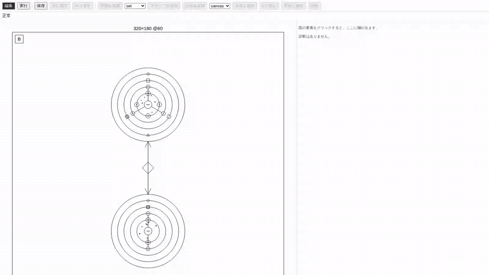

# Jin（陣）

## 概要

Jinは、AIエージェントの構成と処理の流れを「魔法陣」で表すビジュアルプログラミング言語です。エージェントへの指示、使うツール、記憶する情報、ほかのエージェントとの連携を、ひとつの図で確認できます。

プログラムは `.jin` ファイル（JSON）に保存します。同じファイルから魔法陣を描画し、Google ADKのエージェントとして実行できます。複数の処理を順番に実行する、並列に進める、繰り返す構成にも対応しています。

ブラウザのエディタでは、魔法陣の要素をクリックして編集できます。記録済みの実行履歴を読み込み、処理の流れを図上で振り返ることもできます。

## 言語の例


エディタのデバッグモードで [Pipeline](examples/pipeline/pipeline.jin) を fake モデルで実行した画面です。発火した要素が魔法陣上で赤く強調され、右のパネルでイベントを選ぶと入出力を確認できます。

サンプルを開いて、魔法陣の構成を試せます。

- [Researcher](examples/researcher/researcher.jin)：ツールや記憶を持ち、別のエージェントを呼び出す構成。
- [Pipeline](examples/pipeline/pipeline.jin)：順次・並列・繰り返しの処理を組み合わせた構成。
- [Showcase](examples/showcase/showcase.jin)：描かれる要素 9 種がすべて出る構成。エディタを一通り触るときに。
- [DocReview](docs/samples/docreview/docreview.jin)：基準抽出、6観点の並列検査、指摘検証、Pythonルールによる合否判定を組み合わせた実践構成。チュートリアルは [文章レビューエージェントの作成ガイド](docs/document-review-agent.md) を参照。

## Jin v2：ゲームを作るビジュアル言語

同じ魔法陣の記法で、AI エージェントではなく**小さなゲーム**を書けるのが Jin v2 です（`version: 2` の `.jin`）。陣の記憶環に状態を持ち、手順（`rite`）のステップで毎 tick の処理を書き、`canvas` / `input` などの能力で画面と入力を扱います。実行は Lua（Wasmoon）か wasm-GC のどちらかにコンパイルして、ブラウザのプレイヤーかヘッドレスの `jin run` で走らせます。



上の動画は [Paddle](examples-v2/paddle/paddle.jin) をエディタで開き、手順 `Play/step` のステップを選んで式エディタでパドルの速さを書き換え、保存してからデバッグモードの実行パネルで遊び、一時停止してトレースをスクラブしている様子です（[MP4 版](docs/images/editor-v2-paddle-demo.mp4)）。式は確定すると正準形に揃い、保存は `jin fmt` の出力とバイト一致します。止めると発火した要素が魔法陣に重なり、記憶環の値がその時点の値になります。

v2 のサンプルは `examples-v2/` にあります。

- [Fib](examples-v2/fib/fib.jin)：記憶環と手順だけの最小構成。`jin run` の標準出力に公開 state が出ます。
- [Paddle](examples-v2/paddle/paddle.jin)：矢印キーでパドルを動かす。陣の `flow`（Play → Result のループ）、`wait` を含む手順、`audio` の例。
- [Clicker](examples-v2/clicker/clicker.jin)：`ui.button` で押すボタンと `random`、`wait` で待つ手順の例。

v2 の実行パネルはプレイヤー（`apps/player`）のビルド物を使うので、[エディタの実行方法](#エディタの実行方法) のセットアップに加えてプレイヤーもビルドしてから開きます。

```bash
cd apps/player && pnpm install --frozen-lockfile && pnpm build && cd ../..
uv run jin editor examples-v2/paddle/paddle.jin
```

ヘッドレスで走らせてトレースを取る、ブラウザ用のバンドルを書き出す、といった操作は次のとおりです。

```bash
uv run jin run examples-v2/paddle/paddle.jin --ticks 300 --trace /tmp/t.jsonl   # Lua（lupa）で 300 tick
uv run jin run examples-v2/paddle/paddle.jin --target wasm-gc --ticks 300 --trace /tmp/w.jsonl   # wasm-GC（wasmtime）。トレースは Lua と一致
uv run jin build examples-v2/paddle/paddle.jin --out /tmp/dist          # game.lua + プレイヤー（静的サーバで開ける）
uv run jin build examples-v2/paddle/paddle.jin --out /tmp/single --single   # index.html 1 本
```

仕様は [設計書](docs/superpowers/specs/2026-09-13-jin-v2-general-design.md) と [`docs/spec/v2/`](docs/spec/v2/) にあります。動画は `cd apps/editor && pnpm demo` で撮り直せます（Playwright の収録を ffmpeg で GIF / MP4 に変換します）。

## エディタの実行方法

### 1. 必要なツールを用意する

- Python 3.14（このリポジトリの指定バージョン）
- [uv](https://docs.astral.sh/uv/getting-started/installation/)（Pythonの環境管理）
- Node.js 22以上
- [pnpm](https://pnpm.io/installation) 10.15.1（エディタのビルド）

エディタでサンプルを表示・編集するだけなら、AIモデルのAPIキーは不要です。

### 2. 初回のセットアップを行う

リポジトリを取得し、そのディレクトリで依存関係のインストールとエディタのビルドを行います。

```bash
git clone https://github.com/rswisteria/jin-lang.git
cd jin-lang
uv sync --locked
cd apps/editor
pnpm install --frozen-lockfile
pnpm build
cd ../..
```

### 3. サンプルを開く

リポジトリのルートで実行します。

```bash
uv run jin editor examples/pipeline/pipeline.jin
```

ブラウザに魔法陣が表示されます。要素をクリックし、プロパティパネルで値を編集して「保存」を押すと、開いた `.jin` ファイルに反映されます。別のファイルを開くには、コマンドのファイルパスを置き換えてください。

ブラウザが自動で開かない場合は、ターミナルに表示されたURLを開いてください。終了するときは、ターミナルで `Ctrl+C` を押します。次回からは起動コマンドだけで使えます。

CLIの各コマンドやデバッグの使い方、利用上の注意は[詳細ガイド](docs/usage.md)を参照してください。

`jin check --resolve` は任意コードを実行するため、中身を確認した `.jin` ファイルにだけ使ってください。
