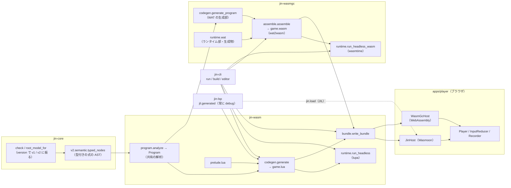
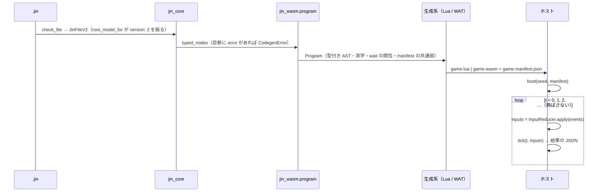

# Jin v2 実行エンジンのアーキテクチャ

[← README に戻る](../README.md) ／ 正典: [runtime.md](spec/v2/runtime.md) ・ [jil.md](spec/v2/jil.md) ・ [abilities.md](spec/v2/abilities.md)

この文書は、Jin v2 の `.jin` が**どの部品を通って、どう実行されるか**の実装の地図である。
対象は v2 の実行系（共有の解析・Lua/JIL 経路・wasm-GC 経路・3 種のホスト・CLI / エディタからの配線）で、
v1（Google ADK のコード生成）は §10 で違いだけ触れる。

## 0. 正典との関係

- **契約は正典にある。** ホスト境界の形、tick の 7 段の順序、トレース行の kind、結果の鍵の順、数値の書式、
  JIL の禁止語、wasm-GC の値の表現は [runtime.md](spec/v2/runtime.md) / [jil.md](spec/v2/jil.md) が決め、
  `tests/spec/` と `tests/contract/` が実装と突き合わせている。この文書はそれらを**転記しない**（転記した表は
  突合の網の外で黙って腐る）。「正本は runtime.md §5」のようにリンクする
- **この文書が書くのは、正典に無い「実装の形」**: どのモジュールが何を持つか、契約の各項目をどの関数が担うか、
  2 つの生成系がどこを共有しどこで分かれるか、変えるときにどこへ波及するか
- 参照は「ファイル + 記号名」で書き、行番号は書かない（`tests/contract/test_docs_execution_engine.py` が
  パスの実在と行番号の不在を固定する）。具体値は定義場所と組で書く

## 1. 全体像



**生成系が 2 つ、ホストが 4 つある。** 意味論（スケジューラ・能力・トレース）は生成物の中に閉じていて、
ホストは「JSON を渡して `boot` / `tick` を呼び、JSON を受け取る」だけをする。

| 生成系 | 生成物 | 意味論を持つ側 | ホスト |
|---|---|---|---|
| Lua 経路（`jin_wasm.codegen`） | `game.lua`（JIL = Lua 5.4 の静的サブセット） | `prelude.lua`（そのまま連結） | lupa（`jin_wasm.runtime.LuaHost`）／ Wasmoon（`apps/player/src/host.ts` の `JinHost`） |
| wasm-GC 経路（`jin_wasmgc.codegen` + `assemble`） | `game.wasm`（wasm-GC の module） | `runtime.wat`（そのまま連結） | wasmtime（`jin_wasmgc.runtime.WasmGcHost`）／ ブラウザの `WebAssembly`（`host.ts` の `WasmGcHost`） |

既定は Lua 経路。wasm-GC は `jin run` / `jin build` の `--target wasm-gc` で選ぶ。
**エディタの実行パネルは常に Lua 経路**（LSP が JIL を作り、iframe のプレイヤーは `kind: "lua"` 固定で読む）。

### 1.1 パッケージの境界

依存の向きは CLAUDE.md と `pyproject.toml` の import-linter 契約が正本。実行系に関わる点だけ:

- `jin-wasm` は `jin-core` と `lupa` だけに依存する（`jin_adk` / `jin_render` を import しない）
- `jin-wasmgc` は `jin-core` / `jin-wasm` / `wasmtime` に依存し、`jin_wasm` の解析・バンドル・録画・`answer_asks` を**再利用する**。
  `wasmtime` を `jin-wasm` に足さないのは、`jin-lsp` が `jin_wasm.codegen` を import していて wheel が LSP のインストールに乗るため
- `jin-lsp` が import するのは `jin_wasm.codegen` / `jin_wasm.jil` だけ（lupa の実行は LSP の中で起きない）
- v1 の陣を呼ぶ実装（`jin_cli.agents.AgentHost`）は `jin_cli` にだけあり、`jin_wasm` は「問いに答える呼び出し可能」を引数で受けるだけ

## 2. パイプライン



1. **読み込みと検査**: `jin_core.check.check_file` が診断し、`root_model_for` が `version: 2` を `JinFileV2` に振る（CLI の入口は `_load_model_or_exit`）。
   型付けは `jin_core.v2.semantic.typed_nodes`
2. **共有の解析**: `jin_wasm.program.analyze` が `Program` を作る（§3）。2 つの生成系はここから読むだけで、
   `typed_nodes` を呼び直さない
3. **生成**: Lua 経路は `jin_wasm.codegen.generate`（§4）、wasm-GC 経路は `jin_wasmgc.assemble.assemble`（§5）。
   どちらも `debug`（トレース・snapshot を出す）と release を同じ関数の引数で切り替える
4. **実行**: ヘッドレスは `jin run`（§7）、ブラウザは `jin build` の束か `jin editor` の `/play/`（§6）

## 3. 共有の解析 `jin_wasm.program`

`packages/jin-wasm/src/jin_wasm/program.py`。Lua も WAT も出さない。

| 記号 | 中身 |
|---|---|
| `Program.model` | 元の `JinFileV2` |
| `Program.nodes` | JSON Pointer → 型注記付きの式の AST（`Program.node(pointer)` で引く。無ければ `CodegenError`） |
| `Program.forms` → `FormInfo` | 型紙名 → `index`（組み込み `Pointer` が 0、`forms` は 1 始まり）と `fields`（欄名 → (宣言順の添字, 型)） |
| `Program.circles` → `CircleInfo` | 陣名 → `index`（1 始まり = Lua の添字）／`pointer_index`（0 始まり = JSON Pointer）／`states`／`rites`／`sigils`（`("host", ns)` / `("summon", circle, rite)` / `("agent", file)`）／`waits` |
| `rite_waits` | 手順ごとに「`wait` に到達しうるか」。直接 `WaitStep` を含むかと、**自陣の**手順への `cast` の宛先を集め、不動点反復で伝播する（summon は辿らない。semantic の JIN212 と同じ閉包） |
| `manifest_base` | `game.manifest.json` の共通部（`file` / `stage` / `namespaces` / `assets` / `debug`）。`jil`（Lua）か `target` + `wasm`（wasm-GC）は各生成系が足す |

**名前を識別子に埋めない**（jil.md §3）のは、この添字の表があるから成り立つ。陣・手順・state・欄はすべて
添字で引き、名前は文字列としてトレース行と `CIRCLES[i].name`（Lua）/ data 区画（wasm）にだけ現れる。
`waits` は両経路にとって重要で、Lua 経路ではコルーチンで走らせるかの判定に、wasm-GC 経路では状態機械に
変換する手順の選択に使う。

## 4. Lua / JIL 経路（`jin_wasm`）

### 4.1 `game.lua` の組み立て

`jin_wasm.codegen.generate` が次を連結する（構成の正本は jil.md §1）:

```
ヘッダ 3 行（_header。source 名は lua_string を通す）
prelude.lua（jin_wasm.prelude.prelude_source がそのまま読む）
-- program
生成部（_Generator.program）
return { boot = boot, tick = tick }
```

manifest は `manifest_base` に `jil`（`game.lua` 全文の sha256）を足したもの。戻り値は `GeneratedGame`。

**生成部はプレリュードの `local` に代入して埋める。** プレリュードは冒頭で
`local DEBUG, ROOT, FPS, CIRCLES, R, JF, JR, S, P` を宣言し、同じチャンクの後ろに続く生成部が
`DEBUG = true` / `CIRCLES[i] = { … }` / `R[i][j] = function … end` と書く。同じチャンクなので代入は上の
`local` に入り、外に出るグローバルは `function boot` / `function tick` の 2 つだけになる。
生成部が定義してよい名前の一覧はプレリュード先頭のコメントにあり、`codegen.py` と 1:1
（`tests/contract/test_jil_contract.py` の `PROGRAM_ASSIGNMENTS` が固定する）。

### 4.2 生成器 `_Generator`（`codegen.py`）

`analyze` を 1 回だけ呼び、行を `self.lines` に積む。出す順は
`DEBUG` / `ROOT` / `FPS` → 型紙（`JF[k]`、debug なら `JR[k]`）→ 核あり陣の `R[i] = {}` → 全手順 → 全 `CIRCLES[i]`。

| 関数 | 担うもの |
|---|---|
| `lua_string` / `lua_number` | リテラル。`num` は常に float の字面（`160.0`）、inf / nan は `(1.0/0.0)` の形 |
| `_RiteCtx` | 手順ごとの文脈。局所 → `l_n`、一時変数 `a_n` / `r_n` / `w_n`、debug の rite 行の変数 |
| `expr` / `name` / `field` / `call` | 式。局所は `l_n`、自陣の state は `S[i].k_j`、**他陣の state は確定値 `P[j].k_j`**（二重バッファ）、型紙の欄は `.f_j`、添字は `AT(…)`、純関数は `F.x(…)`、能力は `H.ns.member(…)`。演算子の写しは `_BINARY` |
| `assign` | `SETAT(…)` か `x = v`。debug で代入先の根が state なら `TS(…)`（set 行） |
| `step` / `steps` / `loop` | ステップの振り分け。`wait` は `WAIT_TICKS` / `WAIT_UNTIL`、`finish` / `transfer` は `FINISH` / `TRANSFER` + `do return end` |
| `cast` | `cast` の 5 分類（自陣の手順 → `R[ci][j]`、agent → `ASK`、summon → `R[他陣][j]`、効果 → `E.x`、能力 → `H.ns.m`）。自陣の手順への `cast` だけ `local w = LIVE(ci)` … `if STOP(ci, w) then return end` で挟む（jil.md §4） |
| `emit_step` | `EMIT(to, name, {args}, meta)`。`meta` は debug だけ |
| `emit_rite` | `R[i][j] = function(l_0, …)`。debug は先頭で `TR(…)`（rite 行） |
| `emit_circle` | `CIRCLES[i] = { … }`。flow 陣は `flow` / `children` / `exit`、核あり陣は `init` / `publish` / `core` / `core_waits` / `on` / `on_waits` / … と debug の `dump` / `pdump` / `restore` / `prestore` / `guards` |

**トレース行は 2 か所で積む。** 生成部が積むのは `set` / `cast` / `rite` / `transfer` / `finish` の行
（release では呼び出しごと生成しない）、プレリュードが積むのは `enter` / `exit` / `event` / `emit` / `wait` /
`assert` / `error` / `frame` の行。kind の意味と pointer は runtime.md §5 が正本。

**コルーチンにするかは生成時に決める。** `CIRCLES[i].core_waits` / `on_waits` に `Program` の `waits` を焼き込み、
プレリュードの `RUN(i, fn, waits, args)` は `waits` が偽なら直接呼び、真なら `coroutine.create` してから
`resume` する。手順同士の `cast` は常に直接呼び出しで、`wait` の `yield` は同じコルーチンの中を伝わる（jil.md §4）。

### 4.3 プレリュード `prelude.lua` の区画

`packages/jin-wasm/src/jin_wasm/prelude.lua` は上から次の順に並ぶ。

| 区画 | 主な記号 |
|---|---|
| 先頭コメント | 生成部が定義するもの / プレリュードが持つものの一覧（codegen と 1:1） |
| 生成部が埋める `local` | `DEBUG` `ROOT` `FPS` `CIRCLES` `R` `JF` `JR` `S` `P` |
| 実行時の状態 | `C`（陣の生存）`OPS` `AUDIO` `TRACE` `Q`（emit の待ち行列）`ASKS` `ASK_MAP` `SEQ` `TICK` `DONE` `ERRMSG` `INPUTS` … |
| 命令数の上限 | `ARM = JIN_ARM` / `HOOK = JIN_HOOK` を読み込み時に捕まえる、`ADVANCE_LIMIT`、`ERR` |
| 数値の書式 | `shortest_digits`（`%.{p}e` を p = 0…16 で試す）・`NUMSTR`（runtime.md §6） |
| JSON の書き手 | `JS`（エスケープ。制御文字はロケールに依らない範囲で書く）`JN` `JB` `JV` `JL` `JROW` … |
| resume の読み手 | `RREC` `RN` `RB` `RSTR` `RL`（lupa の table と Wasmoon の userdata の両方を欄の読み取りで受ける） |
| トレース | `ROW`（`SEQ` を進める）`T` `TS` `TR` `TRET` |
| 入力 | `prepare_inputs`（押下の遷移から `RELEASES` を作る） |
| PCG32 | `rng_step` / `rng_seed`（Lua 5.4 の 64 bit 整数） |
| 能力 | `H.canvas` / `H.input` / `H.ui` / `H.audio` / `H.random` / `H.storage`（`STORAGE_BASE` + `STORE` の 2 段） |
| 純関数と効果 | `F`（`round` / `len` / `sub` / `num` / `cmp` …）`AT` `SETAT` `E` |
| 陣の順 | `ORDER`（root から前順。休止中は委譲先へ）`is_active` |
| 手順の起動 | `LIVE` `STOP` `RUN` `resume`（`HOOK(co)` を掛けてから `coroutine.resume`）`WAIT_TICKS` `WAIT_UNTIL` |
| 生存 | `reset` `publish` `FINISH` `TRANSFER` `EMIT` `ASK` `ENTER` `advance_flow` `ADVANCE` |
| 状態を保った差し替え | `snapshot_json` `restore_from` `repair_flows` `find_circle` `fresh_state` |
| tick の段 | `deliver` `resume_waits` `dispatch_events` `publish_all` `check_guards` `step` |
| 例外の受け口 | `protected`（`pcall` はここ 1 か所） |
| 結果 | `result`（tick 結果の JSON を鍵の順に書く） |
| ホスト境界 | `function boot(seed, manifest)` / `function tick(t, inputs)` |

**陣の生存は配列 `C[i]`** で持つ（`fresh_state` が作る）:
`{ status = "idle" | "active" | "done", paused, delegate, pending, cursor, waits = { {co, pointer, ticks | until_} }, published }`。
state 本体は `S[i]`、他陣が読む公開 state の確定値は `P[i]` に分けて持つ（二重バッファ）。

**tick の 7 段**（runtime.md §2）は次の関数に対応する。

| 段 | Lua（`prelude.lua`） | wasm-GC（`05_sched.wat` / `03_host.wat`） |
|---|---|---|
| 1 配達 | `deliver`（`Q` の emit と `reply` イベント） | `$deliver` |
| 2 再開 | `resume_waits` | `$resume_waits` |
| 3 イベント | `dispatch_events`（key / pointer を発生順、最後に tick(dt)） | `$dispatch_events` |
| 4 確定 | `publish_all` | `$publish_all` |
| 5 検査 | `check_guards`（`DEBUG` のときだけ） | `$check_guards`（同） |
| 6 進行 | `ADVANCE`（`ADVANCE_LIMIT` 回で打ち切り） | `$advance` |
| 7 返却 | `tick` の後半（frame 行）+ `result` | export `tick` の後半 + `$result` / `$flush` |

1〜6 は Lua の `step(t)`、wasm の `$step` が**同じ順に**呼ぶ。段の境目で何が起きるか（`finish` 後の配達を
止める、確定のタイミング、進行の繰り返し）は runtime.md §2〜§3 が正本。

**`boot` と `tick` の流れ**:

- `boot(seed, manifest)`: `ARM()` → 64 bit 整数の検査 → `manifest.storage` / `manifest.resume` を取り出す →
  全状態を初期化（`fresh_state`）→ seed を決める（resume の seed が勝つ）→ `protected` の中で
  「復元できれば `restore_from` → `repair_flows` → `ADVANCE`、でなければ `ENTER(ROOT)` → `ADVANCE`」→
  復元でなければ `publish_all` → boot の表示リストは捨てる
- `tick(t, inputs)`: `ARM()` → 表示リストを空に → `DONE` なら `result()` だけ → でなければ
  `prepare_inputs` → `protected(step)` → debug なら frame 行 → `result()` → 一時表（`TRACE` / `STORE_OUT` / `ASKS` / 復元の知らせ）を空に

**エラー**: 生成部もプレリュードも `error({code, message})` を投げ、`protected` 1 か所が受けて `DONE` と
`ERRMSG` を立てる（debug なら `CUR_CI` / `CUR_PTR` を付けた error 行）。スタック溢れは Lua が文字列で投げるので
受け口は形で分岐する（jil.md §2）。

### 4.4 lupa ホスト（`jin_wasm.runtime`）

| 記号 | 役割 |
|---|---|
| `sandboxed_runtime` | `lupa.lua54.LuaRuntime(register_eval=False, register_builtins=False, …)` を作り、`python` を消し、`_SETUP` で `JIN_ARM` / `JIN_HOOK` を置き、`SANDBOX_REMOVED` の各グローバルと `string.dump` を nil にする（順序は runtime.md §8） |
| `_SETUP` | `debug.sethook` を `debug` を消す前に捕まえて hook の関数を作る Lua。**`apps/player/src/host.ts` の `HOOK_SETUP` と同じ文字列**（`error` 行の文がホストで変わるとパリティが割れる。契約テストが突き合わせる） |
| `INSTRUCTION_BUDGET` | 命令数の上限（boot と tick ごと） |
| `LuaHost` | JIL を `execute` し、`finally` で `JIN_ARM` / `JIN_HOOK` を消し、`boot` / `tick` を呼ぶ。`tick` の戻りの文字列を `json.loads` する。`LuaError` は `RunError` |
| `InputState` | 入力スナップショットの reducer（key / pointer で押下状態を更新、text / reply は通す）。TS の `InputReducer` の原本 |
| `run_headless` | events を tick ごとに束ね → `boot` → `t = 0…` で `tick` → トレース行・frames・公開 state・記憶の書き込み（`apply_storage_writes`）を集める → `answer_asks` の答えを `t + 1` の入力に積む → done で止める。戻りは `HeadlessResult` |
| `answer_asks` | `asks` を `answer` で答え、`clean_reply_text` で正規化して `reply` イベントにする。**wasm-GC 経路もこれを使う** |

### 4.5 周辺（`jil` / `jinrec` / `bundle`）

- `jin_wasm.jil`: `JIL_VERSION`・`JIL_FORBIDDEN`・`TRACE_KINDS`・`HOST_HOOK_GLOBALS` の定数と、禁止語の走査
  `forbidden_uses`（コメントと文字列を空白に潰してから自由な識別子だけを見る）
- `jin_wasm.jinrec`: `.jinrec` の読み手 `read_jinrec`（行番号付きの `JinrecError`）・書き手 `dumps_jinrec`・
  記憶の写しの検査 `check_storage_copy`・答えの正規化 `clean_reply_text`。TS の写しは `apps/player/src/jinrec.ts`
- `jin_wasm.bundle.write_bundle`: 束の書き出し。`Bundleable` プロトコルで Lua の `GeneratedGame` と wasm-GC の
  `GeneratedWasm` の両方を受け、本体ファイル名だけを `program` で差し替える。asset は `_asset_source` が `.jin` の
  親の中に閉じ、書き込みは `O_EXCL` / `O_NOFOLLOW` / 一時ファイル + `os.replace`。`--single` は `single_index_html`
  （`JIN_BUNDLE` の形は Lua が `{ jil, manifest, wasm }`、wasm-GC が `{ manifest, game }`）。同梱するプレイヤーは
  `PLAYER_FILES` / `PLAYER_FILES_WASMGC`

## 5. wasm-GC 経路（`jin_wasmgc`）

### 5.1 `game.wasm` の組み立て

`jin_wasmgc.assemble`:

```
module_text = ヘッダ 3 行 + "(module" + runtime.wat（runtime_source）+ 生成部（generate_program）+ ")"
game.wasm   = bytes(wasmtime.wat2wasm(module_text))
```

自前の binary writer も `wasm-tools` も無い。manifest は `manifest_base` に `target: "wasm-gc"` と
`wasm`（sha256）を足す（`jil` は無い）。戻り値は `GeneratedWasm`（`wat` / `wasm` / `manifest`）。
同じ WAT は同じバイト列になる（`test_codegen.py` が 2 回の assemble の一致を見る）。

### 5.2 ランタイム部 `runtime.wat`（生成物）

正本は `packages/jin-wasmgc/runtime/` の部品で、`scripts/generate_runtime_wat.py` がファイル名順に連結して
目印を置き換え、`packages/jin-wasmgc/src/jin_wasmgc/runtime.wat` を書く（手で編集しない）。

| 部品 | 持つもの |
|---|---|
| `01_head.wat` | 先頭コメント（生成部が定義する `$prog_*` の一覧と線形メモリの配置）、型（`$str` / `$Lf` `$Li` `$Lr` / `$buf` / `$F0` = Pointer / JSON の木 `$J` / 多倍長 `$bn`）、`@DATA@`、実行時の global（`$OUT` `$OPS` `$AUDIO` / `$DONE` `$ERRED` `$ERRMSG` / `$BUDGET` / `$RS` … ）、export `input`、出力の書き手（`$puts` `$put_js` `$flush` …）、UTF-8 の文字列操作 |
| `02_num.wat` | 多倍長（10^9 進）、数値の書式 `$shortest` / `$put_num` / `$put_jn`（Lua の `shortest_digits` の写し）、strtod（Clinger の速い経路 + AlgorithmR）と `num(str)` の `$f_num` |
| `03_host.wat` | `$fmod` / `$lmod`、エラー `$ERR` と命令数 `$bud`、JSON の読み手（`$parse_input` `$j_get` …）、list（`@LISTS@` の展開）、純関数 `$f_*`、PCG32、入力、能力 `$h_<名前空間>_<メンバ>`、記憶、結果 `$result`、**export `boot` / `tick`** |
| `04_trig.wat` | `sin` / `cos` / `atan2` の fdlibm の移植（既知の差は jil.md §6.4） |
| `05_sched.wat` | トレース行 `$Row`・待ち `$Wait`・メッセージ `$Msg`・問い `$Ask` の型、陣の生存の配列（`$CST` `$CPAUSED` `$CPENDING` `$CCURSOR` `$CPUB` `$CDELEG`）、`$order` / `$enter` / `$finish` / `$transfer` / `$emit` / `$ask` / `$advance` / `$step`、`$snapshot` / `$restore_from` / `$repair_flows` |
| `strings.json` | ランタイム部の文字列の表（結果の鍵・op 名・エラー文・JSON の鍵 …） |

**生成器の目印**（`scripts/generate_runtime_wat.py`）: `strings.json` を表の順に 0 番地から詰めて番地を振り、
`@K:name@`（`(i32.const off) (i32.const len)`）・`@OFF:name@`・`@LEN:name@`・`@DATA@`（data 区画の列）・
`@LISTS@`（`LIST_TEMPLATE` を `$Lf` / `$Li` / `$Lr` ごとに展開）を置き換える。合計が `DATA_BASE` を超えたら
止まる。`--check` / `--stdout` でずれを見る。

**陣の生存はランタイム部の配列で、大きさは boot で決める。** `$fresh_state` が `$N`（陣の数）個に確保する。
ランタイム部の global の初期化式は、後ろに来る生成部の `$N` を参照できないため。

### 5.3 線形メモリと data 区画

`01_head.wat` の先頭コメントが正本:

| 範囲 | 中身 |
|---|---|
| `[0, DATA_BASE)` | ランタイム部の文字列（`strings.json`。`generate_runtime_wat.py` の `DATA_BASE`） |
| `[DATA_BASE, $in_base)` | 生成部の文字列（陣名・手順名・公開 state の鍵など。`jin_wasmgc.codegen.DATA_BASE` から積む） |
| `[$in_base, +$in_cap)` | 入力域（ホストが JSON を書く。`input(n)` が `memory.grow` で広げる） |
| `[$in_base + $in_cap, …)` | 出力域（`$flush` が tick の結果を書き、`(ptr, len)` を返す） |

式の文字列リテラルは data 区画ではなく passive data（`$L<i>`）に置き、`array.new_data $str` で heap に作る。
値の表現（`num` = `f64`、`str` = `(array (mut i8))` の UTF-8、list は要素の表現ごとの struct、型紙と陣の
state は struct）の正本は jil.md §6.3。

### 5.4 生成部（`jin_wasmgc.codegen`）

入口は `generate_program(model, debug)`。`_Generator.program_part` が次の順に出す:

1. `emit_types`: 型紙 `$F<k>`（k ≥ 1）と陣の state `$S<i>` を 1 つの `rec` に
2. `emit_form_serializers`: 型紙の直列化 `$jf<k>`（debug は読み手 `$jr<k>` も）
3. 全陣の全手順の `emit_rite`
4. 全陣の `emit_circle`: global `$S<i>`（作業値）/ `$P<i>`（確定値）、`$init<i>` / `$publish<i>` / `$pub<i>`、
   on の入口、debug の `$dump` / `$pdump` / `$restore` / `$prestore` / `$guards<i>`
5. `emit_dispatchers`: ランタイム部が呼ぶ `$prog_*`（陣の添字 → 陣ごとの関数の `if` 連鎖）
6. global `$ROOT` / `$N` / `$FPS` / `$DEBUG`、フレームの型、`$u<n>`（until）/ `$dlv<n>`（配達）/ `$rpl<n>`（答え）、
   直列化 `$ser<n>` / 読み手 `$rl<n>`、passive / active data、`$in_base`、memory

**名前を識別子に埋めない**（`$S<i>` / `$r<i>_<j>` / `$l<n>` / `$F<k>`）のは Lua 経路と同じ規律。

**エラーは例外ではなくフラグ。** `$ERR` が最初のエラーだけを `$ERRED` / `$ERRMSG` / `$DONE` に残す。生成部は
エラーし得る所（添字を含む式は `value` で一度局所に置いてから、代入の後、`cast` の後、loop の後、自陣の手順への
`cast` の後の `stop_check`）で `$ERRED` を見て `early_return` する。これがプレリュードの `pcall` の範囲の写しで、
module は trap しない（trap したら生成系のバグ・`WasmGcRunError` / `HostError`）。

**命令数の上限は module の中のカウンタ。** `$bud` が `$BUDGET` を 1 減らし、尽きたら `$ERR` する。生成部は
ループの戻り辺（`back_edge`）と手順の呼び出しの前に `(call $bud)` を埋める。boot と tick の先頭で `$BUDGET` を
戻す。数える単位は Lua の VM 命令と違うが、上限の値と文は同じで、両経路は同じ tick で止まる（jil.md §6.6）。

### 5.5 `wait` の状態機械

wasm にコルーチンは無いので、`Program` の `waits` が真の手順だけを状態機械にする（契約は jil.md §6.5）。

- 局所と再開点 `pc` をフレームの struct `$W<i>_<j>` に持ち上げる（欄 0 = `pc`、欄 1 = 戻り値、続いて局所）
- `$r<i>_<j>w(frame) -> i32` は**毎回先頭から走り**、`$rs`（早送り中のフラグ・`pc != 0` で立つ）が立っている
  間は副作用を飛ばして再開点まで進む:
  - 再開点を含まないステップの並びは `(if (i32.eqz (local.get $rs)) …)` で包む（`steps`）
  - `if` は cond を評価せず、再開点を含む枝へ入る（`if_resumable`）
  - 再開点を含まない loop は loop ごと飛ばし、含む loop はヘッダ（回数 / 添字の初期化・`each` の item の読み直し）を
    飛ばして本文へ入る（`loop` / `loop_body` / `guard_rs`）
  - `wait` に着いたら（`wait`）、早送り中なら `pc == w` で `$rs` を下ろして先へ。でなければ `$WREQ_*` に要求を置き、
    `pc = w` を保存して 1（中断）を返す。ランタイム部の `$register_wait` が要求を `$WAITS` に積む
- 待つ手順への自陣の `cast`（`cast_waiting`）は、呼び先のフレームを呼び元のフレームの欄に保持する（フレームの鎖 =
  Lua のコルーチンの呼び出し列）
- `wait until` の式は最も内側のフレームを受ける `$u<n>(frame)` にする
- 再開はランタイム部の `$resume_waits` が陣の順に待ちを見て、`$prog_until` / `$prog_resume(rite, frame)` を呼ぶ

制約: 早送り中に再開点を含まない loop に入ると抜けられない（ヘッダを飛ばすため）ので、その形にならないことを
`test_codegen.py` のスナップショットと `test_runtime.py` の wait の網が固定する。

### 5.6 wasmtime ホスト（`jin_wasmgc.runtime`）

| 記号 | 役割 |
|---|---|
| `WasmGcHost` | `Config.consume_fuel` の Engine / Store。import を持つ module は拒む。instantiate も fuel を食うので、`Instance()` の前に `set_fuel` する |
| `_call` | payload を JSON の UTF-8 にし → `input(len)` → `memory.write` → `set_fuel`（`FUEL_PER_CALL`）→ `boot(len)` / `tick(len)`。`Trap` は `WasmGcRunError`（fuel 切れと `unreachable` は「生成系の不備」と書く） |
| `tick_raw` / `tick` | `(ptr, len)` を読んでバイト列 / JSON で返す |
| `run_headless_wasm` | `run_headless` と同じ引数・同じ `HeadlessResult`。`InputState` / `apply_storage_writes` / `answer_asks` は `jin_wasm.runtime` のものを使う |

fuel は保険で、上限は module の中の `$BUDGET` が掛ける（ブラウザには fuel が無い）。

## 6. ブラウザのホスト（`apps/player`）

| ファイル | 責務 |
|---|---|
| `src/host.ts` | `Host` インタフェース（`boot` / `tick` / `close`）と 2 つの実装。`JinHost`（Wasmoon・`HOOK_SETUP` と `SANDBOX_REMOVED`・`withoutNulls`）、`WasmGcHost`（`WebAssembly.instantiate(bytes, {})`）。失敗はすべて `HostError` |
| `src/player.ts` | `Player`: tick のループ・録画・再生・差し替え・記憶 |
| `src/main.ts` | 入口: 読み込み元の決定、ホストの選択（`targetOf` / `createHost`）、UI、iframe の postMessage、`localStorage` |
| `src/input.ts` | `InputReducer`（`InputState` の写し）と `InputCollector`（DOM から集める） |
| `src/recorder.ts` / `src/jinrec.ts` | `.jinrec` の書き手 / 読み手（`jin_wasm.jinrec` の写し） |
| `src/canvas.ts` / `src/audio.ts` / `src/font.ts` / `src/glyphs.ts` | 表示リストを canvas に、音を WebAudio に。書体は 6×8 の枠（`glyphs.ts` は生成物） |
| `src/abilities.ts` | `schemas/abilities.json` からキー名・op 名・購読する入力を引く（リテラルを書かない） |

**ホストの選択**（`main.ts` の `loadSource`）: `window.JIN_BUNDLE` があれば `--single`（`game` の有無で
wasm-gc / lua）、iframe の中なら fetch せず親の `jin.load` を待つ（常に `kind: "lua"`）、それ以外は
`game.manifest.json` の `target`（無ければ `"lua"`）で `game.lua` か `game.wasm` を fetch する。
`Player` / `InputReducer` / `Recorder` はどちらのホストかを知らない。

**`WasmGcHost` のメモリ**: JSON をバイト列にしてから `input(len)` を呼び、**その後で** `memory.buffer` を取り直して
書く（`input` が `memory.grow` すると古い `ArrayBuffer` は detach される）。結果も `memory.buffer` を取り直して
`TextDecoder` で読む。

**tick のループ**（`Player.frame`）: `requestAnimationFrame` の時刻差を `accumulator` に積み、`1000 / fps` ごとに
`advance()` を最大 `MAX_CATCH_UP` 回呼び、それでも残る時間は捨てる（捨てた tick は存在しない＝決定性は保たれる）。
`advance` は 1 tick で「録画に積む → `reducer.apply` → `host.tick` → 復元の知らせ → snapshot と記憶の更新 →
描画と音 → トレースを親へ」を行う。**録画と `inputs` は同じ `events` から作る**ので、録画を `jin run --input` に
渡すと同じ入力になる。

**差し替えと世代**: `jin.load` の `keep` が真なら `Player.resumeFrom` が前のプレイヤーの直近の `snapshot` を
`manifest.resume` に付けて新しいホストで `boot` し、tick / seed / reducer / 押下状態（`InputCollector.adopt`）/
トレース / 記憶を引き継ぐ。`resume.mode` が `fresh` ならその tick を捨てて `reboot`。boot し直すたびに増える
`generation` を `jin.status` で親へ流し、親は seq が 0 に戻ったことを知る。読み込みは `loading` の promise 鎖で直列化する。

**親（エディタ）との語彙**は 7 語（`jin.load` / `jin.control` / `jin.replay` / `jin.frame` は親から、`jin.trace` /
`jin.status` / `jin.recording` は親へ）。プレイヤーは `window.parent` からの message だけを受け、親へは宛先 `"*"` で
送る（トレースは秘密ではない）。親（`apps/editor/src/run/RunPanel.tsx`）は `window.location.origin` を宛先にし、
`event.source` が iframe の `contentWindow` であることを確かめる。

## 7. CLI とエディタからの配線

### 7.1 `jin run` / `jin build`（`jin_cli.main`）

- `_load_model_or_exit` が `JinFile | JinFileV2` を返し、v2 なら `_build_v2` / `_run_v2` に入る
  （v1 で `--target` / `--debug` / `--single` などを付けると exit 2）。`--target` は `_check_target`（`TARGETS`）
- `_build_v2`: `wasm-gc` なら `assemble`、でなければ `generate_game`（= `jin_wasm.codegen.generate`）→ `write_bundle`。
  agent の sigil があれば「ブラウザは答えない」と stderr に 1 行
- `_run_v2`:
  1. `--input` があれば `read_jinrec`（ticks / seed / storage の既定はヘッダ。`--storage` は読みも書きもしない）
  2. なければ `--storage` を `_check_storage_destination` → `_read_storage_file` で読む
  3. `--input` が無いときだけ `AgentHost.prepare`（agent の sigil が無ければ None）
  4. 生成して `run_headless_wasm if target == "wasm-gc" else run_headless` で走らせる（`answer=host.answer`）
  5. 後処理: `--record`（入力と `result.replies` を tick で安定ソートして `dumps_jinrec`）、`--frames`、標準出力に公開 state、
     記憶の書き戻し（`_write_storage_file` → `_write_atomically`。実行時エラーでも書き戻す）、`error` なら exit 1
- `jin_cli.agents.AgentHost`: v1 の `.jin` を `resolve_agent_file`（親の中・リンク拒否）で解決して `check_file`、
  `answer(ask)` は問いごとに新しいセッションで `jin_adk.runtime.run_model` を呼び、最後のモデル応答を返す。
  ここは任意コード実行の経路（`hazard:` 記法と CLAUDE.md の「危険性」）

### 7.2 LSP とエディタ

- `jin_lsp.jil.generated` が `jin_wasm.codegen.generate(…, debug=True)` を**常に debug で**呼び、`jin/model` と
  `jin/applyOps` の応答に `jil` / `manifest` / `jilError` を載せる（生成できなければ `ok: true` のまま `jil: null`）
- エディタの `RunPanel` は `jil` が変わったときだけ `jin.load` を iframe に送る（`keep` は「編集しても状態を保つ」の値）。
  隠れたら `jin.control` の `suspend` / `wake`
- `jin editor` は同じ静的サーバの `/play/` にプレイヤーの dist を配る（`jin_cli.editor` の `_StaticHandler.translate_path`。
  探す順は `--player-dist` > `apps/player/dist` > 同梱版）

## 8. 決定性とパリティ

2 つの生成系 × 4 つのホストが**同じトレースと表示リスト**を出すことが、この設計の中心にある保証である。
根拠の一覧は runtime.md §4、wasm-GC 経路の既知の差は jil.md §6.4。実装上の要点:

- 意味論は生成物（プレリュード / ランタイム部）に閉じ、ホストは JSON を運ぶだけ。ホストの差が出うる所
  （サンドボックスの手続き、hook の Lua、入力の reducer、`.jinrec` の読み手）は**同じ文字列・写し**にして、
  契約テストと共有 fixture で突き合わせる
- プレリュードとランタイム部は**機能が 1:1**（片方にだけある機能を作らない・`jil` の版を共有する）
- 数値の書式は両経路とも Lua の `%.{p}e` 探索が正（`tests/fixtures/numbers.jsonl`）

**パリティの網**（どこが何を固定するか）:

| 層 | 場所 | 見るもの |
|---|---|---|
| 生成物の形 | `packages/jin-wasm/tests/`・`packages/jin-wasmgc/tests/` の syrupy スナップショット | 生成部 × debug / release |
| JIL の契約 | `tests/contract/test_jil_contract.py` | 禁止語・`PROGRAM_ASSIGNMENTS`・hook の呼び位置 |
| ランタイム部の契約 | `tests/contract/test_wasmgc_runtime_contract.py` | 能力 / 純関数 / 効果の揃い、上限の値と文、`$prog_*` の定義 |
| tick 結果の生文字列 | `packages/jin-wasmgc/tests/test_runtime.py` | `LuaHost` と `WasmGcHost.tick_raw` の結果文字列の一致（`json.loads` を通すと 1 / 1.0 の差が消えるため） |
| ランタイム部の単体 | `packages/jin-wasmgc/tests/conftest.py` の `Probe` | test 専用の export を足した module で書式・strtod・PCG32・三角関数を叩く |
| 差し替え | `packages/jin-wasm/tests/test_resume.py`・`packages/jin-wasmgc/tests/test_resume.py` | 途切れずに走らせた列と差し替えて続けた列の一致 |
| 実プロセス | `tests/contract/test_wasmgc_parity.py` | `jin run --target lua` と `--target wasm-gc` の frames / trace / 標準出力 / エラー行のバイト一致 |
| ブラウザ | `apps/player/e2e/parity.spec.ts`・`apps/player/e2e/wasmgc.spec.ts`・`apps/player/e2e/replay.spec.ts` | 実ブラウザで録画 → `jin run --input` と全行一致 |

## 9. 変えるときの手引き

| 変えるもの | 一緒に直すもの |
|---|---|
| 生成部（Lua） | `uv run pytest packages/jin-wasm --snapshot-update` で差分を読む。生成部が定義する名前を増やしたらプレリュード先頭のコメントと `PROGRAM_ASSIGNMENTS`、`JIL_VERSION` |
| プレリュードの機能 | ランタイム部にも同じ機能を（1:1）。`JIL_VERSION` と両方のヘッダの版。jil.md §1 の版の履歴 |
| ランタイム部 | 部品（`packages/jin-wasmgc/runtime/`）を直して `uv run python scripts/generate_runtime_wat.py`。文字列は `strings.json` |
| 生成部（WAT） | `uv run pytest packages/jin-wasmgc --snapshot-update` で差分を読む。`$prog_*` を増やしたら `01_head.wat` の先頭コメント |
| 数値の書式 | `uv run python scripts/generate_number_fixture.py` で共有 fixture を作り直し、両経路の単体テスト |
| 能力（abilities） | `jin_core.v2.abilities` → `uv run python scripts/generate_schema.py`（`schemas/abilities.json`）→ プレリュードの `H` / ランタイム部の `$h_*` / プレイヤーの描画 |
| hook / サンドボックス | `jin_wasm.runtime._SETUP` と `apps/player/src/host.ts` の `HOOK_SETUP` を同じ文字列に |
| 入力の reducer | `InputState.apply` と `InputReducer.apply` の両方、`tests/fixtures/jinrec/reducer.*` |
| プレイヤー | `cd apps/player && pnpm build`、同梱するなら `uv run python scripts/sync_player.py` |

正典（runtime.md / jil.md）に書いてある契約を変えるときは、正典を先に直す。

## 10. v1 との違い

v1（`version: 1`・LLM エージェント）には「実行エンジン」が無い。`jin build` は `jin_adk` のテンプレートから
ADK の Python プロジェクトを生成し、`jin run` は生成コードを一時ディレクトリに書いて import し ADK の `Runner` で
走らせる（[adk-mapping.md](spec/adk-mapping.md)）。tick も決定性の保証も無く、トレースは ADK のイベントから作る。
v2 との接点は `agent` の sigil だけで、v2 のヘッドレスホストが問いを v1 の `jin run` と同じ経路
（`jin_adk.runtime.run_model`）に渡す（runtime.md §11）。
