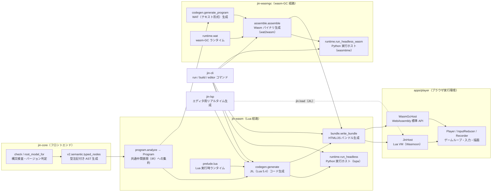
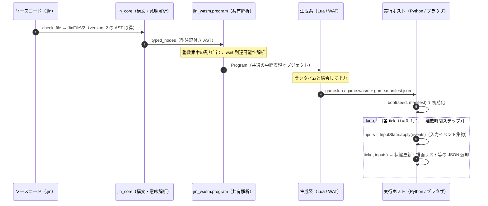

# Jin v2 実行エンジンのアーキテクチャ

[← README に戻る](../README.md) ／ 正典: [runtime.md](spec/v2/runtime.md) ・ [jil.md](spec/v2/jil.md) ・ [abilities.md](spec/v2/abilities.md)

この文書は、Jin v2 のソースコード（`.jin`）が**どのようなパイプラインを通って変換され、どのように実行されるか**を解説する「実装の構造図（アーキテクチャガイド）」です。

### 本書の想定読者と目的
- **想定読者**: 計算機科学（CS）の基礎（プログラミング言語の基本、データ構造、コンパイラのフロントエンド/バックエンドの概念、OS やプロセス・メモリの基礎）を学んだ学部2年生程度の知識を持つ開発者。
- **目的**: Jin v2 のコード生成系（Lua / WebAssembly GC）や各種実行ホスト（Python / ブラウザ）の内部構造を俯瞰し、機能の追加や不具合の修正を迷わず行えるようになること。

> [!NOTE]
> **Jin の言語概念と計算機科学（CS）用語の対応**:
> 本書を読み進めるにあたり、Jin 特有の用語は一般的な CS の概念と次のように対応付けて捉えると理解がスムーズです。
> - **陣（Circle）**: 状態と振る舞いを持つ自律オブジェクト（**アクターモデル**のアクターに近い単位）
> - **手順（Rite）**: 陣に属する手続き（通常の**メソッド**、または途中で中断・再開できる**コルーチン**）
> - **型紙（Form）**: 複数のフィールドを持つ複合データ型（**構造体 / レコード型**）
> - **刻（Tick）**: システムの時間を 1 ステップ進める離散時間単位（**ゲームループ**の 1 フレーム）
> - **公開状態（Published State）と作業状態（State）**: フレーム内での参照競合を防ぐ**二重バッファリング**

---

## 0. 正典（仕様書）との関係

Jin v2 のドキュメント体系では、**仕様の正本（正典）** と **実装の地図（本書）** に明確な役割分担を設けています。

- **仕様（契約）の正本は正典にあります**:
  ホストとの境界仕様、tick の 7 段階の順序、トレース行の種類、結果 JSON のキー順、数値の書式、JIL の禁止語、wasm-GC のメモリ・値表現などは、[runtime.md](spec/v2/runtime.md)、[jil.md](spec/v2/jil.md)、[abilities.md](spec/v2/abilities.md) に定義されています。これらは `tests/spec/` および `tests/contract/` の自動テスト群によって実装と常に厳密に突き合わされています。
- **本書は仕様を転記しません**:
  仕様の表や定数リストを本書に複製（転記）すると、自動テストの検証網から外れてしまい、コードの変更に伴ってドキュメントが陳腐化（腐敗）する原因になります。そのため、仕様の詳細値は「正本は [runtime.md](spec/v2/runtime.md) §5 を参照」のように正典へリンクする方針をとります。
- **本書が提供するのは「実装の形と地図」です**:
  どのモジュールがどの責務を持つか、仕様の各項目がどの関数に実装されているか、2 つのコード生成系がどこを共有しどこで分岐するか、変更時にどのモジュールへ影響が波及するかという「実装の全体構造」を解説します。
- **参照規律（テストによる機械的固定）**:
  コードの参照は「ファイルパス + 記号名（関数名・クラス名）」で記述し、行番号は記述しません（行番号はコードの修正ですぐにズレてしまうためです）。この規律は `tests/contract/test_docs_execution_engine.py` により、パスの実在と行番号の不在が機械的にテスト・固定されています。

---

## 1. 全体像

Jin v2 の実行エンジンは、大きく分けて **「共有フロントエンド（解析）」**、**「2 つのコード生成系（バックエンド）」**、**「4 つの実行環境（ホスト）」** で構成されています。



### 1.1 2 つの生成系と 4 つのホスト

Jin v2 には **2 つのコード生成系（ターゲット）** があり、それぞれに対して **ヘッドレス（Python）** と **ブラウザ（TypeScript）** の実行ホストが存在します（合計 4 通りの実行パス）。

| 生成系（バックエンド） | 生成される成果物 | 言語の意味論（ランタイム）を持つ側 | ヘッドレス実行ホスト（Python） | ブラウザ実行ホスト（TypeScript） |
|---|---|---|---|---|
| **Lua 経路**<br/>(`jin_wasm.codegen`) | `game.lua`<br/>（**JIL**: Lua 5.4 の静的サブセット） | `prelude.lua`<br/>（生成コードの前にそのまま連結） | lupa<br/>(`jin_wasm.runtime.LuaHost`) | Wasmoon（WebAssembly 版 Lua VM）<br/>(`apps/player/src/host.ts` の `JinHost`) |
| **wasm-GC 経路**<br/>(`jin_wasmgc.codegen` + `assemble`) | `game.wasm`<br/>（Wasm-GC 拡張バイナリ） | `runtime.wat`<br/>（生成 WAT コードと連結してアセンブル） | wasmtime<br/>(`jin_wasmgc.runtime.WasmGcHost`) | ブラウザ標準の `WebAssembly` API<br/>(`apps/player/src/host.ts` の `WasmGcHost`) |

- **意味論の自己完結性**: スケジューリング、コルーチン制御、時間待ち（`wait`）、トレース収集などの言語意味論は、すべて生成物自身（`prelude.lua` または `runtime.wat`）の中に閉じて実装されています。
- **シンプルなホスト境界**: ホスト側の責務は極めてシンプルで、「初期化時（`boot`）やフレームごと（`tick`）に JSON を渡して呼び出し、返ってきた結果の JSON を受け取る」ことだけに専念します。
- **既定の経路とエディタの挙動**:
  - 通常の実行（`jin run`）およびビルド（`jin build`）の既定は **Lua 経路** です。wasm-GC 経路で動かす場合は `--target wasm-gc` を指定します。
  - **エディタ内の実行パネル（プレビュー機能）は常に Lua 経路** を使用します（`jin-lsp` が高速に JIL を生成し、iframe 内のプレイヤーが Wasmoon 経由で即座に実行します）。

### 1.2 パッケージ境界と依存関係の原則

依存関係の向きは `pyproject.toml`（import-linter 設定）および CLAUDE.md が正本です。実行系に関わる主な原則は以下の通りです。

- **`jin-wasm` の依存局所化**: `jin-core` と `lupa` だけに依存します（UI 描画の `jin_render` やエージェント連携の `jin_adk` は import しません）。
- **`jin-wasmgc` の責務と再利用**: `jin-core`、`jin-wasm`、`wasmtime` に依存します。共通の構文解析・バンドル書き出し・録画処理・外部エージェントへの問い合わせ（`answer_asks`）は `jin_wasm` の実装を**そのまま再利用**します。
  - *Note*: `wasmtime` を `jin-wasm` ではなく `jin-wasmgc` に切り出している理由は、エディタ拡張の `jin-lsp` が `jin_wasm.codegen` を import するためです。C拡張を含む重い `wasmtime` を LSP の配布 wheel に含めないようにしています。
- **`jin-lsp` の軽量性**: import するのは `jin_wasm.codegen` と `jin_wasm.jil` のみです（LSP プロセス内では Lua 実行を行いません）。
- **外部エージェント呼び出しの分離**: v1 のエージェントを呼び出す具体的な実装（`jin_cli.agents.AgentHost`）は CLI パッケージ（`jin_cli`）にのみ置かれます。`jin_wasm` 側は「問いに答える呼び出し可能オブジェクト（関数）」を引数として受け取るだけで、互いに疎結合を保っています。

---

## 2. 実行パイプライン

ソースコード（`.jin`）が読み込まれてから、ホスト上で離散時間ステップ（tick）ごとの実行ループが回るまでの流れは次の通りです。



パイプラインの各段階の責務は以下の通りです。

1. **読み込みと静的検査（Validation）**:
   `jin_core.check.check_file` がソースコードを構文解析・診断し、`root_model_for` が `version: 2` を確認して `JinFileV2` AST を返します（CLI の入口は `_load_model_or_exit`）。式の型推論と型検査は `jin_core.v2.semantic.typed_nodes` が行います。
2. **共有の中間表現への集約（Common IR Analysis）**:
   `jin_wasm.program.analyze` が、両方のバックエンドで共通して必要となるメタデータ（配列添字、型紙情報、非同期待機の到達性など）を解析し、`Program` オブジェクトを構築します（§3）。2 つのコード生成系はこの解析結果を入力として受け取るため、型検査や意味解析を二重に行う必要がありません。
3. **コード生成（Code Generation）**:
   - Lua 経路: `jin_wasm.codegen.generate` が `game.lua` を生成します（§4）。
   - wasm-GC 経路: `jin_wasmgc.assemble.assemble` が WAT を組み立てて `game.wasm` を生成します（§5）。
   どちらの生成系も、引数（`debug=True/False`）を切り替えることで、開発用の詳細なトレース・スナップショット出力コードと、本番用の高速実行コードの双方を出力できます。
4. **ホストでの実行（Execution）**:
   - ヘッドレス（CLI）: `jin run` コマンドが Python プロセス内のサンドボックス環境（`lupa` または `wasmtime`）でヘッドレス実行します（§7）。
   - ブラウザ: `jin build` で書き出された静的バンドル、または `jin editor` の内蔵プレイヤー（`/play/`）が、WebAssembly 環境で実行します（§6）。

---

## 3. 共有フロントエンド解析: `jin_wasm.program`

`packages/jin-wasm/src/jin_wasm/program.py` は、言語のフロントエンドとコード生成バックエンドを仲介する **共通中間表現（IR: Intermediate Representation）** の構築を担当します。このモジュール自体は Lua や WAT といったターゲット言語のコードを一切出力しません。

### 3.1 `Program` オブジェクトの構成要素

| 属性・記号 | 型 / 中身 | 役割と意味 |
|---|---|---|
| `Program.model` | `JinFileV2` | 元となった `.jin` ファイルのパース済み AST |
| `Program.nodes` | `dict[str, Node]` | JSON Pointer → 型注記付きの式 AST。`Program.node(pointer)` で検索し、存在しなければ `CodegenError` を送出 |
| `Program.forms` | `dict[str, FormInfo]` | 型紙（構造体）名 → `index`（組み込みの `Pointer` 型が 0、ユーザー定義型紙は 1 始まり）および `fields`（フィールド名 → (宣言順の添字, 型)） |
| `Program.circles` | `dict[str, CircleInfo]` | 陣名 → `index`（1 始まりの整数）、`pointer_index`（0 始まりの JSON Pointer）、内部状態 `states`、手順 `rites`、外部境界 `sigils`（`("host", ns)` / `("summon", circle, rite)` / `("agent", file)`）、待機情報 `waits` |
| `rite_waits` | `set[tuple[str, str]]` | 手順ごとに「非同期待機（`wait`）に到達しうるか」の判定結果 |
| `manifest_base` | `dict[str, Any]` | `game.manifest.json` の共通メタデータ（ファイル名、ステージ設定、アセット、名前空間など）。バックエンドがそれぞれの識別情報（Lua の sha256 や Wasm のターゲット指定）を追加するベース |

### 3.2 重要な設計方針

#### 名前を識別子に埋めない（インデックスによる管理）
コンパイラ最適化および難読化・軽量化の観点から、生成されるコード（JIL / Wasm）では **陣・手順・内部状態・構造体フィールドの識別子として名前文字列を一切使用しません**（[jil.md](spec/v2/jil.md) §3）。
すべて上記の解析テーブルによって `1`, `2`, `3`… といった整数の添字（インデックス）に変換され、実行時の配列アクセス（$O(1)$）に置き換えられます。元の名前文字列は、デバッグ用のトレース行やメタデータ区画（Lua の `CIRCLES[i].name` や Wasm の data 区画）にのみ文字列リテラルとして保持されます。

#### `wait` の到達可能性解析（不動点反復）
Jin の手順（Rite）は、途中で時間待機（`wait`）を行って制御をホストに一時返却できます。
`program.py` は、コンパイラのデータフロー解析でおなじみの **不動点反復（Fixed-point Iteration）** を用いて、各手順が `wait` に到達しうるかを静的に判定します。
1. 手順の構文木を走査し、直接 `WaitStep`（時間待ちステップ）を含んでいるか調べる。
2. 他の手順への呼び出し（自陣の手順への `cast`）を含んでいる場合、呼び出し先が `wait` に到達可能であれば、呼び出し元も「到達可能」として伝播させる（再帰呼び出しにも対応するため、状態が変化しなくなるまで反復する。なお `summon` による他陣の呼び出しは跨がない閉包境界）。

この静的解析結果（`waits`）はバックエンドにとって極めて重要です。
- **Lua 経路**: `waits` が真の手順のみをコルーチン（`coroutine.create`）としてラップし、待機を含まない手順は通常の関数呼び出しとして高速に実行します。
- **wasm-GC 経路**: Wasm にはネイティブなコルーチンがないため、`waits` が真の手順のみを **中断・再開可能な状態機械（ステートマシン）** にコンパイルします（§5.5）。

---

## 4. Lua / JIL 経路（`jin_wasm`）

Lua 経路は、高速なコード生成と人間が読める中間コード（JIL）を出力する標準バックエンドです。

### 4.1 `game.lua` の組み立て

`jin_wasm.codegen.generate` は、次のパーツを順番に連結して 1 つの Lua スクリプト `game.lua` を出力します（構成の正本は [jil.md](spec/v2/jil.md) §1）。

```
ヘッダ 3 行（_header。source 名は lua_string でエスケープ）
prelude.lua（jin_wasm.prelude.prelude_source が提供する実行時ライブラリ）
-- program
生成部（_Generator.program が出力する AST 由来のコード）
return { boot = boot, tick = tick }
```

- **生成物の戻り値**: `GeneratedGame`（`lua` コード文字列、`manifest` 辞書）。マニフェストには `manifest_base` に加えて `jil`（`game.lua` 全文の SHA-256 ハッシュ値）が付与されます。
- **単一チャンクでのスコープ管理**:
  生成されたコードは、プレリュードのローカル変数に代入する形で埋め込まれます。プレリュードの冒頭で `local DEBUG, ROOT, FPS, CIRCLES, R, JF, JR, S, P` のように必要な変数が宣言されており、同じチャンク（ファイル）の後続部分にある生成コードが `DEBUG = true` や `CIRCLES[i] = { … }`、`R[i][j] = function … end` と代入します。
  これにより、外部スコープに漏れるグローバル変数は公開関数である `function boot` と `function tick` の 2 つだけに限定されます。生成部が定義してよい識別子の一覧はプレリュード先頭のコメントに明記されており、`tests/contract/test_jil_contract.py` の `PROGRAM_ASSIGNMENTS` が 1:1 の対応をテストで固定しています。

### 4.2 コード生成器 `_Generator`（`codegen.py`）

`_Generator` は `analyze` を 1 回だけ呼び出し、変換された Lua コードの行を内部バッファ `self.lines` に積み上げます。出力順序は次の通りです。
`DEBUG` / `ROOT` / `FPS` → 型紙シリアライザ（`JF[k]`、デバッグ時はデシリアライザ `JR[k]` も）→ 手順を持つ陣のテーブル初期化 `R[i] = {}` → 全手順の実体定義 → 全陣の定義 `CIRCLES[i]`。

| 生成関数 | 変換対象と責務 |
|---|---|
| `lua_string` / `lua_number` | リテラルのエスケープ。数値 `num` は常に浮動小数点数（`160.0`）、inf / nan は `(1.0/0.0)` の形式で出力 |
| `_RiteCtx` | 手順（Rite）ごとのローカル変数文脈。ローカル変数 `l_n`、一時変数 `a_n` / `r_n` / `w_n`、デバッグ時のトレース行変数を管理 |
| `expr` / `name` / `field` / `call` | 式の変換。ローカル変数は `l_n`、自陣の内部状態は `S[i].k_j`、**他陣の状態は確定値 `P[j].k_j`（二重バッファリング）**、型紙フィールドは `.f_j`、配列添字は `AT(…)`、組み込み純関数は `F.x(…)`、能力呼び出しは `H.ns.member(…)`。演算子の対応は `_BINARY` |
| `assign` | 代入文。フィールド更新 `SETAT(…)` または変数代入 `x = v`。デバッグ時は代入先の根が状態変数なら `TS(…)`（set トレース行）を出力 |
| `step` / `steps` / `loop` | 制御構文の振り分け。待機 `wait` は `WAIT_TICKS` / `WAIT_UNTIL`、脱出 `finish` / `transfer` は `FINISH` / `TRANSFER` + `do return end` に変換 |
| `cast` | メッセージ送信 `cast` の 5 つの分類（自陣の手順 → `R[ci][j]`、agent → `ASK`、他陣の summon → `R[他陣][j]`、演出効果 → `E.x`、ホスト能力 → `H.ns.m`）。自陣の手順呼び出しのみ、途中で陣が停止した場合に備えて `local w = LIVE(ci)` … `if STOP(ci, w) then return end` で保護（[jil.md](spec/v2/jil.md) §4） |
| `emit_step` | 外部へのイベント送出 `EMIT(to, name, {args}, meta)`。`meta` 情報はデバッグ時のみ付与 |
| `emit_rite` | 手順の関数定義 `R[i][j] = function(l_0, …)`。デバッグ時は先頭で `TR(…)`（rite 開始トレース行）を出力 |
| `emit_circle` | 陣の定義テーブル `CIRCLES[i] = { … }`。flow 陣（制御フロー専用の陣）は `flow` / `children` / `exit`、核あり陣（状態と手順を持つ陣）は `init` / `publish` / `core` / `core_waits` / `on` / `on_waits` など、およびデバッグ用関数 `dump` / `pdump` / `restore` / `prestore` / `guards` を出力 |

#### 二重バッファリング（Double Buffering）によるレースコンディション防止
同一フレーム（tick）内で複数の陣が並行して動く際、状態の読み書きの順序によって結果が変わると決定性が崩れてしまいます。これを防ぐため、**作業用状態 `S[i]`** と **公開状態 `P[i]`** の 2 つのバッファを持ちます。
自陣の内部状態を変更する際は `S[i]` に書き込みますが、他陣の状態を参照する際は前フレームで確定した `P[j]` を読み取ります。フレームの最後（tick の第 4 段）で `publish_all` が呼ばれ、`S` の内容が `P` へ一括反映（コミット）されます。

#### トレース行の二重計上防止
デバッグ実行時の動作ログ（トレース行）は 2 つの場所で記録されます。
- 生成部がコードに直接埋め込むもの: `set`、`cast`、`rite`、`transfer`、`finish`（リリースビルドでは呼び出し自体を出力しない）。
- プレリュードのランタイムが記録するもの: `enter`、`exit`、`event`、`emit`、`wait`、`assert`、`error`、`frame`。
各イベントの意味や JSON Pointer の仕様は [runtime.md](spec/v2/runtime.md) §5 が正典です。

#### コルーチン化の静的決定
手順をコルーチンとして実行するかどうかはコンパイル時に決定されます。
陣の定義テーブル `CIRCLES[i].core_waits` / `on_waits` に `Program` の静的解析結果（`waits`）が埋め込まれます。プレリュードの実行関数 `RUN(i, fn, waits, args)` は、`waits` が偽なら通常の関数として直接呼び出し、真なら `coroutine.create` でコルーチンを生成してから `resume` します。手順同士の `cast` 呼び出しは常に直接の関数呼び出しであり、途中で発生した `wait` による `yield` は同じコルーチンの中を親へと伝播します（[jil.md](spec/v2/jil.md) §4）。

### 4.3 プレリュード `prelude.lua` の構成

`packages/jin-wasm/src/jin_wasm/prelude.lua` は、JIL の実行時意味論を提供する中核ライブラリです。上から順に以下の区画で構成されています。

| 区画 | 主な記号・変数 | 役割と責務 |
|---|---|---|
| 先頭コメント | コメント記述 | 生成部が定義すべき識別子とプレリュードが提供する識別子の一覧（`codegen.py` と 1:1 に対応） |
| 生成部用ローカル宣言 | `DEBUG` `ROOT` `FPS` `CIRCLES` `R` `JF` `JR` `S` `P` | 生成コードが値を代入するためのローカル変数枠 |
| 実行時コンテキスト | `C` `OPS` `AUDIO` `TRACE` `Q` `ASKS` `ASK_MAP` `SEQ` `TICK` `DONE` `ERRMSG` `INPUTS` | 陣の実行状態配列 `C`、描画命令リスト `OPS`、オーディオ命令 `AUDIO`、メッセージキュー `Q` など |
| 命令数リミット | `ARM` `HOOK` `ADVANCE_LIMIT` `ERR` | 無限ループを防止するための VM 命令数フック（`JIN_ARM` / `JIN_HOOK`） |
| 数値フォーマット | `shortest_digits` `NUMSTR` | 浮動小数点数を最短の文字列表現にする探索処理（[runtime.md](spec/v2/runtime.md) §6） |
| JSON 直列化 | `JS` `JN` `JB` `JV` `JL` `JROW` | 外部ライブラリに頼らず安全に JSON を組み立てる関数群（文字列エスケープなど） |
| リジューム入力デコード | `RREC` `RN` `RB` `RSTR` `RL` | lupa の table と Wasmoon の userdata の差異を吸収して復元データを読み取る関数群 |
| トレース記録 | `ROW` `T` `TS` `TR` `TRET` | シーケンス番号 `SEQ` を進めながらトレース行を `TRACE` に蓄積 |
| 入力イベント処理 | `prepare_inputs` | キーやマウスの押下遷移から離脱イベント（`RELEASES`）を生成 |
| 乱数生成 | `rng_step` `rng_seed` | 決定論を保証する 64-bit 整数ベースの PCG32 擬似乱数生成器 |
| 組み込み能力 | `H.canvas` `H.input` `H.ui` `H.audio` `H.random` `H.storage` | 画面描画、入力取得、ストレージ等のホスト機能インターフェース |
| 純関数と副作用 | `F`（`round` / `len` / `sub` / `num` / `cmp` など）`AT` `SETAT` `E` | Jin 言語の標準組み込み関数群 |
| 陣のトポロジー | `ORDER` `is_active` | ルート陣から前順（先行順）走査でアクティブな陣のリストを構築 |
| 手順実行とコルーチン | `LIVE` `STOP` `RUN` `resume` `WAIT_TICKS` `WAIT_UNTIL` | コルーチンの生成・再開、命令数フックの再適用、待機条件の登録 |
| ライフサイクル管理 | `reset` `publish` `FINISH` `TRANSFER` `EMIT` `ASK` `ENTER` `advance_flow` `ADVANCE` | 陣の開始、完了、遷移、メッセージ送出 |
| スナップショットと復元 | `snapshot_json` `restore_from` `repair_flows` `find_circle` `fresh_state` | ホットリロード時に状態を維持したまま新しいコードへ移行する仕組み |
| tick のフェーズ関数 | `deliver` `resume_waits` `dispatch_events` `publish_all` `check_guards` `step` | tick の 7 段階を実行する主要ルーチン |
| 例外ハンドリング | `protected` | `pcall` を用いてエラーをキャッチし、安全に停止状態へ移行する保護関数 |
| 結果出力 | `result` | tick の実行結果（描画リスト、音、トレース、公開状態など）を JSON に直列化 |
| ホスト公開 API | `boot(seed, manifest)` `tick(t, inputs)` | ホストから呼び出される 2 つの公開エントリポイント |

#### 陣の実行時コンテキスト `C[i]`
各陣の生存状態は配列 `C[i]` で管理されます（`fresh_state` が初期化）。
`{ status = "idle" | "active" | "done", paused, delegate, pending, cursor, waits = { {co, pointer, ticks | until_} }, published }`。
状態変数本体は `S[i]` に、他陣から参照される公開状態は `P[i]` に保持されます。

#### ゲームループの心臓部: tick の 7 段階（フェーズ）
1 つの tick（フレーム）の中で実行される処理は、[runtime.md](spec/v2/runtime.md) §2 により厳密に 7 つのフェーズに分かれています。プレリュードと wasm-GC ランタイムは全く同じ順序でこれらを実行します。

| 段階（フェーズ） | Lua 側の実装関数 | wasm-GC 側の実装関数 | フェーズの責務と動作 |
|---|---|---|---|
| **1. 配達（Deliver）** | `deliver` | `$deliver` | メッセージキュー `Q` に積まれた `emit` イベントおよびエージェントからの `reply` イベントを宛先の陣に届ける |
| **2. 再開（Resume）** | `resume_waits` | `$resume_waits` | 時間待ち（`wait ticks`）や条件待ち（`wait until`）で一時停止していたコルーチン/状態機械を再開する |
| **3. イベント（Dispatch）** | `dispatch_events` | `$dispatch_events` | キー入力やポインタ操作などの外部イベントを発生順に処理し、最後にフレーム更新イベント `tick(dt)` を配信する |
| **4. 確定（Publish）** | `publish_all` | `$publish_all` | 二重バッファのコミット処理。各陣の内部作業状態 `S[i]` を外部公開状態 `P[i]` へ一括コピーする |
| **5. 検査（Guards）** | `check_guards` | `$check_guards` | （デバッグ時のみ）陣の状態不変条件（ガード条件）を満たしているかを検証する |
| **6. 進行（Advance）** | `ADVANCE` | `$advance` | 陣のライフサイクル状態遷移を進める（無限ループ防止のため `ADVANCE_LIMIT` 回で打ち切る） |
| **7. 返却（Result）** | `tick` の後半 + `result` | export `tick` の後半 + `$result` / `$flush` | フレーム描画命令、オーディオ命令、トレース、公開状態などを JSON 文字列としてホストへ返却する |

フェーズ 1〜6 は、Lua の `step(t)` および wasm の `$step` が順に呼び出します。各フェーズの境界で何が起きるか（たとえば `finish` 呼び出し後のイベント配達のキャンセルなど）の厳密な仕様は [runtime.md](spec/v2/runtime.md) §2〜§3 が正本です。

#### `boot` と `tick` のライフサイクル
- **`boot(seed, manifest)`**:
  命令数フック `ARM()` を設定 → 64-bit 整数の動作環境チェック → `manifest.storage` や `manifest.resume` を抽出 → `fresh_state` で全状態を初期化 → シード値を決定（復元時は復元シードが優先） → `protected` の中で「復元データがあれば `restore_from` → `repair_flows` → `ADVANCE`、新規起動なら `ENTER(ROOT)` → `ADVANCE`」を実行 → 復元でなければ `publish_all` を実行 → 初期化時の描画リストを破棄して準備完了。
- **`tick(t, inputs)`**:
  命令数フック `ARM()` を設定 → 描画命令リストをクリア → すでに `DONE` 状態なら `result()` のみ返却 → 動作中なら `prepare_inputs` で入力を正規化 → `protected(step)` で tick の 7 段階を実行 → デバッグ時なら frame トレース行を記録 → `result()` で結果 JSON を出力 → 一時領域（トレースバッファや問い合わせリスト）をクリアして返却。

#### エラーハンドリング
生成部やプレリュードでエラーが発生した場合、`error({code, message})` をスローします。これを `protected` 関数の `pcall` が捕捉し、安全に実行を停止して `DONE` フラグとエラーメッセージ `ERRMSG` を記録します（デバッグモードなら発生箇所のポインタを付与した `error` トレース行を出力）。スタックオーバーフローなどの Lua VM 自身が発生させるエラー（文字列エラー）も適切にパースして共通形式に変換します（[jil.md](spec/v2/jil.md) §2）。

### 4.4 lupa ホスト（`jin_wasm.runtime`）

Python 環境で Lua 経路をヘッドレス実行するためのホスト実装です。

| 記号・関数 | 役割と責務 |
|---|---|
| `sandboxed_runtime` | セキュアな Lua ランタイム環境を構築。`lupa.lua54.LuaRuntime(register_eval=False, register_builtins=False)` を作成し、Python オブジェクトへの参照を削除。`_SETUP` スクリプトで命令監視フック `JIN_ARM` / `JIN_HOOK` を注入し、危険な標準グローバル（`os`, `io` 等）および `string.dump` を `nil` に設定（無効化の順序は [runtime.md](spec/v2/runtime.md) §8） |
| `_SETUP` | Lua 組み込みの `debug.sethook` を用いて命令数をカウントするフックスクリプト。**ブラウザ側 `apps/player/src/host.ts` の `HOOK_SETUP` と完全一致する文字列** を使用（文言が異なると環境間でトレースパリティが崩れるため、契約テストで突き合わせを実施） |
| `INSTRUCTION_BUDGET` | 1 回の `boot` および `tick` で消費可能な命令数の上限値 |
| `LuaHost` | JIL スクリプトをロードして実行するホストクラス。実行終了時に `finally` でフック用グローバル変数をクリーンアップし、`boot` や `tick` を呼び出す。戻り値の JSON 文字列を `json.loads` でパースし、Lua の例外 `LuaError` を Jin の `RunError` にラップ |
| `InputState` | 入力状態のレデューサー（Reducer）。キーやマウスイベントから現在の押下状態を差分更新し、テキスト入力や返信イベントを管理。TypeScript 側の `InputReducer` のマスター実装 |
| `run_headless` | コマンドライン実行の主ルーチン。入力イベント列を tick ごとにまとめ → `boot` 呼び出し → `t = 0, 1, 2…` と順次 `tick` を実行 → トレース、描画フレーム、公開状態、ストレージ書き込み（`apply_storage_writes`）を収集 → `answer_asks` によるエージェント返答を次 tick の入力に反映 → 終了条件（done）で停止。結果を `HeadlessResult` として返却 |
| `answer_asks` | 実行中に発生した外部エージェントへの問い合わせ `asks` に対し、指定された回答関数 `answer` を呼び出して結果を取得。`clean_reply_text` で正規化して次フレーム用の `reply` イベントを構築。**この処理は wasm-GC 経路でも共通して利用される** |

### 4.5 周辺モジュール（`jil` / `jinrec` / `bundle`）

- **`jin_wasm.jil`**:
  JIL の仕様定数（`JIL_VERSION`、禁止識別子一覧 `JIL_FORBIDDEN`、トレース種類 `TRACE_KINDS`、ホストフック識別子 `HOST_HOOK_GLOBALS`）と、生成コードの静的検証関数 `forbidden_uses` を提供します。構文解析器を介さず、コメントと文字列リテラルを空白に置換した上で、禁止された識別子（`io`, `os`, `debug` など）が使われていないかを高速に走査します。
- **`jin_wasm.jinrec`**:
  決定論的リプレイファイル（`.jinrec`）の読み書きを担当します。パース関数 `read_jinrec`（構文エラー時は行番号付きの `JinrecError` を送出）、シリアライザ `dumps_jinrec`、ストレージコピーの整合性検証 `check_storage_copy`、エージェント回答テキストの正規化 `clean_reply_text` を含みます。TypeScript 側の対応実装は `apps/player/src/jinrec.ts` です。
- **`jin_wasm.bundle.write_bundle`**:
  スタンドアロンで動く HTML/JS 成果物の書き出しを担当します。`Bundleable` プロトコル（ダックタイピング）により、Lua 経路の `GeneratedGame` と wasm-GC 経路の `GeneratedWasm` の両方を透過的に受け入れます。アセットファイルは `_asset_source` により `.jin` ファイルの親ディレクトリ配下に閉じ込め、シンボリックリンク攻撃を防ぐため `O_EXCL` / `O_NOFOLLOW` フラグおよび一時ファイル置換（`os.replace`）を用いて安全に書き出します。単一ファイル出力（`--single`）時は `single_index_html` を使用し、同梱するプレイヤー実装コードは `PLAYER_FILES` / `PLAYER_FILES_WASMGC` から取得します。

---

## 5. wasm-GC 経路（`jin_wasmgc`）

wasm-GC 経路は、WebAssembly の GC 拡張（Garbage Collection）仕様を活用し、バイナリサイズと実行速度を追求するバックエンドです。

### 5.1 `game.wasm` の組み立て

`jin_wasmgc.assemble.assemble` は、手書きの実行時ランタイム（WAT 形式）とコンパイラが生成したコード（WAT 形式）を結合し、`wasmtime.wat2wasm` を呼び出して単一の Wasm バイナリ `game.wasm` を生成します。

```
module_text = ヘッダ 3 行 + "(module" + runtime.wat（ランタイム部品群）+ 生成部（generate_program）+ ")"
game.wasm   = bytes(wasmtime.wat2wasm(module_text))
```

- **外部ツールの非依存性**: 独自の複雑なバイナリエンコーダや外部の重量級ツール（`wasm-tools` 等）を必要とせず、WAT のテキスト結合と `wasmtime` のアセンブラだけで完結します。
- **再現性**: 全く同じ入力 WAT からは、常に 1 バイトの狂いもなく同一のバイナリが生成されます（`packages/jin-wasmgc/tests/` のテスト群が検証）。
- **生成物の戻り値**: `GeneratedWasm`（`wat` テキスト、`wasm` バイナリ、`manifest` 辞書）。マニフェストには `manifest_base` に加えて `target: "wasm-gc"` と `wasm`（バイナリの SHA-256 ハッシュ値）が記録されます。

### 5.2 ランタイム部 `runtime.wat`（生成物）

`runtime.wat` は、Lua 経路における `prelude.lua` に相当する実行時ライブラリです。`packages/jin-wasmgc/runtime/` 配下の複数の WAT 部品から構成され、ビルドスクリプト `scripts/generate_runtime_wat.py` がこれらをアルファベット順に連結・テンプレート置換して `packages/jin-wasmgc/src/jin_wasmgc/runtime.wat` を生成します（手作業での編集は禁止されています）。

| ランタイム部品 | 主な内容と提供する機能 |
|---|---|
| `01_head.wat` | 先頭コメント（生成部が提供すべき `$prog_*` 関数一覧と線形メモリマップ）、基本型定義（文字列 `$str`、リスト `$Lf` `$Li` `$Lr`、バッファ `$buf`、組み込み型 `$F0` = Pointer、JSON 木 `$J`、多倍長整数 `$bn`）、`@DATA@` プレースホルダ、実行時グローバル変数（`$OUT` `$OPS` `$AUDIO` / `$DONE` `$ERRED` `$ERRMSG` / `$BUDGET` / `$RS` など）、export `input`、出力ライター（`$puts` `$put_js` `$flush` など）、UTF-8 文字列操作 |
| `02_num.wat` | 多倍長整数演算（$10^9$ 進法）、浮動小数点数の最短文字列表現 `$shortest` / `$put_num` / `$put_jn`（Lua の `shortest_digits` と同等の探索アルゴリズム）、高速な文字列-数値変換（Clinger's Fast Path + Algorithm R による strtod 実装）と組み込み関数 `num(str)` を担う `$f_num` |
| `03_host.wat` | 浮動小数点余り演算 `$fmod` / `$lmod`、エラー処理 `$ERR` と命令数カウント `$bud`、JSON パーサー（`$parse_input` `$j_get` など）、リスト操作展開（`@LISTS@`）、組み込み純関数 `$f_*`、PCG32 乱数、入力イベント処理、能力呼び出し `$h_<名前空間>_<メンバ>`、ストレージ管理、結果直列化 `$result`、**export `boot` / `tick`** |
| `04_trig.wat` | 正確な三角関数（`sin` / `cos` / `atan2`）の fdlibm アルゴリズム移植（Lua との微小な計算誤差の仕様は [jil.md](spec/v2/jil.md) §6.4 に規定） |
| `05_sched.wat` | スケジューラの中核。トレース行 `$Row`、待機 `$Wait`、メッセージ `$Msg`、問い合わせ `$Ask` の型定義、陣の生存管理配列（`$CST` `$CPAUSED` `$CPENDING` `$CCURSOR` `$CPUB` `$CDELEG`）、ライフサイクル関数（`$order` / `$enter` / `$finish` / `$transfer` / `$emit` / `$ask` / `$advance` / `$step`）、スナップショットと復元（`$snapshot` / `$restore_from` / `$repair_flows`） |
| `strings.json` | ランタイムが使用する静的文字列テーブル（結果 JSON のキー名、描画オペコード名、エラーメッセージ、JSON キーなど） |

#### テンプレート置換の仕組み（`scripts/generate_runtime_wat.py`）
`strings.json` に定義された文字列を 0 番地から順に線形メモリに配置し、WAT ソース内の目印を実際の定数値に置換します。
- `@K:name@` → `(i32.const offset) (i32.const length)`
- `@OFF:name@` → `(i32.const offset)`
- `@LEN:name@` → `(i32.const length)`
- `@DATA@` → 文字列データを埋め込んだ WAT の `(data ...)` ディレクティブ群
- `@LISTS@` → リストテンプレート `LIST_TEMPLATE` を各型（`$Lf`, `$Li`, `$Lr`）向けに展開したコード
文字列データの合計サイズが静的領域の上限 `DATA_BASE` を超えるとエラーで停止します。スクリプトに `--check` や `--stdout` オプションを渡すことで、生成物のズレを検証できます。

#### 陣の配列の動的確保
Wasm のグローバル変数の初期化式では、後続の生成部で定義される陣の総数 `$N` を静的に参照できません。そのため、ランタイム部のグローバル配列（`$CST` など）は固定長ではなく、`boot` 実行時に `$fresh_state` が `$N` の値に基づいて動的にヒープ上に確保します。

### 5.3 線形メモリと GC マネージドヒープの使い分け

wasm-GC 経路の大きな特徴は、**線形メモリ（Linear Memory）** と **GC マネージドヒープ（GC Heap）** を明確に使い分けている点です（メモリレイアウトの正典は `01_head.wat` の先頭コメント）。

```
0                  DATA_BASE            $in_base             $in_base + $in_cap
|----------------------|--------------------|--------------------|--------------------->
  ランタイム静的文字列       生成部静的文字列          入力バッファ域          出力バッファ域
  (strings.json)       (陣名・手順名など)        (ホストが書くJSON)      ($flushが書き出すJSON)
```

| 線形メモリの領域 | アドレス範囲 | 格納されるデータと役割 |
|---|---|---|
| ランタイム静的文字列 | `[0, DATA_BASE)` | ランタイムが使用する定数文字列（`strings.json`。`generate_runtime_wat.py` の `DATA_BASE` で区切られる） |
| 生成部静的文字列 | `[DATA_BASE, $in_base)` | プログラム固有の静的文字列（陣名、手順名、公開キーなど。`jin_wasmgc.codegen.DATA_BASE` から配置） |
| 入力バッファ域 | `[$in_base, $in_base + $in_cap)` | ホストから渡される入力 JSON 文字列。ホストが `input(n)` を呼ぶと必要に応じて `memory.grow` で拡張される |
| 出力バッファ域 | `[$in_base + $in_cap, …)` | tick の結果 JSON 文字列。`$flush` が書き込みを行い、ホストに `(ptr, len)` を返す |

一方で、Jin のプログラム実行中に動的に作成されるオブジェクトは、すべて Wasm-GC のマネージドヒープ上にアロケートされます。
- 数値 `num`: `f64`
- 文字列 `str`: `(ref $str)` = `(ref (array (mut i8)))`（UTF-8 バイト列の GC 配列）
- リスト: 要素の表現ごとに特化した struct（`$Lf`, `$Li`, `$Lr`）
- 型紙（Form）のインスタンスや陣の内部状態: GC 管理の struct
値表現の厳密な仕様は [jil.md](spec/v2/jil.md) §6.3 に規定されています。プログラム内の式に現れる文字列リテラルは、線形メモリではなくパッシブデータ区画（`$L<i>`）に格納され、実行時に `array.new_data $str` 命令によって GC ヒープ上に生成されます。

### 5.4 コード生成部（`jin_wasmgc.codegen`）

コード生成の入口は `generate_program(model, debug)` です。`_Generator.program_part` が次の順序で WAT コードを生成します。

1. **`emit_types`**: 型紙型 `$F<k>`（$k \ge 1$）および陣の状態型 `$S<i>` を 1 つの相互再帰型ブロック `(rec ...)` 内に定義
2. **`emit_form_serializers`**: 型紙の直列化関数 `$jf<k>`（デバッグ時はデシリアライザ `$jr<k>` も生成）
3. **`emit_rite`**: すべての陣の全手順の実体関数
4. **`emit_circle`**: 各陣の作業用グローバル変数 `$S<i>`、確定値グローバル変数 `$P<i>`、初期化 `$init<i>`、公開関数 `$publish<i>` / `$pub<i>`、イベント受付 `on` のエントリポイント、デバッグ用関数（`$dump`, `$pdump`, `$restore`, `$prestore`, `$guards<i>`）
5. **`emit_dispatchers`**: ランタイム部から陣番号経由で呼び出すディスパッチャ関数群 `$prog_*`（インデックスによる分岐）
6. **メタデータとメモリ**: グローバル定数 `$ROOT`, `$N`, `$FPS`, `$DEBUG`、フレーム型、待機条件関数 `$u<n>`、メッセージ配達 `$dlv<n>`、返答処理 `$rpl<n>`、パッシブ/アクティブデータ区画、`$in_base`、線形メモリ宣言

#### 識別子命名規則
Lua 経路と同様に、名前文字列を Wasm の識別子に埋め込むことはしません。陣の内部状態は `$S<i>`、手順関数は `$r<i>_<j>`、ローカル変数は `$l<n>`、型紙型は `$F<k>` のように、すべて添字インデックスで命名されます。

#### Trap を起こさない防御的エラー設計
WebAssembly では、未処理のエラーが発生して `unreachable` 命令などで Trap（異常終了）してしまうと、インスタンス全体がクラッシュして復帰できなくなります。そのため、wasm-GC 経路では **例外や Trap を一切使わず、エラーフラグによる Early Return 方式** を徹底しています。
- エラーが発生すると、内部関数 `$ERR` が最初のエラー情報のみをグローバル変数 `$ERRED`, `$ERRMSG`, `$DONE` に記録します。
- 生成されたコードは、エラーが発生しうる箇所（配列添字アクセス、代入文、`cast` の呼び出し後、ループの各反復後、自陣手順の終了後チェックなど）において、常に `$ERRED` フラグをチェックし、エラーが立っていれば即座に関数を脱出（`early_return`）します。
- これにより、プレリュードの `pcall` と全く同等の保護範囲が実現され、モジュールが Trap することはありません（万が一 Trap が発生した場合はコンパイラの重大なバグとみなされ、`WasmGcRunError` や `HostError` として扱われます）。

#### 仮想マシン命令数制限（Fuel / Budget）
無限ループによるハングアップを防ぐため、Wasm モジュール内に命令数カウンタを埋め込んでいます。
- グローバル変数 `$BUDGET` が残りの実行可能命令数を保持します。
- 生成部は、ループの後方枝（`back_edge`）および手順の関数呼び出しの直前に `(call $bud)` を挿入します。
- `$bud` は `$BUDGET` をデクリメントし、0 に達した時点で `$ERR` を呼び出して実行を打ち切ります。
- `boot` および `tick` の呼び出し開始時に `$BUDGET` は規定値にリセットされます。Lua の VM 命令数とはカウントの粒度が異なりますが、設定上限値と停止時のエラー文言は完全に一致しており、両経路とも同じ tick で停止します（[jil.md](spec/v2/jil.md) §6.6）。

### 5.5 `wait` の状態機械（ステートマシン変換）

WebAssembly にはネイティブなコルーチンやスレッドの中断・再開機能が存在しません。そのため、コンパイラは `Program` 解析で `waits` が真（待機に到達しうる）と判定された手順のみを、**中断・再開可能な状態機械（ステートマシン）** に変換します（契約の正典は [jil.md](spec/v2/jil.md) §6.5）。

- **フレーム構造体への昇格**: 手順内のローカル変数群と再開位置を示すプログラムカウンタ `pc` を、専用のヒープフレーム構造体 `$W<i>_<j>` に格納します（フィールド 0 が `pc`、フィールド 1 が戻り値、以降がローカル変数）。
- **早送り実行（Fast-forwarding）による再開**:
  状態機械化された関数 `$r<i>_<j>w(frame) -> i32` は、**再開時にも常に先頭から実行を開始します**。
  グローバルな早送りフラグ `$rs`（`pc != 0` のときにセットされる）が立っている間は、過去に実行済みの副作用をスキップしながら目的の再開点まで高速に進みます。
  - 再開点を含まない通常のステップ列は `(if (i32.eqz (local.get $rs)) ...)` で囲んでスキップ（`steps`）。
  - 分岐 `if` は条件式を再評価せず、前回の実行で再開点を含んでいた枝に直接突入（`if_resumable`）。
  - 再開点を含まないループはループごと丸ごとスキップ。再開点を含むループは初期化処理やイテレータの読み直しをスキップしてループ本体に突入（`loop` / `loop_body` / `guard_rs`）。
  - 待機ステップに到達した際（`wait`）、早送り中であれば `pc == w` を確認して `$rs` フラグを下ろし、以降の通常実行を再開。通常実行中に `wait` に達した場合は、待機要求を `$WREQ_*` にセットし、現在の再開番号 `pc = w` を保存してステータス 1（中断）を返却。ランタイム部の `$register_wait` がこの要求を待ち行列 `$WAITS` に登録。
- **フレームの連鎖（スタックの再現）**:
  待機を含む手順から別の待機を含む手順へ `cast` する場合（`cast_waiting`）、呼び出し元のフレーム構造体に呼び出し先のフレーム構造体を保持させます。これにより、Lua のコルーチン呼び出しスタックと同等のコールツリーがヒープ上のフレーム構造体の連鎖として再現されます。
- **条件待機の評価**: `wait until <式>` の評価式は、最内層のフレームを受け取る関数 `$u<n>(frame)` としてコンパイルされます。
- **スケジューラからの再開**: tick の第 2 段階で、ランタイム部の `$resume_waits` が待機リストを順にチェックし、条件を満たした待機に対して `$prog_until` や `$prog_resume(rite, frame)` を呼び出します。

> [!IMPORTANT]
> **状態機械変換の制約と検証**:
> 早送り中に「再開点を含まない内部ループ」に入ってしまうと、ループの初期化ヘッダを飛ばしているため無限ループに陥って抜け出せなくなります。そのため、コンパイラは再開点を含まないループを検出して確実にループ全体をスキップする設計をとっています。
> ループ内の `wait ticks` / `wait until`、ローカル変数の退避・復元、および待機手順への `cast` 呼び出しが Lua 経路と全く同じトレース列を出力することは、`packages/jin-wasmgc/tests/test_runtime.py` のテストケース `test_wait_ticks_and_until_inside_loops_with_locals_and_a_waiting_cast` によって厳密に固定されています。

### 5.6 wasmtime ホスト（`jin_wasmgc.runtime`）

Python 環境で wasm-GC モジュールをヘッドレス実行するホスト実装です。

| 記号・関数 | 役割と責務 |
|---|---|
| `WasmGcHost` | wasmtime の `Engine` および `Store` を管理。Wasm の Fuel 消費設定（`Config.consume_fuel`）を有効化。外部 import を持つモジュールは安全のため拒否。Wasm モジュールのインスタンス化自体も Fuel を消費するため、`Instance()` 呼び出しの直前に `set_fuel` を実行 |
| `_call` | Wasm 関数の呼び出しラッパー。引数 payload を JSON 文字列（UTF-8）にエンコード → Wasm の `input(len)` を呼び出してメモリを確保 → `memory.write` で線形メモリに入力を書き込み → Fuel を補充（`FUEL_PER_CALL`）→ `boot(len)` または `tick(len)` を実行。Wasm の `Trap` 例外を `WasmGcRunError` にラップ（Fuel 切れや `unreachable` は「生成系の不備」として報告） |
| `tick_raw` / `tick` | tick 実行後に返された `(ptr, len)` のメモリ領域から結果を読み取り、バイト列のまま（`tick_raw`）、または JSON パースして（`tick`）返却 |
| `run_headless_wasm` | wasm-GC 用のヘッドレス実行メイン関数。Lua 側の `run_headless` と完全に同一の引数を受け取り、同一形式の `HeadlessResult` を返却。入力レデューサー `InputState`、ストレージ反映 `apply_storage_writes`、エージェント回答 `answer_asks` は `jin_wasm.runtime` の実装を共通利用 |

*Note*: wasmtime の Fuel 機構は二重の暴走防止（セーフティネット）として機能しており、実際の命令数制限はブラウザ環境と挙動を統一するため、Wasm モジュール内の `$BUDGET` カウンタが担っています。

---

## 6. ブラウザ実行環境（`apps/player`）

`apps/player` は、ブラウザ上で Jin プログラムを実行・レンダリングするための Web アプリケーション（TypeScript / Vite）です。

### 6.1 ディレクトリ構成と各モジュールの責務

| ファイルパス | 責務と役割 |
|---|---|
| `apps/player/src/host.ts` | 実行ホストの抽象インターフェース `Host`（`boot`, `tick`, `close`）と 2 つの具象実装クラス。`JinHost`（Wasmoon による Lua 実行。フック `HOOK_SETUP` とサンドボックス `SANDBOX_REMOVED` を適用し `withoutNulls` で結果を取得）、`WasmGcHost`（ブラウザ標準の `WebAssembly.instantiate(bytes, {})` による Wasm 実行）。失敗はすべて `HostError` で統一 |
| `src/player.ts` | `Player` クラス。メインループ（tick の進行）、録画、リプレイ再生、コードの動的差し替え（ホットリロード）、ローカルストレージの永続化を統括 |
| `src/main.ts` | アプリケーションのエントリポイント。ロード元の判定、ホストの選択（`targetOf` / `createHost`）、UI イベント処理、iframe の postMessage 通信、`localStorage` との同期 |
| `src/input.ts` | `InputReducer`（Python 側 `InputState` の TypeScript 実装）と、ブラウザの DOM イベントからキーやポインタ操作を収集する `InputCollector` |
| `src/recorder.ts` / `apps/player/src/jinrec.ts` | リプレイファイル（`.jinrec`）の記録器およびパーサー（Python 側 `jin_wasm.jinrec` の TypeScript 実装） |
| `src/canvas.ts` / `src/audio.ts` / `src/font.ts` / `src/glyphs.ts` | tick 結果の描画コマンドリストを HTML5 Canvas にレンダリングし、音響コマンドを Web Audio API で再生。フォントは 6×8 ドットのビットマップフォント（`glyphs.ts` は自動生成ファイル） |
| `src/abilities.ts` | `schemas/abilities.json` から能力のキー名、オペコード名、購読すべき入力イベント定義を取得（文字列リテラルのハードコードを防止） |

### 6.2 主要なアーキテクチャ設計

#### ホストの自動選択（`main.ts` の `loadSource`）
実行環境に応じて、最適なホストが自動的に選択されます。
1. グローバル変数 `window.JIN_BUNDLE` が存在する場合（単一 HTML バンドル `--single`）: 同梱されているデータに応じて Lua または wasm-GC ホストを初期化。
2. iframe 内で実行されている場合（エディタ連携時）: 自身でアセットを fetch せず、親ウィンドウからの `jin.load` メッセージを待機（エディタ実行は常に `kind: "lua"`）。
3. それ以外の場合: `game.manifest.json` を fetch し、その `target` フィールド（デフォルトは `"lua"`）に従って `game.lua` または `game.wasm` をロード。
`Player`、`InputReducer`、`Recorder` などの上位コンポーネントは、背後のホストが Lua か Wasm かを意識することなく動作します。

#### Wasm-GC におけるメモリバッファの再取得問題
ブラウザの `WebAssembly.Memory` では、モジュール内部で `memory.grow` が実行されてメモリが拡張されると、**既存の `ArrayBuffer` インスタンスが自動的に無効化（detach）されます**。
そのため、`WasmGcHost` では入力 JSON 文字列を書き込む際、まず `input(len)` を呼び出してメモリを拡張させた**直後に** `memory.buffer` を再取得して書き込みを行います。同様に、出力結果を `TextDecoder` で読み取る際も、必ず最新の `memory.buffer` を取得してデコードします。

#### 固定タイムステップ（Fixed Timestep）ゲームループ
画面の描画更新レート（ディスプレイの Hz に依存する可変の `requestAnimationFrame`）と、言語の意味論である固定 tick レート（例: 60 FPS）を分離するため、アキュムレータ方式のゲームループを採用しています（`Player.frame`）。
- 前フレームからの経過時間を `accumulator` に加算。
- `1000 / fps` ミリ秒ごとに `advance()`（1 tick の処理）を実行。
- ブラウザのタブがバックグラウンドに回るなどして遅れが蓄積した場合、1 フレームあたり最大 `MAX_CATCH_UP` 回まで tick を巻き戻し実行し、それでも消化できない過剰な時間は切り捨てます（切り捨てられた時間はシステム上「存在しなかった」扱いになるため、決定論的動作は完全に維持されます）。
- 1 回の `advance()` では、「録画への追加 → `reducer.apply` による入力確定 → `host.tick` 実行 → 復元通知処理 → スナップショットとストレージの更新 → 描画とオーディオの出力 → 親ウィンドウへのトレース送信」を一気通貫で処理します。**録画データと `inputs` は同一の `events` から生成される**ため、ブラウザで記録した `.jinrec` を CLI の `jin run --input` にそのまま渡して寸分違わず再現できます。

#### ホットリロード（状態を保持したコードの動的差し替え）
エディタ上でコードを編集した際、ゲームの実行状態（スコアや位置など）を維持したまま新しいコードへ差し替えることができます。
- 親ウィンドウから `jin.load` メッセージが届き、`keep: true` が指定されている場合、`Player.resumeFrom` が直前のプレイヤーからスナップショットを取得し、新しいホストの `boot` 時に `manifest.resume` として渡します。
- これにより、現在の tick 数、乱数シード、入力レデューサーの押下状態（`InputCollector.adopt`）、トレースシーケンス、ストレージ内容がシームレスに引き継がれます。
- 再初期化を行うたびに `generation` 番号がインクリメントされ、`jin.status` メッセージによって親ウィンドウへ通知されます。複数のコード変更が連続して届いた場合でも、Promise の連鎖によってロード処理は厳密に直列化されます。

#### エディタ（親ウィンドウ）との通信プロトコル
iframe 内のプレイヤーと親エディタ（`apps/editor/src/run/RunPanel.tsx`）は、HTML5 postMessage API を介して以下の 7 種類のメッセージで通信します。
- **親から子へ**: `jin.load`（コードのロード）、`jin.control`（一時停止・再開）、`jin.replay`（リプレイ再生）、`jin.frame`（コマ送り）
- **子から親へ**: `jin.trace`（リアルタイムトレース行）、`jin.status`（稼働ステータスや世代番号）、`jin.recording`（録画データ）
セキュリティを担保するため、親エディタ側は `event.source` が該当 iframe の `contentWindow` であることを必ず検証し、`window.location.origin` を指定して安全にメッセージを送受信します。

---

## 7. CLI とエディタからの配線

### 7.1 `jin run` / `jin build`（`jin_cli.main`）

CLI コマンドのエントリポイントにおける制御フローは以下の通りです。

- **バージョン判定と分岐**:
  `_load_model_or_exit` がパースされたモデル（`JinFile` または `JinFileV2`）を返します。`JinFileV2`（`version: 2`）であれば v2 用のルーチン `_build_v2` / `_run_v2` へ進みます（v1 のファイルに対して `--target`, `--debug`, `--single` などの v2 専用オプションを指定した場合は即座に exit code 2 で異常終了します）。ターゲットの妥当性は `_check_target`（`TARGETS`）で検証されます。
- **ビルド処理（`_build_v2`）**:
  ターゲットが `wasm-gc` の場合は `assemble`、それ以外の場合は `generate_game`（`jin_wasm.codegen.generate`）を呼び出し、`write_bundle` で成果物ディレクトリに書き出します。外部エージェントを呼び出す `agent` sigil が含まれている場合、「ブラウザ環境ではエージェントに回答できません」という警告を標準エラー出力に表示します。
- **実行処理（`_run_v2`）**:
  1. `--input` オプションが指定されている場合、`read_jinrec` でリプレイファイルを読み込みます（実行 tick 数、シード値、ストレージの初期値はリプレイのヘッダ情報が使われ、`--storage` オプションは無視されます）。
  2. `--input` がない場合、`--storage` オプションのパスを `_check_storage_destination` → `_read_storage_file` で読み込みます。
  3. `--input` がない場合のみ、外部エージェント呼び出し用の `AgentHost.prepare` を準備します（コード内に `agent` sigil がなければ None）。
  4. 指定されたターゲットに応じて `run_headless_wasm` または `run_headless` を呼び出し、ヘッドレス実行を開始します（エージェント回答コールバックとして `answer=host.answer` を注入）。
  5. **終了後処理**:
     - `--record` が指定されていれば、入力イベントとエージェント返答（`result.replies`）を tick 順にソートして `dumps_jinrec` でリプレイファイルに書き出し。
     - `--frames` が指定されていれば描画フレーム情報を出力。
     - 標準出力に最終的な公開状態（Published State）の JSON を表示。
     - ストレージの変更内容をアトミックに書き戻し（`_write_storage_file` → `_write_atomically`。スクリプトが実行時エラーで停止した場合でも確実に書き戻されます）。
     - 実行時エラーが発生していた場合は exit code 1 で終了。
- **エージェントホストのセキュリティ境界（`jin_cli.agents.AgentHost`）**:
  v1 のエージェント定義ファイルを `resolve_agent_file`（プロジェクトディレクトリ配下に限定し、シンボリックリンクを拒否）で安全に解決・検査します。各問い合わせ（`ask`）ごとに独立した新規セッションを立ち上げ、`jin_adk.runtime.run_model` を呼び出してモデルの最終応答を返します。
  > [!CAUTION]
  > この経路は LLM によるコード実行を伴うため、任意コード実行のリスクが存在します（CLAUDE.md のセキュリティガイドラインおよび `hazard:` 表記を参照）。

### 7.2 言語サーバ（LSP）とエディタ連携

- **エディタ用リアルタイム生成**:
  `jin_lsp.jil.generated` は、`jin_wasm.codegen.generate(…, debug=True)` を **常にデバッグモード有効** で呼び出します。エディタプロトコルの `jin/model` や `jin/applyOps` のレスポンスに `jil`（生成された Lua コード）、`manifest`、`jilError` を含めて返却します（構文エラー等で生成に失敗した場合でも、通信自体は `ok: true` のまま `jil: null` としてエラー情報を返します）。
- **プレビューパネルの制御（`RunPanel`）**:
  エディタの `apps/editor/src/run/RunPanel.tsx` は、受信した `jil` の内容が変化したときだけ、iframe に対して `jin.load` メッセージを送信します（`keep` オプションには「編集後も状態を維持する」フラグの値を設定）。また、プレビュータブがバックグラウンドに隠れた際は、無駄なリソース消費を抑えるため `jin.control` メッセージで `suspend`（停止）と `wake`（復帰）を指示します。
- **内蔵静的サーバー**:
  `jin editor` コマンドは、内蔵の静的 HTTP サーバー上の `/play/` パスにプレイヤーの配布ビルドを配信します（`jin_cli.editor` の `_StaticHandler.translate_path`）。配布ビルドの探索順序は、コマンドライン引数の `--player-dist` > `apps/player/dist` > パッケージ同梱版の順となっています。

---

## 8. 決定性とパリティ（Determinism & Parity）

Jin v2 のアーキテクチャにおける最重要の保証は、**「2 つのコード生成系 × 4 つの実行ホストが、同一の入力に対して全く同じトレースログと描画コマンドを出力する」** という **決定論的パリティ（完全な動作の一致）** です。
数学的根拠の一覧は [runtime.md](spec/v2/runtime.md) §4、wasm-GC 経路における既知の微小な計算差異は [jil.md](spec/v2/jil.md) §6.4 に規定されています。

### 8.1 パリティを保証するための実装方針
1. **ランタイムへの意味論の完全封じ込め**: スケジューリングや状態遷移のロジックはすべて `prelude.lua` または `runtime.wat` の中に完結しており、ホスト環境の差異（OS、ブラウザ、JavaScript エンジン）から隔離されています。
2. **共有ロジックと同一文字列の徹底**: サンドボックス初期化スクリプト（`_SETUP` と `HOOK_SETUP`）、入力レデューサーの更新論理（`InputState` と `InputReducer`）、リプレイ形式のパーサーなどは、Python と TypeScript の間で完全に同一のロジック・同一の文字列として保守され、契約テストで突き合わされています。
3. **機能の 1:1 対応**: プレリュードとランタイム部は常に機能的に 1:1 であり、片方のバックエンドにしか存在しない構文や組み込み関数を作ることは禁止されています。
4. **浮動小数点数値フォーマットの一致**: 数値の文字列表現は、両経路ともに Lua の `%.{p}e` 最短探索アルゴリズムを正として実装されており、テスト用フィクスチャ `tests/fixtures/numbers.jsonl` によって検証されています。

### 8.2 パリティを担保する多層テスト網

パリティの崩壊を未然に防ぐため、以下の重層的なテストピラミッドが機械的に実行されています。

| テストの層 | テストファイル・配置場所 | 検証内容と対象 |
|---|---|---|
| **生成コードの回帰検証** | `packages/jin-wasm/tests/`<br/>`packages/jin-wasmgc/tests/` | syrupy による AST からの生成物スナップショットテスト（debug / release 両モード） |
| **JIL 構文契約** | `tests/contract/test_jil_contract.py` | 禁止語の不使用、生成部変数の対応関係（`PROGRAM_ASSIGNMENTS`）、hook 呼び出し位置の検証 |
| **Wasm ランタイム契約** | `tests/contract/test_wasmgc_runtime_contract.py` | 能力・純関数・効果の網羅性、命令数上限値とエラー文言の一致、`$prog_*` 関数の完全性 |
| **結果文字列の生一致** | `packages/jin-wasmgc/tests/test_runtime.py` | `LuaHost` と `WasmGcHost.tick_raw` の出力文字列のバイトレベル完全一致（JSON パースを通すと `1` と `1.0` の差異が隠れてしまうため、生の出力文字列を直接比較） |
| **ランタイム単体機能** | `packages/jin-wasmgc/tests/conftest.py` の `Probe` | テスト用 export を追加した専用モジュールを用い、数値書式、strtod、PCG32 乱数、三角関数を個別にテスト |
| **状態復元の同一性** | `packages/jin-wasm/tests/test_resume.py`<br/>`packages/jin-wasmgc/tests/test_resume.py` | 最初から継続実行した状態と、途中でスナップショットから差し替えて再開した状態が完全一致するかを検証 |
| **実プロセス間パリティ** | `tests/contract/test_wasmgc_parity.py` | CLI の `jin run --target lua` と `--target wasm-gc` を実プロセスとして実行し、描画フレーム、トレース、標準出力、エラー出力の全バイト完全一致を検証 |
| **実ブラウザ E2E パリティ** | `apps/player/e2e/parity.spec.ts`<br/>`apps/player/e2e/wasmgc.spec.ts`<br/>`apps/player/e2e/replay.spec.ts` | Headless Chrome 上で実際に操作して録画した `.jinrec` を CLI の `jin run --input` で再生し、全フレームの完全一致を検証 |

---

## 9. 開発者ガイド: 変更時の波及先

エンジンに新しい機能を追加したり、仕様を変更したりする際は、以下の対応表を参考に影響範囲を漏れなく更新してください。

| 変更したいコンポーネント | 同時に更新・確認すべきファイルと手順 |
|---|---|
| **Lua コード生成部** | `uv run pytest packages/jin-wasm --snapshot-update` でスナップショット差分を確認。生成部が定義する識別子を追加した場合は、`packages/jin-wasm/src/jin_wasm/prelude.lua` 先頭のコメント、`tests/contract/test_jil_contract.py` の `PROGRAM_ASSIGNMENTS`、および `JIL_VERSION` を更新 |
| **プレリュードの機能** | wasm-GC 側のランタイム部にも**全く同じ機能**を 1:1 で追加。`JIL_VERSION` と両ランタイムヘッダのバージョン番号を更新。[jil.md](spec/v2/jil.md) §1 のバージョン履歴に記録 |
| **wasm-GC ランタイム部** | `packages/jin-wasmgc/runtime/` 配下の該当 WAT 部品を編集し、`uv run python scripts/generate_runtime_wat.py` を実行して `packages/jin-wasmgc/src/jin_wasmgc/runtime.wat` を再生成。文字列定数を追加した場合は `strings.json` も編集 |
| **WAT コード生成部** | `uv run pytest packages/jin-wasmgc --snapshot-update` でスナップショット差分を確認。ディスパッチャ `$prog_*` を増やした場合は `01_head.wat` 先頭のコメントも更新 |
| **数値の書式仕様** | `uv run python scripts/generate_number_fixture.py` で共有テストフィクスチャ `tests/fixtures/numbers.jsonl` を再生成し、両経路の単体テストを実行して一致を確認 |
| **組み込み能力（Abilities）** | `jin_core.v2.abilities` を修正 → `uv run python scripts/generate_schema.py` を実行して `schemas/abilities.json` を更新 → プレリュードの `H`、ランタイム部の `$h_*`、およびプレイヤー側の描画コードを更新 |
| **フック / サンドボックス** | Python 側の `jin_wasm.runtime._SETUP` とブラウザ側の `apps/player/src/host.ts` 内の `HOOK_SETUP` を**全く同一の文字列**に保つ |
| **入力レデューサー** | Python 側の `InputState.apply` と TypeScript 側の `InputReducer.apply` の双方を修正し、`tests/fixtures/jinrec/reducer.*` で一致を検証 |
| **プレイヤー（Web UI）** | `cd apps/player && pnpm build` でビルド。パッケージ同梱版を更新する場合は `uv run python scripts/sync_player.py` を実行 |

> [!IMPORTANT]
> 正典（[runtime.md](spec/v2/runtime.md) や [jil.md](spec/v2/jil.md)）に定義されている契約そのものを変更する場合は、必ず**正典の仕様ドキュメントを先に修正**してから実装に着手してください。

---

## 10. v1 との違い

Jin v1（`version: 1`）は LLM エージェントのオーケストレーションを主眼に置いており、v2 のような固定フレームレートの「実行エンジン」は存在しませんでした。
- **v1 の実行方式**: `jin build` は `jin_adk` のテンプレートから Google ADK（Agent Development Kit）向けの Python ソースコードを生成し、`jin run` はその生成コードを一時ディレクトリに書き出して import し、ADK の `Runner` を使って実行していました（[adk-mapping.md](spec/adk-mapping.md)）。
- **非決定性とイベント**: tick や固定タイムステップの概念はなく、決定論的再現性の保証もありませんでした。動作ログは ADK の発行するイベントから事後的に生成されていました。
- **v2 との唯一の接点**: v2 における v1 との接点は `agent` sigil のみです。v2 のヘッドレスホストが実行中にエージェントへの問い合わせ（`ask`）を受け取った際、v1 の `jin run` と全く同じ ADK 実行経路（`jin_adk.runtime.run_model`）を呼び出して回答を取得し、次の tick へ結果を渡します（[runtime.md](spec/v2/runtime.md) §11）。
