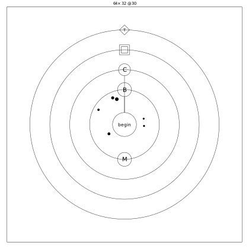

# 01 クイックスタート：四角を 1 つ動かす

> 所要 10 分。
> ゴールは、小さな `.jin` を走らせて画面で四角が動くのを見て、出力から「動いた」と判定できるようになることです。
> 前提：リポジトリで `uv sync` が済んでいること。

Jin v2 は、ブラウザで動く 2D のゲームや、動きのある図を作る言語です。
書いたプログラムは、そのまま魔法陣の図としても描けます。
業務システムのような、データベースやネットワークを使う処理には向きません（時計・通信・ファイルを扱う手段がありません）。

## 動かすもの

64 × 32 の画面で、白い四角が 1 フレームに 1 マスずつ右へ進むプログラムです。
走らせると、画面はこう変わります（左から 0・20・40 フレーム目）。


ファイルは [`examples/hello/hello.jin`](examples/hello/hello.jin) です。
`.jin` は JSON で、中にはまず次の部分があります。

<!-- source: examples/hello/hello.jin -->
```json
  "circles": [
    {
      "name": "Hello",
      "core": "begin",
      "state": [
        {
          "name": "x",
          "type": "num",
          "init": "0",
          "out": true
        }
      ],
```

このファイルには、**陣**（circle）が 1 つだけあります。
陣は、Jin のプログラムを組み立てる単位です。
関数とモジュールの中間のようなもので、自分の値と処理を持ちます。

この陣は、**記憶**（state）を 1 つ持っています。
記憶は陣が持ち続ける変数で、ここでは四角の横位置 `x` です。
`init` に書いた `0` から始まります。

## 1 フレームごとに呼ばれる手順

陣の処理は**手順**（rite）に書きます。
手順は関数に当たり、名前と、上から順に実行する**ステップ**の列を持ちます。

<!-- source: examples/hello/hello.jin -->
```json
        {
          "name": "move",
          "steps": [
            {
              "do": "set",
              "target": "x",
              "expr": "x + 1"
            },
            {
              "do": "cast",
              "target": "canvas.clear",
              "args": [
                "\"#000\""
              ]
            },
            {
              "do": "cast",
              "target": "canvas.rect",
              "args": [
                "x",
                "12",
                "8",
                "8"
              ]
            }
          ]
        }
```

ステップは、`do` で種類を決めた 1 つの命令です。
この手順は 3 つのステップで、四角を 1 マス進めて描き直します。

1. `set` は代入です。`x` を `x + 1` にします。
2. `cast` は呼び出しです。`canvas.clear` で画面を黒く塗りつぶします。
3. `canvas.rect` で、横 `x`・縦 12 の位置に 8 × 8 の四角を描きます。

`x + 1` や `"#000"` のように、値を書く文字列を**式**と呼びます。
式は JSON の文字列の中に書くので、文字列の値は `"\"#000\""` のように二重に囲みます。

この手順 `move` は、1 フレームに 1 回呼ばれます。
Jin では、この 1 フレームを **tick** と呼びます。

<!-- source: examples/hello/hello.jin -->
```json
      "boundary": {
        "on": [
          {
            "event": "tick",
            "rite": "move"
          }
        ]
      }
```

`"event": "tick"` は「tick ごとに `move` を呼ぶ」という指定です。
JavaScript の `addEventListener` に近い書き方です。
1 秒あたりの tick の数は `stage.fps`（ここでは 30）で決まります。

## ブラウザで動かす

エディタで開いて、「実行」を押すと四角が動きます。

```sh
uv run jin editor docs/specification-v2/examples/hello/hello.jin
```

エディタとプレイヤーは、事前に `apps/editor` と `apps/player` で `pnpm install && pnpm build` しておきます。
起動すると、ブラウザで開く URL が表示されます。

## 画面なしで確かめる

画面を出さずに確かめることもできます。
まず `jin check` で、ファイルに間違いが無いかを確かめます。

```sh
cd docs/specification-v2/examples
uv run jin check hello/hello.jin
```

<!-- output: hello-check -->
```
1 ファイル / error 0 件 / warning 0 件
```

error が 0 件なら、走らせることができます。
`jin run` は画面を出さずに、指定した tick の数だけ走らせます。

```sh
uv run jin run hello/hello.jin --ticks 3
```

<!-- output: hello-run -->
```
{"Hello.x": 3}
3 tick 走らせました（seed 0）
```

1 行目は、最後の tick が終わったときの `x` です。
3 tick 走らせて `x` が 3 なので、`move` が tick ごとに 1 回ずつ呼ばれたと分かります。
ここに出るのは、`"out": true` を付けた記憶だけです。

`jin run` は同じ入力なら毎回同じ結果を返すので、テストや CI で確かめるのに使えます。

## 魔法陣として見る

同じファイルを、魔法陣の図として描けます。

```sh
uv run jin render hello/hello.jin -o hello.svg
```



中心が、最初に走る手順 `begin` です。
すぐ外の環に手順が頭文字（B と M）で並び、その外の環に記憶 `x` が四角で描かれます。
図の読み方は 8 章にまとめてあります。

## 理解度チェック

<!-- quiz: run-and-judge -->
1. `jin run hello/hello.jin --ticks 100` の 1 行目は何になるでしょうか。そのとき、画面の四角はどこにありますか。

<details>
<summary>答え</summary>

`{"Hello.x": 100}` です。
画面の幅は 64 なので、四角は `x` が 56 を超えると右端からはみ出し始め、64 以上で見えなくなります。
`jin run` の値は増え続けますが、画面の外に描いたものは表示されません。

</details>

<!-- quiz: change-move -->
2. 四角を 2 倍の速さで動かすには、どこを変えますか。

<details>
<summary>答え</summary>

手順 `move` の `set` の式を `x + 2` にします。
`move` は tick ごとに 1 回呼ばれるので、1 回に進む量を変えれば速さが変わります。

</details>

<!-- quiz: read-parts -->
3. `hello.jin` の `"out": true` を消して `jin run` すると、1 行目はどうなるでしょうか。

<details>
<summary>答え</summary>

`{}` になります。
`jin run` が最後に出すのは `"out": true` の記憶だけなので、`x` は動いていても表示されません。
動いたかどうかを `jin run` の出力で判定したい値には、`"out": true` を付けます。

</details>

→ [02 1 枚の .jin の形](02-shape.md)
