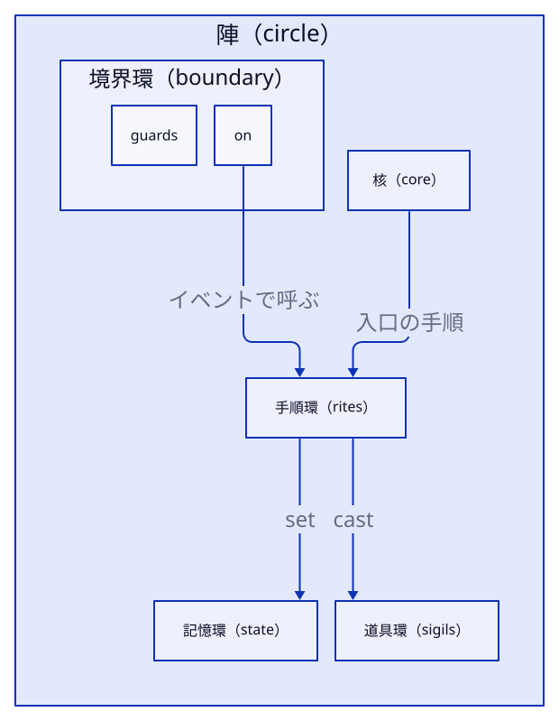

# 02 1 枚の .jin の形

> 12 分。
> ゴールは、`.jin` のどの欄に何を書くかを、表と図から引けるようになることです。
> 前提：1 章（陣・記憶・手順・ステップ・式・tick）。

## ファイルの一番外側

`.jin` の一番外側には、決まった欄が 6 つあります。

| 欄 | 必須 | 書くこと |
|---|---|---|
| `$schema` | 必須 | `"https://xtone.internal/jin/schemas/jin-v2.schema.json"`。エディタの補完にも使う |
| `version` | 必須 | `2`（この本の言語） |
| `root` | 必須 | 最初に動かす陣の名前 |
| `stage` | 必須 | 画面の大きさ `width` / `height`（16〜1024）、1 秒の tick 数 `fps`（既定 60）、乱数の種 `seed`（既定 0）、画像と音 `assets` |
| `forms` | 任意 | 型紙（この章の最後） |
| `circles` | 必須 | 陣の配列。1 つ以上 |

知らない欄を書くと、`jin check` が落とします。
綴りの間違いは、ここで見つかります。

## 陣の中身：核と 4 つの環

陣は、中心の**核**と、そのまわりの 4 つの環でできています。
魔法陣の図でも、この並びのまま描かれます。



| 部分 | 欄 | 書くこと | 上限 |
|---|---|---|---|
| 核 | `core` | 陣に入ったときに最初に走る手順の名前 | 1 つ |
| 手順環 | `rites` | 手順。`name`・引数 `params`・戻り値の型 `returns`・`steps` | 12 個 |
| 記憶環 | `state` | 記憶。`name`・`type`・初期値 `init`・`out`。`init` に書けるのは決まった値だけ（数・文字列・list・型紙と、組み込みの関数。`1 + 2` のような計算は書けない） | 12 個 |
| 道具環 | `sigils` | 手順から使える**道具**。`{"name": "canvas", "kind": "host", "host": "canvas"}` のように書く | 12 個 |
| 境界環 | `boundary` | 外から届く出来事への応答 `on` と、見張り `guards` | — |

上限の 12 は、図に描ける数から決めた約束です。
1 つの手順の直下のステップも 12 個までです。
足りなくなったら、手順や陣を分けます。

道具を宣言しないと、手順からその名前は使えません。
`canvas.rect` を使う陣は、道具環に `canvas` を置きます。
使える名前（`canvas`・`input`・`ui`・`audio`・`random` など）は 6 章にまとめてあります。

**境界**には、2 種類のものを置きます。

| 欄 | 書き方 | 意味 |
|---|---|---|
| `on` | `{"event": "tick", "rite": "count"}` | 出来事が届いたら手順を呼ぶ。出来事は `tick`・`key`・`pointer`・`message`・`exit` |
| `guards` | `{"assert": "score >= 0", "message": "…"}` | デバッグで走らせたとき、毎 tick の終わりに確かめる条件。偽なら記録を残す。実行は止めない |

`key` と `pointer` の出来事を受けるには、道具環に `input` が要ります。

## 核のある陣と、流れを持つ陣

陣には 2 種類あります。
これまでの陣は核を持ち、手順を走らせます。

もう 1 つは、核の代わりに**流れ**（`flow`）を持つ陣です。
流れの陣は自分では何もせず、ほかの陣を動かす順番だけを決めます。

<!-- source: examples/score/score.jin -->
```json
    {
      "name": "Game",
      "flow": {
        "kind": "parallel",
        "steps": [
          "Play",
          "Hud"
        ]
      }
    },
```

`Game` は `Play` と `Hud` を同時に動かします。
陣は `core` か `flow` の**どちらか一方**を持ちます。
流れの種類（`sequence`・`parallel`・`loop`）は 5 章で扱います。

## 公開：ほかの陣から読める記憶

[`examples/score/score.jin`](examples/score/score.jin) では、`Play` が Space の押された回数を `score` に数え、`Hud` がそれを画面に描きます。

<!-- source: examples/score/score.jin -->
```json
            {
              "do": "cast",
              "target": "canvas.text",
              "args": [
                "\"SCORE \" ++ str(Play.score)",
                "4",
                "4"
              ]
            }
```

`Hud` は、ほかの陣の記憶を `Play.score` のように `陣名.記憶名` で読みます。
読めるのは、`"out": true` を付けて**公開**した記憶だけです。
書き込みは、持ち主の陣からしかできません。

公開した記憶は、`jin run` の最後にも出ます。
`examples/score/space.jinrec` は、tick 1 に Space を押す記録です。

```sh
uv run jin run score/score.jin --input score/space.jinrec
```

<!-- output: score-run -->
```
{"Play.score": 1}
4 tick 走らせました（seed 0）
```

Space を 1 回押したので、`score` は 1 です。

<!-- exercise: ex-out -->
### 演習：公開を足す

[`examples/ex-out/start.jin`](examples/ex-out/start.jin) は、`score.jin` から `"out": true` を 1 つ消したものです。
`jin check` を通るように直してください。

```sh
uv run jin check ex-out/start.jin
```

<!-- output: ex-out-start -->
```
error JIN203: 陣 'Play' に公開 state 'score' はありません
  hint: Play の state 'score' に "out": true を付ける
```

<details>
<summary>答え</summary>

`Play` の記憶 `score` に `"out": true` を足します（[`examples/ex-out/answer.jin`](examples/ex-out/answer.jin)）。

<!-- output: ex-out-answer -->
```
1 ファイル / error 0 件 / warning 0 件
```

`Hud` が `Play.score` を読むには、`Play` 側で公開しておく必要があります。
エラーの位置（`start.jin:104:41`）は、読む側の `Hud` の式を指しています。
直すのは、読む側ではなく持ち主の側です。

</details>

## 型と型紙

記憶・引数・戻り値には型を書きます。

| 型 | 値 |
|---|---|
| `num` | 数（倍精度の浮動小数） |
| `bool` | `true` / `false` |
| `str` | 文字列 |
| `list<T>` | `T` の並び。0 始まり |
| 型紙の名前 | 自分で定義した組 |

**型紙**（`forms`）は、名前の付いた欄の組です。
ゲームの駒の位置と向きのように、まとめて扱いたい値に使います。

```json
"forms": [
  { "name": "Ball", "fields": [ { "name": "x", "type": "num" }, { "name": "y", "type": "num" } ] }
]
```

式では `Ball{x: 1, y: 2}` で作り、`ball.x` で欄を読みます。
作るときは、全部の欄を書きます。
ポインタの位置を表す型紙 `Pointer`（`x`・`y`・`down`）は、最初から使えます。

## 理解度チェック

<!-- quiz: find-field -->
1. 「Space を押したら音を鳴らす」陣を書きます。道具環と境界環に、それぞれ何を置きますか。

<details>
<summary>答え</summary>

道具環に `input`（Space を読む）と `audio`（音を鳴らす）を置きます。
境界環の `on` に `tick` で呼ぶ手順を置き、その手順で `input.pressed("Space")` を確かめます。
キーの出来事 `key` で受けるなら、やはり `input` が要ります。

</details>

<!-- quiz: fix-out -->
2. `Hud` の式が `Play.score` を読めないとき、直すのは `Hud` と `Play` のどちらですか。

<details>
<summary>答え</summary>

`Play` です。
`Play` の記憶 `score` に `"out": true` を付けて公開します。
演習「公開を足す」のエラーは読む側を指していましたが、原因は持ち主の側にありました。

</details>

→ [03 ステップと式](03-steps.md)
