# 04 時間の進み方：tick と待機

> 12 分。
> ゴールは、値がどの tick で変わるかを予想し、トレースで確かめられるようになることです。
> 前提：1 章（tick）、2 章（公開・境界）、3 章（ステップ）。

## 1 tick の中で起きること

Jin のプログラムは、tick を 1 つずつ進めて動きます。
1 つの tick の中では、いつも次の 7 段をこの順に行います。



順番を覚えておくと、値が変わる tick を予想できます。
特に効くのは次の 3 つです。

- 核の手順は、陣に入ったときに走ります。最初の陣はプログラムの起動時（tick −1）に入ります。
- `on` の `tick` で呼ぶ手順は、3 段目で毎 tick 走ります。
- 公開した記憶の値は、4 段目で確定します。

## 待機：tick をまたいで止まる

ふつうの関数は、呼ばれたら最後まで走ります。
Jin の手順は、`wait` で途中で止まり、後の tick で続きから再開できます。
これを**待機**と呼びます。

| 書き方 | 再開する tick |
|---|---|
| `{"do": "wait", "ticks": "3"}` | 3 tick 後 |
| `{"do": "wait", "until": "Play.score >= 10"}` | 条件が真になった tick |

[`examples/time/blink.jin`](examples/time/blink.jin) の核の手順は、3 tick ごとに `lit` を切り替えます。

<!-- source: examples/time/blink.jin -->
```json
              "steps": [
                {
                  "do": "wait",
                  "ticks": "3"
                },
                {
                  "do": "set",
                  "target": "lit",
                  "expr": "not lit"
                },
```

`while true` の繰り返しでも、`wait` があるので 1 つの tick が終わらなくなることはありません。
待機している間も、同じ陣の `on` には出来事が届きます。

`wait` は、核の手順と `on` で呼ぶ手順（と、そこから `cast` で呼んだ自分の陣の手順）にだけ書けます。
ほかの陣から `summon` で呼ばれる手順には書けません（5 章）。

`jin run --trace` は、何が起きたかを 1 行ずつ JSON で書き出します（トレース）。
止まった行と再開した行は、`"kind":"wait"` で記録されます。

```sh
uv run jin run time/blink.jin --ticks 10 --trace blink.jsonl
```

<!-- output: blink-trace -->
```
{"seq":2,"tick":-1,"circle":"Blink","kind":"wait","name":null,"pointer":"/circles/0/rites/0/steps/0/steps/0","input":{"ticks":3},"output":"suspend"}
{"seq":5,"tick":2,"circle":"Blink","kind":"wait","name":null,"pointer":"/circles/0/rites/0/steps/0/steps/0","input":{"ticks":0},"output":"resume"}
```

起動時（tick −1）に止まり、tick 2 で再開しています。

<!-- exercise: ex-wait -->
### 演習：点滅する tick を当てる

`blink.jin` を 10 tick 走らせたとき、`lit` が切り替わるのはどの tick でしょうか。
予想してから、トレースの `"name":"lit"` の行で確かめてください。

```sh
grep '"name":"lit"' blink.jsonl
```

<details>
<summary>答え</summary>

tick 2・5・8 です。

<!-- output: ex-wait-answer -->
```
"tick":2
"tick":5
"tick":8
```

起動時の tick −1 に `wait` で止まり、3 tick の終わりを越えた tick 2 で再開します。
その後は切り替えてすぐまた止まるので、3 tick ごとの 5 と 8 です。

</details>

## 二重バッファ：ほかの陣の値は 1 tick 遅れて見える

ほかの陣の公開した記憶を読むと、見えるのは**前の tick に確定した値**です。
同じ tick の中で書き換えられても、読む側には次の tick まで届きません。
この仕組みを**二重バッファ**と呼びます。

[`examples/time/buffer.jin`](examples/time/buffer.jin) では、`Writer` が毎 tick `n` を 1 増やし、`Reader` が毎 tick `Writer.n` を `seen` に写します。

```sh
uv run jin run time/buffer.jin --ticks 3
```

<!-- output: buffer-run -->
```
{"Writer.n": 3, "Reader.seen": 2}
```

`Writer.n` は 3 なのに、`Reader.seen` は 2 です。
`Reader` が読んだのは、4 段目で確定した 1 つ前の tick の値です。

このおかげで、陣を並べる順番を入れ替えても、読み取る値は変わりません。

## 決定性：同じ入力なら、同じ結果

Jin のプログラムは、同じファイル・同じ乱数の種・同じ入力なら、毎回まったく同じに動きます。
これを**決定性**と呼びます。

| 決まり | 理由 |
|---|---|
| 1 tick の長さは `1 / fps` 秒で固定 | 時計を読む手段が無い |
| 乱数は `stage.seed` から決まる | 種が同じなら同じ並び |
| 入力は tick の境目でまとめて渡る | tick の途中で入力が変わらない |

決定性があるので、エディタで録画したプレイ（`.jinrec`）を `jin run --input` で再生すると、同じトレースが出ます。
バグを見つけたら、録画を渡すだけで同じ場面を再現できます。

## 理解度チェック

<!-- quiz: predict-tick -->
1. `blink.jin` の `"ticks": "3"` を `"2"` に変えると、`lit` が最初に切り替わるのはどの tick でしょうか。

<details>
<summary>答え</summary>

tick 1 です。
起動時の tick −1 に止まり、2 tick の終わり（tick −1 と tick 0）を越えた tick 1 で再開します。
演習「点滅する tick を当てる」と同じ数え方です。

</details>

<!-- quiz: buffer-lag -->
2. `buffer.jin` を 10 tick 走らせると、`Reader.seen` は何になりますか。それはなぜですか。

<details>
<summary>答え</summary>

9 です。
`Reader` が読むのは、前の tick に確定した `Writer.n` なので、いつも 1 つ遅れます。

</details>

→ [05 陣をつなぐ](05-connect.md)
