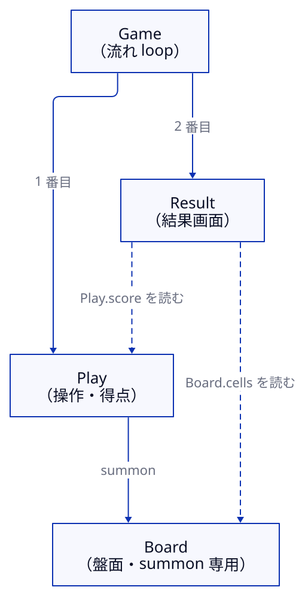

# 05 陣をつなぐ：流れと召喚

> 所要 12 分。
> ゴールは、複数の陣を順番に動かし、陣をまたいで手順を呼ぶ構成を、図とトレースから読めるようになることです。
> 前提：2 章（流れ・公開）、4 章（待機）。

## 流れの 3 つの種類

流れを持つ陣は、`steps` に並べた陣を動かす順番だけを決めます（2 章）。
種類は 3 つです。

| `kind` | 始まるとき | 子が終わったとき | 自分が終わるとき |
|---|---|---|---|
| `sequence` | 最初の子を始める | 次の子を始める | 最後の子が終わったら |
| `parallel` | 全員を並べた順に始める | 何もしない | 全員が終わったら |
| `loop` | 最初の子を始める | 次の子を始める。最後の子なら `exit` を確かめる | `exit` が真になったら |

子の陣が「終わる」のは、その陣の手順が `finish` を実行したときです。

## 例：3 回まわって終わる

[`examples/rounds/rounds.jin`](examples/rounds/rounds.jin) の `Game` は、`Play` → `Tally` を繰り返します。

<!-- source: examples/rounds/rounds.jin -->
```json
      "name": "Game",
      "flow": {
        "kind": "loop",
        "steps": [
          "Play",
          "Tally"
        ],
        "exit": "Tally.done"
      }
```

`exit` に書いた式が、繰り返しの**終了条件**です。
終了条件に書けるのは、公開した記憶だけです。

`Play` は 2 tick 待って `finish` し、`Tally` は周の数を数えて、3 周目に `done` を真にします。

```sh
uv run jin run rounds/rounds.jin
```

<!-- output: rounds-run -->
```
{"Play.turns": 1, "Tally.round": 3, "Tally.done": true}
6 tick 走らせました（seed 0、tick 5 で done）
```

3 周して tick 5 で終わりました。
ここで、`Play.turns` が 3 ではなく 1 であることに注目してください。

**`loop` が次の周に入るたびに、子の陣の記憶は `init` の値に戻ります。**
`Play` の `turns` は毎周 0 から数え直すので、最後も 1 です。

周をまたいで数えたい値は、流れの外の陣に置きます。
`Tally` の周の数は、流れに入っていない陣 `Lib` が持っています。

## 召喚：ほかの陣の手順を呼ぶ

`Tally` は、`Lib` の手順 `bump` を呼んで周の数を受け取ります。
ほかの陣の手順を呼ぶことを**召喚**と呼び、道具環に `summon` の道具を置きます。

<!-- source: examples/rounds/rounds.jin -->
```json
      "sigils": [
        {
          "name": "bump",
          "kind": "summon",
          "circle": "Lib",
          "rite": "bump"
        }
      ],
```

<!-- source: examples/rounds/rounds.jin -->
```json
            {
              "do": "cast",
              "target": "bump",
              "into": "round"
            },
```

召喚された手順は、呼ばれた陣の記憶を読み書きします。
`Lib` は一度も流れで始まっていませんが、記憶 `count` は 1 つあり、呼ばれるたびに増えます。

召喚には 2 つの決まりがあります。

- `cast` からだけ呼べます。式の中では呼べません（どの順で副作用が起きるかを、ステップの並びで見えるようにするため）。
- 召喚される手順には `wait` を書けません。陣をまたいで待つ仕組みはありません。

## 大きな例：tetris-plus

[`examples-v2/tetris-plus`](../../examples-v2/tetris-plus/tetris-plus.jin) は、4 つの陣でできています。



- `Game` は流れの陣で、`Play` → `Result` を繰り返します。
- `Board` は盤面と当たり判定を持つ陣で、流れには入っていません。`Play` が召喚で使います。
- `Result` は、`Play` と `Board` の公開した記憶を読んで結果を描きます。

1 つの陣に置ける手順は 12 個までなので、大きくなったら役割ごとに陣を分け、召喚でつなぎます。

## そのほかのつなぎ方

| 書き方 | すること | 気をつけること |
|---|---|---|
| `emit` ステップ | ほかの陣の `on message` に、引数付きで知らせる | 届くのは**次の tick**。相手が動いていなければ捨てられる |
| `transfer` ステップと `delegate` | `delegate` に書いた陣へ制御を渡す。相手が終わると戻る | 渡している間、自分は出来事を受けない |
| `agent` の道具 | v1 の陣（LLM のエージェント）に問いを出す | 答えはヘッドレスの `jin run` だけが返す。ブラウザでは届かない |

詳しい決まりは [`docs/spec/v2/model.md`](../spec/v2/model.md) の §3.2 / §3.4 / §3.6 にあります。

## 理解度チェック

<!-- quiz: read-flow -->
1. `rounds.jin` の `"exit": "Tally.done"` を `"exit": "Play.turns >= 3"` に変えると、どうなるでしょうか。

<details>
<summary>答え</summary>

終わらなくなります。
`Play.turns` は周のたびに `init` の 0 に戻り、最後の子 `Tally` が終わった時点では 1 なので、終了条件はずっと偽です。
周をまたぐ値は、`Lib` のように流れの外の陣に置きます。

</details>

<!-- quiz: choose-summon -->
2. 盤面の当たり判定を、`Play` と `Result` の両方から使いたいとします。判定の手順をどこに置き、どう呼びますか。

<details>
<summary>答え</summary>

流れに入らない陣（tetris-plus の `Board` のような陣）に置き、両方の陣の道具環に `summon` の道具を置いて `cast` で呼びます。
召喚される手順には `wait` を書けないので、判定は 1 tick の中で終わる形にします。

</details>

→ [06 能力の一覧](06-abilities.md)
