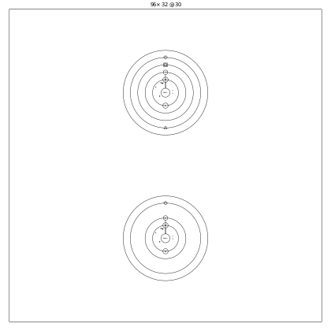
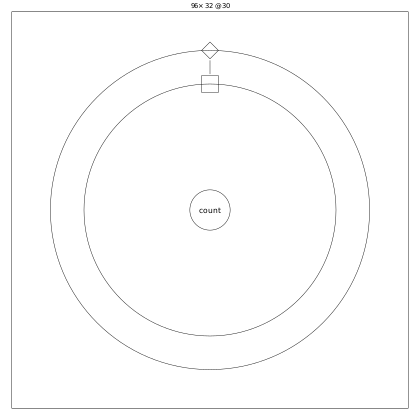
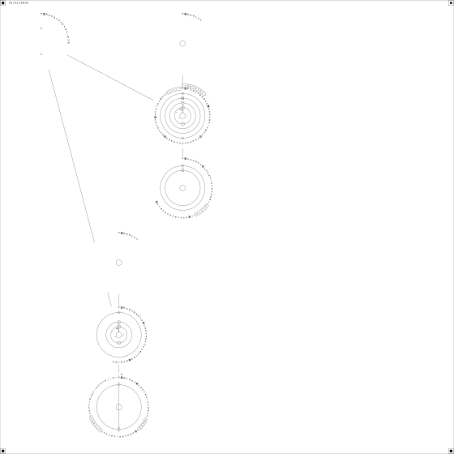
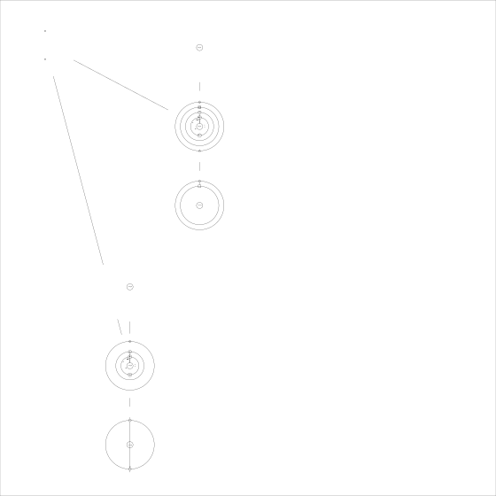

# 08 図として読む：4 つの見え方

> 所要 8 分（引く用の章）。
> ゴールは、確かめたいことに合わせて、`jin render` の見え方とエディタのモードを選べるようになることです。
> 前提：2 章（核・環）、3 章（ステップ）、5 章（流れ・召喚）。

## 1 つの .jin、4 つの見え方

`.jin` は、同じ中身をいくつかの図として描けます。
どれも `jin render` で描け、エディタも同じ図を使います。

| 見え方 | コマンド | 描かれるもの | 向いている問い |
|---|---|---|---|
| 既定の図 | `jin render x.jin` | root の陣と、その中の陣を 1 段だけ | 陣がどうつながっているか |
| 手順の図 | `jin render x.jin --focus 陣名/手順名` | 1 つの手順のステップ全部 | 手順が何をどの順にするか |
| 完全陣 | `jin render x.jin --full` | すべての陣・手順と、プログラムの全文（銘文） | 1 枚の絵にプログラムを丸ごと残す |
| 全景 | `jin render x.jin --panorama` | すべての陣と手順の図を 1 枚に（銘文なし） | 全部の手順を見渡す |

以下は、2 章の [`examples/score/score.jin`](examples/score/score.jin) を描いたものです。

## 既定の図

外の四角が額縁（`stage`）で、上に画面の大きさと fps が書かれます。
中の 2 つの陣が `Play` と `Hud` です。

既定の図が開くのは 1 段目までです。
陣の中の陣や手順の中身は、点か小さな円になります。
`--focus 陣名` で、その陣を中心に描き直せます。

## 手順の図

中心が手順の名前で、ステップは外の環から内へ、入れ子の深さの順に並びます。
いちばん外の環が手順の直下、1 つ内側が `if` や `loop` の中です。

ステップは形で見分けます。

| ステップ | 形 |
|---|---|
| `set` / `let` | 四角（`let` は小さい） |
| `cast` | 円。道具なら環の外へ、自分の手順なら内へ短い線、召喚なら破線 |
| `if` | 自分の印から、`then` の範囲へ実線、`else` の範囲へ破線 |
| `loop` | 多角形（`each` は星形） |
| `wait` | 環の欠け |
| `finish` / `return` / `break` | 環の外へ抜ける短い線（先端の形が違う） |

## 完全陣

**完全陣**は、プログラムのすべてを 1 枚に描いた図です。
陣と手順の図のまわりを、名前・式・数を紋と点の文字で書いた環（銘文）が巡ります。

完全陣を PNG にした画像は、`jin check x.png` で読み戻せます。
1 枚の絵が、そのまま `.jin` のもう 1 つの書き方になっています（[`docs/spec/v2/glyph.md`](../spec/v2/glyph.md)）。

## 全景

**全景**は、完全陣と同じ配置で、銘文を除いた図です。
既定の図では点になる手順の中身や、流れに入っていない陣も、全部描かれます。

エディタの鑑賞モードは、最初にこの全景を 3D で見せます。

## エディタの 3 つのモード

`uv run jin editor x.jin` で開くエディタには、3 つのモードがあります。

| モード | できること | 使う図 |
|---|---|---|
| 編集 | 図をクリックして欄を直す。ダブルクリックで陣や手順を開く | 既定の図・手順の図 |
| 実行 | ブラウザでゲームを動かし、録画して、tick を戻しながら記憶の値を見る | 同上（動いた場所が赤く強調される） |
| 鑑賞 | 魔法陣を 3D で見て、動画や画像に書き出す | 全景（陣や手順を開いている間はその図） |

## 理解度チェック

<!-- quiz: choose-view -->
1. tetris-plus（5 章）で、「`Board` の手順 `sweep` が、どの順にステップを実行するか」を確かめたいとき、どの見え方を使いますか。

答え

手順の図です。
`jin render x.jin --focus Board/sweep` で、その手順のステップを入れ子の深さの順に描けます。
既定の図では、手順の中身は小さな円にしか見えません。

<!-- quiz: why-full -->
2. 完全陣と全景の違いは何ですか。それぞれ、どんなときに使いますか。

答え

配置は同じで、完全陣にだけ銘文（プログラムの全文）があります。
プログラムを 1 枚の絵として残したり読み戻したりしたいときは完全陣、全部の陣と手順を見渡したいときは全景を使います。

