# Jin v2 でプログラムを書く

> 想定読者：変数・関数・if・ループ・リスト・JSON が分かり、Jin v2 で初めてプログラムを書く人（仮のペルソナ [`personas/jin-v2-newcomer.md`](../../personas/jin-v2-newcomer.md)）。
> 省いたもの：一般的なプログラミングと JSON の説明、実行系の内部（[`docs/execution-engine.md`](../execution-engine.md)）。
> 検証方法：本文に引用した出力と演習の答えは [`checks.json`](checks.json) のコマンドで再生成して照合しています。

この本は、Jin v2 の言語マニュアルです。
読み終えると、Jin v2 で小さなゲームを書き、動かし、間違いを自分で直せるようになります。

Jin v2 は、ブラウザで動く 2D のゲームや、動きのある図を作る言語です。
書いたプログラムは、そのまま魔法陣の図としても描けます。
時計・通信・ファイルを扱う手段が無いので、業務システムのような処理には向きません。
作れるものの例は [`examples-v2/`](../../examples-v2/)（テトリス・オセロ・クリッカーなど）にあります。

正確な定義（正典）は [`docs/spec/v2/`](../spec/v2/) にあります。
この本は、正典を読む前に全体の形をつかむための入口です。

## 章と、読み終えたらできること

| 章 | 読み終えたらできること | 時間 |
|---|---|---|
| [01 クイックスタート](01-quickstart.md) | 小さな `.jin` を検査して走らせ、動いたかを出力から判定する | 10 分 |
| [02 1 枚の .jin の形](02-shape.md) | やりたいことから、どの欄に何を書くかを決める（演習つき） | 12 分 |
| [03 ステップと式](03-steps.md) | 11 種のステップと式で手順を書き、`jin fmt` の結果を予想する | 12 分 |
| [04 時間の進み方](04-time.md) | 値が変わる tick を予想し、トレースで確かめる（演習つき） | 12 分 |
| [05 陣をつなぐ](05-connect.md) | 流れと召喚で、複数の陣を組み合わせる | 12 分 |
| [06 能力の一覧](06-abilities.md) | 画面・入力・音・乱数・保存の道具を、表から選ぶ | 8 分 |
| [07 間違いを見つけて直す](07-debug.md) | 診断と実行時エラーから、直す場所を決める（演習つき） | 12 分 |
| [08 図として読む](08-views.md) | 4 つの見え方とエディタのモードを使い分ける | 8 分 |

初めて読むときは 01〜05 を順に、書きながら引くときは 06〜08 と各章の表を使ってください。



矢印は「この章は、矢印の先の章で出てきた言葉を使う」を表します。

## 手元で確かめる

```sh
uv sync
cd docs/specification-v2/examples
uv run jin check hello score ex-out/answer.jin
```

本全体の検証（出力の照合・図の検査）は、explainer の `verify-book.mjs` で行います。
