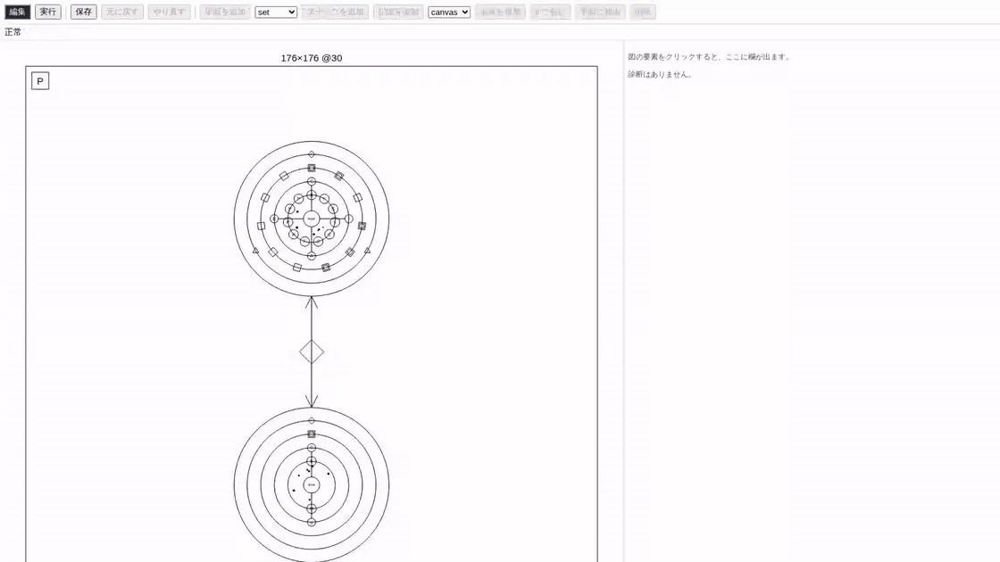

# テトリスを作りながらプログラミングを学ぶ — Jin v2 入門教材

[← README に戻る](../README.md) ／ [利用ガイド（v1・AI エージェント）](usage.md) ／ [完成形 `examples-v2/tetris/tetris.jin`](../examples-v2/tetris/tetris.jin)

この教材は、**プログラミングをこれから始める人**が、Jin v2 で**テトリス**を 1 本作り上げるまでを 9 段階に分けて案内します。段階ごとに「動く `.jin` ファイル」が用意してあり、どの段階からでもエディタで開いて遊べます。

プログラミングの入門書で必ず出てくる考え方 —— **変数、型、条件分岐、繰り返し、関数、リスト（配列）、構造体、イベント、デバッグ** —— を、テトリスの部品として順番に手に入れていきます。それぞれの段階で「なぜそれが要るのか」を、目の前で動くゲームの不足として先に体験してから、道具を導入する構成です。



---

## 対象読者と前提知識

- **対象**: プログラミング未経験、または他の言語を少し触ったことがある人。ゲームを題材に「プログラムがどう動くか」を掴みたい人
- **前提**: ターミナルでコマンドを打てること。[README のセットアップ](../README.md#エディタの実行方法)（`uv` / `pnpm`）を済ませて、`uv run jin editor …` でエディタが開くこと
- **要らないもの**: 数学の知識は四則演算と割り算の余りだけ。JSON を読んだことがなくても、この教材の中で慣れます

Jin v2 は、魔法陣の絵として描かれるビジュアル言語です。**ファイルの中身は JSON**（`{ "do": "set", … }` のような書き方）で、エディタは同じものを図として見せています。この教材では、正本である JSON の抜粋を示しつつ、実際に触るのはエディタという二本立てで進めます。

---

## 本教材の構成ファイル

段階ごとの `.jin` は [`docs/samples/tetris/`](samples/tetris/) にあります。番号順に「前の段階に少し足したもの」になっていて、最終段は `examples-v2/` の完成形とまったく同じファイルです。

| 段階 | ファイル | できるようになること | 学ぶこと |
|---|---|---|---|
| 1 | [`01-canvas.jin`](samples/tetris/01-canvas.jin) | 枠と 1 マスを描く | 舞台・座標・呼び出し（`cast`）・tick |
| 2 | [`02-fall.jin`](samples/tetris/02-fall.jin) | マスが下に落ちる | 記憶環（変数）・`set`・`loop while`・`wait` |
| 3 | [`03-move.jin`](samples/tetris/03-move.jin) | 矢印キーで左右に動く | `if`・真偽値・入力イベント |
| 4 | [`04-piece.jin`](samples/tetris/04-piece.jin) | 7 種のミノが落ちて回る | 型紙（構造体）・リストの表・添字の計算・局所変数・乱数 |
| 5 | [`05-fits.jin`](samples/tetris/05-fits.jin) | 壁を突き抜けなくなる | 引数と戻り値を持つ手順（関数）・早期 `return` |
| 6 | [`06-board.jin`](samples/tetris/06-board.jin) | 盤面に積もり、積み上がると終わる | 200 個のリスト・`push` / `clear`・添字への代入 |
| 7 | [`07-lines.jin`](samples/tetris/07-lines.jin) | 揃った行が消えて点が入る | 入れ子の繰り返し・アルゴリズム・表引き |
| 8 | [`08-controls.jin`](samples/tetris/08-controls.jin) | ソフト / ハードドロップ・次のミノの予告・音 | `break`・押しっぱなしの扱い・手順の再利用 |
| 9 | [`09-tetris.jin`](samples/tetris/09-tetris.jin) | ゲームオーバー画面から RETRY / QUIT | 陣の流れ（`flow`）・他の陣の値を読む・`assert` |

> [!NOTE]
> 9 本すべてが `jin check` / `jin fmt --check` を通り、ヘッドレスで走って実行時エラーを出さないこと、最終段が `examples-v2/tetris/tetris.jin` とバイト一致すること、本文の JSON 抜粋がサンプルからコピーされたままであることは、自動テスト [`tests/contract/test_docs_tetris_tutorial.py`](../tests/contract/test_docs_tetris_tutorial.py) が常時検証しています。

---

## 学び方

各段階は同じ手順で進めます。

1. **開いて遊ぶ**: `uv run jin editor docs/samples/tetris/<番号>-<名前>.jin` でエディタが開きます。上部の「編集」「実行」がモードの切り替えで、**「実行」を押すと右側に実行パネルが出てゲームが動きます**（ゲームの画面を一度クリックしてからキーを押してください）
2. **図を読む**: 魔法陣の手順環には手順（`rite`）が**頭文字の印**（`paint` なら P）で並び、中央には核の手順の名前が出ます。印をクリックすると右側に名前が出て、**ダブルクリックするとその手順のステップの図**（ステップが輪になって並ぶ）に切り替わります。戻るのは上部の「focus を外す」。本文の JSON 抜粋と見比べてください
3. **変えてみる**: 「編集」モードでステップの図のステップをクリックすると、右側のパネルに `Do` / `Target` / `Args` などの欄が出ます。書き換えて Enter で確定すると、「実行」に切り替えたときにその変更が反映されています（走っている途中の状態は保ったまま。「編集しても状態を保つ」が既定で入っています）。ファイルに書き戻すのは上部の「保存」ボタンで、押すと「保存しました: …」と出ます。次に開くときのために保存しておきましょう
4. **練習問題**: 各節の末尾にあります。答えは次の段階のファイルの中にあることも、ありません（自分で考える問題）とも書いてあります

エディタを使わずに、ターミナルだけで走らせることもできます（画面は出ませんが、最後の状態が表示されます）。

```bash
uv run jin run docs/samples/tetris/01-canvas.jin --ticks 60
```

---

## 目次

0. [準備 — プログラムが動く仕組み](#0-準備--プログラムが動く仕組み)
1. [舞台に描く](#1-舞台に描く)
2. [記憶と時間 — マスを落とす](#2-記憶と時間--マスを落とす)
3. [入力と分岐 — キーで動かす](#3-入力と分岐--キーで動かす)
4. [型紙と表 — 7 種のミノ](#4-型紙と表--7-種のミノ)
5. [当たり判定 — 手順に名前をつける](#5-当たり判定--手順に名前をつける)
6. [盤面はリスト — 積もる](#6-盤面はリスト--積もる)
7. [行を消す — 入れ子の繰り返し](#7-行を消す--入れ子の繰り返し)
8. [操作の仕上げ](#8-操作の仕上げ)
9. [結果画面 — 陣の流れ](#9-結果画面--陣の流れ)
10. [デバッグ — 動きを目で追う](#10-デバッグ--動きを目で追う)
11. [発展課題と用語対応表](#11-発展課題と用語対応表)

---

## 0. 準備 — プログラムが動く仕組み

### 0-1. 動かす

README のセットアップが済んでいれば、次の 2 行で第 1 段階が開きます（プレイヤーのビルドは v2 のゲームを動かすのに要ります）。

```bash
cd apps/player && pnpm install --frozen-lockfile && pnpm build && cd ../..
uv run jin editor docs/samples/tetris/01-canvas.jin
```

ブラウザに魔法陣が出れば準備完了です。上部の「実行」を押すと、右側に黒い画面（実行パネル）が出てゲームが動き始めます。図に戻って直すときは「編集」を押します。

### 0-2. 3 つの言葉

Jin v2 のプログラムは 3 種類の部品でできています。教材の中で何度も出てくるので、先に名前だけ覚えてください。

| Jin の言葉 | 一般のプログラミングで言うと | この教材での役割 |
|---|---|---|
| **舞台**（`stage`） | 画面 | 176 × 176 の小さな画面。1 秒に 30 回描き直す（`fps: 30`） |
| **陣**（`circle`） | オブジェクト / 画面（シーン） | ゲームの 1 場面。記憶と手順と道具を持つ |
| **手順**（`rite`） | 関数 | ステップ（命令）の並び。名前で呼べる |

陣の中はさらに 4 つの環に分かれます。**記憶環**（`state`：変数）、**道具環**（`sigils`：画面や入力などの機能）、**手順環**（`rites`）、**境界環**（`boundary`：イベントと検査）。エディタの魔法陣で、内側から順に描かれています。

### 0-3. tick — プログラムの時間

ゲームは「1 秒に 30 回、同じことを繰り返す」ことで動いています。この 1 回を **tick** と呼びます。30 fps なら 1 tick は 1/30 秒、30 tick で 1 秒です。

- **核**（`core`）に指定した手順は、陣が始まるときに **1 回だけ**呼ばれます。長く動かしたければ、その中で待ったり繰り返したりします。核の手順が終わっても陣は終わりません。陣を終えるのは **`finish`** というステップです
- **`on tick`** に登録した手順は、**毎 tick** 呼ばれます。画面はここで描きます

「核で時間を進め、`on tick` で描く」。この教材のすべての段階がこの形です。

---

## 1. 舞台に描く

**ファイル**: [`docs/samples/tetris/01-canvas.jin`](samples/tetris/01-canvas.jin)

開くと、暗い背景に灰色の枠、その中に黒い盤面、左上寄りに水色のマスが 1 つ描かれます。10 秒経つと止まります。

### 1-1. 座標

画面の左上が原点 `(0, 0)`、右へ行くほど x が増え、**下へ行くほど y が増えます**（算数のグラフと上下が逆です）。テトリスの盤面は横 10 マス × 縦 20 マス。1 マスを 8 × 8 の大きさにして、盤面の左上を `(8, 8)` に置きます。すると

- 列 `c`、行 `r` のマスの左上は `(8 + c * 8, 8 + r * 8)`
- マスは 7 × 7 で描く（1 だけ隙間を空けて格子に見せる）

### 1-2. 呼び出し（`cast`）

画面に描くには、道具環の `canvas`（画面）に「描いて」と頼みます。頼むステップが **`cast`**（呼び出し）です。手順 `paint` の最後の 2 ステップを見てください。

<!-- excerpt: docs/samples/tetris/01-canvas.jin -->
```json
{
  "do": "cast",
  "target": "canvas.ink",
  "args": [
    "\"#4ce0e6\""
  ]
},
{
  "do": "cast",
  "target": "canvas.rect",
  "args": [
    "8 + 3 * 8",
    "8 + 0 * 8",
    "7",
    "7"
  ]
}
```

- `target` は「誰の何を呼ぶか」。`canvas.ink` は色を決める、`canvas.rect` は塗り四角
- `args` は引数（渡す値）の並び。**すべて式**なので、`"8 + 3 * 8"` のように計算を書けます。これは列 3・行 0 のマス、つまり `(32, 8)` です
- 色は `"#4ce0e6"` のような文字列。JSON の文字列の中に式を書くので、式の中の文字列は `\"…\"` と引用符をエスケープします（エディタでは `"#4ce0e6"` と打つだけで済みます）

`paint` の先頭では `canvas.clear` で画面全体を塗りつぶし、枠と盤面の黒を描いています。**画面は tick ごとに白紙に戻る**ので、残したいものは毎 tick 描き直します。だから `paint` は `on tick` に登録してあります。

### 1-3. 核の手順と `wait`

核の手順 `begin` はステップが 2 つだけです。

<!-- excerpt: docs/samples/tetris/01-canvas.jin -->
```json
{
  "name": "begin",
  "steps": [
    {
      "do": "wait",
      "ticks": "300"
    },
    {
      "do": "finish"
    }
  ]
}
```

`wait` は「指定した tick 数だけ待つ」。300 tick = 10 秒待ってから **`finish`** で陣を終えます。この陣は root（いちばん外の陣）なので、終わるとゲーム全体が終わり、`on tick` も呼ばれなくなって画面はそこで止まります。10 秒で止まるのはそのためです。

`finish` を消すとどうなるでしょう。核の手順は 10 秒で終わりますが、**陣は終わらず** `paint` は毎 tick 呼ばれ続けます。「核の手順が終わること」と「陣が終わること」は別で、陣を終えるのは `finish` だけです。ターミナルで確かめると、`finish` があれば `300 tick 走らせました（seed 3、tick 299 で done）`、無ければ頼んだ tick 数を最後まで走ります。

### 練習問題

1. マスの色を変えてください（`#f2d541` は黄色）。「編集」モードで手順環の P（`paint`）をダブルクリック → 色のステップ（`canvas.ink`）を選ぶ → 右のパネルの `Args` を書き換えて Enter → 「保存」→「実行」で確かめる
2. マスを盤面の右下（列 9・行 19）に置いてください。座標を計算してから書き、思った場所に出るか確かめてください
3. `wait` の tick 数を 60 にして、何秒で止まるか数えてください
4. `finish` のステップを消して、止まらなくなることを確かめてください（ステップを選んで削除）

---

## 2. 記憶と時間 — マスを落とす

**ファイル**: [`docs/samples/tetris/02-fall.jin`](samples/tetris/02-fall.jin)

マスが 0.5 秒に 1 段ずつ落ち、底に着くと 1 秒後に止まります。

### 2-1. 記憶環（変数）

第 1 段階ではマスの位置を `3` と `0` の数で直接書きました。動かすには「今どこにいるか」を**覚えておく場所**が要ります。それが記憶環の **state** で、一般には「変数」と呼ばれるものです。

<!-- excerpt: docs/samples/tetris/02-fall.jin -->
```json
{
  "name": "x",
  "type": "num",
  "init": "3",
  "out": true
},
{
  "name": "y",
  "type": "num",
  "init": "0",
  "out": true
}
```

- `name` は名前、`type` は**型**（どんな種類の値か）。`num` は数です。他に `bool`（真偽）、`str`（文字列）、`list<num>`（数の並び）などがあります。型を決めておくと、数のつもりの場所に文字列を入れるような間違いを、走らせる前に `jin check` が見つけてくれます
- `init` は最初の値。`out: true` は「外から見える」印で、`jin run` の最後の表示やデバッグの表に出ます

`paint` の四角の座標は `"8 + x * 8"`, `"8 + y * 8"` に変わりました。x と y が変われば、描く場所が変わります。

### 2-2. `set` と `loop while` と `wait`

核の手順 `begin` が時間を進めます。

<!-- excerpt: docs/samples/tetris/02-fall.jin -->
```json
{
  "name": "begin",
  "steps": [
    {
      "do": "set",
      "target": "y",
      "expr": "0"
    },
    {
      "do": "loop",
      "kind": "while",
      "cond": "y < 19",
      "steps": [
        {
          "do": "wait",
          "ticks": "15"
        },
        {
          "do": "set",
          "target": "y",
          "expr": "y + 1"
        }
      ]
    },
    {
      "do": "wait",
      "ticks": "30"
    },
    {
      "do": "finish"
    }
  ]
}
```

読み方はこうです。

1. **`set`**（代入）: `y` を `0` にする
2. **`loop while`**（条件つき繰り返し）: `y < 19` が真の間、中のステップを繰り返す
   - 15 tick（0.5 秒）待つ
   - `y` を `y + 1` にする。**`y + 1` は「今の y に 1 を足した値」で、それを y に入れ直す**。プログラミングで最初につまずく形ですが、「右の式を計算してから左に入れる」と読めば大丈夫です
3. y が 19 になったら繰り返しを抜け、30 tick 待って **`finish`**（陣を終える）

大事なのは、**`wait` の間も `on tick` の `paint` は毎 tick 呼ばれている**ことです。核の手順は「y を増やしてから 0.5 秒眠る」を繰り返しているだけで、描くのは別の手順の仕事。役割を分けると、それぞれが短く読めます。

### 2-3. ターミナルで確かめる

```bash
uv run jin run docs/samples/tetris/02-fall.jin --ticks 400
```

```
{"Play.x": 3, "Play.y": 19}
315 tick 走らせました（seed 3、tick 314 で done）
```

400 tick 走らせるつもりが 315 tick で終わっています。19 段 × 15 tick + 最後の 30 tick = 315。`out: true` の x と y の最後の値も出ています。**画面を見なくても、数で動きを確かめられる**のがヘッドレス実行の良さです。

### 練習問題

1. 落ちる速さを 2 倍にしてください（`wait` の値をどうすれば？）。`jin run` の tick 数がどう変わるか予想してから走らせてください
2. マスを右に動かしながら落としてください（`y + 1` のステップの隣に `x` を増やすステップを足す）。列 9 を超えるとどうなりますか
3. `y < 19` を `y < 25` にすると何が起きますか。画面の外に描くと、どうなるのでしょう

---

## 3. 入力と分岐 — キーで動かす

**ファイル**: [`docs/samples/tetris/03-move.jin`](samples/tetris/03-move.jin)

← → でマスが左右に動き、↓ を押している間は速く落ちます。底に着くと上に戻って繰り返します。「実行」モードで、ゲームの画面を一度クリックしてからキーを押してください。

### 3-1. `if` — 条件分岐

「左キーが押されたら x を減らす」を書くのが **`if`** です。`on tick` に登録する手順を `control` に変え、こう書きました。

<!-- excerpt: docs/samples/tetris/03-move.jin -->
```json
{
  "name": "control",
  "steps": [
    {
      "do": "if",
      "cond": "input.pressed(\"ArrowLeft\") and x > 0",
      "then": [
        {
          "do": "set",
          "target": "x",
          "expr": "x - 1"
        }
      ]
    },
    {
      "do": "if",
      "cond": "input.pressed(\"ArrowRight\") and x < 9",
      "then": [
        {
          "do": "set",
          "target": "x",
          "expr": "x + 1"
        }
      ]
    },
    {
      "do": "if",
      "cond": "input.key(\"ArrowDown\") and y < 19",
      "then": [
        {
          "do": "set",
          "target": "y",
          "expr": "y + 1"
        }
      ]
    },
    {
      "do": "cast",
      "target": "paint"
    }
  ]
}
```

- `cond` は**真偽値**（`bool`：真 `true` か偽 `false`）になる式。`x > 0` は比較、`and` は「両方が真のとき真」。他に `or`（どちらかが真）、`not`（反転）があります
- `then` は真のときに走るステップの並び。偽のときのステップは `else` に書きます
- `x > 0` を付けているのは、**左端でさらに左に行かないため**。付けないとどうなるか、外して試してみてください（画面の外に消えます）

道具環に `input`（入力）が増えました。**道具は使う陣が宣言する**決まりで、宣言していない陣は `input.…` を書けません（`jin check` が指摘します）。

### 3-2. `pressed` と `key` の違い

- `input.pressed("ArrowLeft")`: **この tick に押された瞬間**だけ真。押しっぱなしでは 1 回きり。1 回押して 1 マス動くものに使います
- `input.key("ArrowDown")`: **押されている間ずっと**真。押している間 30 tick に 30 段落ちる（速すぎるので、第 8 段階で 3 tick に 1 段にします）

キーの名前は `ArrowLeft` / `ArrowRight` / `ArrowUp` / `ArrowDown` / `Space` / `KeyA` …（ブラウザの `KeyboardEvent.code` と同じ）。名前を打ち間違えると、エディタが赤く指摘します。

### 3-3. 手順から手順を呼ぶ

`control` の最後は `cast paint`。**自分の陣の手順も `cast` で呼べます**。「入力を処理する」と「描く」を別の手順に分けたまま、1 tick の中で順に走らせています。

核の `begin` は `loop while true`（永遠に繰り返す）になり、底に着いたら `else` で `y` を 0 に戻します。ファイルを開いて `if` の `else` を確かめてください。

### 練習問題

1. ↑ を押したらマスが一番上（`y = 0`）に戻るようにしてください（`pressed` と `key` のどちらが向いていますか）
2. `x > 0` の条件を外すと、左端でどうなりますか。`jin run` に録画を渡して確かめる方法は [§10](#10-デバッグ--動きを目で追う) にあります
3. 「押している間、右に動き続ける」を作ってください。速すぎると感じたら、どう遅くしますか（ヒント：第 8 段階の `soft` の仕組み）

---

## 4. 型紙と表 — 7 種のミノ

**ファイル**: [`docs/samples/tetris/04-piece.jin`](samples/tetris/04-piece.jin)

1 マスの代わりに、7 種類のテトリミノ（I / O / T / S / Z / J / L）が色つきで落ち、↑ で回ります。底に着くと、次のミノがランダムに出ます。

ただし **壁がありません**。← を押し続けると盤面の左に突き抜けます。これはわざと残してあり、第 5 段階で直します。

### 4-1. 型紙（構造体） — まとまった値

ミノには「種類」「向き」「位置 x」「位置 y」の 4 つの値があります。4 つの state を別々に持つ代わりに、**型紙**（`form`）で 1 つの型にまとめます。一般には「構造体」や「レコード」と呼ばれるものです。

<!-- excerpt: docs/samples/tetris/04-piece.jin -->
```json
{
  "name": "Piece",
  "fields": [
    {
      "name": "kind",
      "type": "num"
    },
    {
      "name": "rot",
      "type": "num"
    },
    {
      "name": "x",
      "type": "num"
    },
    {
      "name": "y",
      "type": "num"
    }
  ]
}
```

state の `piece` はこの型で、初期値は `Piece{kind: 0, rot: 0, x: 3, y: 0}` と書きます。各値は `piece.x` のように**点**でたどります。`set` の `target` に `piece.y` と書けば、y だけを書き換えられます。

### 4-2. 表 — 形をリストに入れる

7 種 × 4 方向の形を、`if` を 28 個並べて描くのは無理があります。代わりに、**全部の形を 1 本の数のリストに並べておき、計算で取り出します**。state の `shapes`（型 `list<num>`）です。

決めごとはこうです。

- ミノは 4 マスでできている。各マスの相対座標 `(cx, cy)` を 2 つの数で並べる
- 1 つの形 = 4 マス × 2 = **8 個の数**
- 1 種類 = 4 方向 × 8 = **32 個の数**
- 7 種類 = **224 個の数**

種類 `kind`・向き `rot`・何マス目 `i`（0〜3）の x 座標は、リストの何番目でしょうか。

```
((kind * 4 + rot) * 4 + i) * 2        ← x
((kind * 4 + rot) * 4 + i) * 2 + 1    ← y
```

例えば T（kind 2）の向き 1 の 3 マス目なら `((2 * 4 + 1) * 4 + 2) * 2 = 76` 番目が x、77 番目が y です。リストは **0 番目から**数えます（`shapes[0]` が最初の数）。この「並べ方を決めて、添字で取り出す」のはプログラミングの基本技で、画像やマップデータもみな同じ考え方で持たれています。

色も同じく `colors`（`list<str>`）に 7 つ並べ、`colors[kind]` で引きます。

### 4-3. 局所変数 `let` と `loop count`

底に着いたかを調べる手順 `touches` を見てください。

<!-- excerpt: docs/samples/tetris/04-piece.jin -->
```json
{
  "name": "touches",
  "returns": "bool",
  "steps": [
    {
      "do": "let",
      "name": "kind",
      "expr": "piece.kind"
    },
    {
      "do": "let",
      "name": "rot",
      "expr": "piece.rot"
    },
    {
      "do": "loop",
      "kind": "count",
      "name": "i",
      "times": "4",
      "steps": [
        {
          "do": "let",
          "name": "cy",
          "expr": "piece.y + shapes[((kind * 4 + rot) * 4 + i) * 2 + 1]"
        },
        {
          "do": "if",
          "cond": "cy >= 19",
          "then": [
            {
              "do": "return",
              "expr": "true"
            }
          ]
        }
      ]
    },
    {
      "do": "return",
      "expr": "false"
    }
  ]
}
```

- **`let`** はその手順の中だけで使う**局所変数**。state と違って陣には残らず、手順が終わると消えます。`kind` と `rot` を先に取り出しておくと、添字の式が短くなります
- **`loop count`** は「回数を決めた繰り返し」。`name: i` に 0, 1, 2, 3 が順に入ります（0 始まり）
- `returns: bool` は「この手順は真偽値を返す」宣言。`return` で値を返してその場で手順を抜けます。4 マスのどれかが行 19（一番下）にあれば `true`、全部見て無ければ `false`

呼ぶ側（核の `begin`）はこうです。

<!-- excerpt: docs/samples/tetris/04-piece.jin -->
```json
{
  "do": "let",
  "name": "bottom",
  "expr": "false"
},
{
  "do": "cast",
  "target": "touches",
  "into": "bottom"
},
{
  "do": "if",
  "cond": "bottom",
  "then": [
    {
      "do": "cast",
      "target": "spawn"
    }
  ],
  "else": [
    {
      "do": "set",
      "target": "piece.y",
      "expr": "piece.y + 1"
    }
  ]
}
```

`cast` の **`into`** は戻り値の入れ先。「`touches` を呼んで、答えを `bottom` に入れる」です。受け皿の `let` を先に置く必要があります。

### 4-4. 乱数と剰余

`spawn`（新しいミノを出す）は `Piece{kind: random.range(0, 6), rot: 0, x: 3, y: 0}` を `piece` に入れます。道具環の `random` の `range(0, 6)` は **0 以上 6 以下**の整数をランダムに返します（両端を含みます）。

↑ で回すのは `(piece.rot + 1) % 4`。`%` は割り算の**余り**で、3 の次が 0 に戻ります。「4 で割った余り」は「0〜3 をぐるぐる回る」の常套句です。

乱数は `stage.seed`（このファイルでは 3）で決まります。**同じ seed なら毎回同じ順でミノが出る**ので、後でデバッグするときに「あのときの並び」を再現できます。

### 練習問題

1. 回転を反時計回りにしてください（`+ 1` の代わりに何を足せば `% 4` で 1 つ戻りますか。ヒント：`+ 3`）
2. 最初のミノを I（kind 0）に固定してください（`random.range` をどう書き換える？）
3. `shapes` の最初の 8 個の数 `0, 1, 1, 1, 2, 1, 3, 1` は I の向き 0 です。どんな形か紙に描いてください。次の 8 個（向き 1）はどうなるはずですか

---

## 5. 当たり判定 — 手順に名前をつける

**ファイル**: [`docs/samples/tetris/05-fits.jin`](samples/tetris/05-fits.jin)

壁を突き抜けなくなりました。壁ぎわで回せないときは回りません。

### 5-1. 同じ検査を 4 か所でしたい

第 4 段階には「底に着いたか」の検査しかなく、左右と回転は無条件に動かしていました。正しくは、**動かす前に「動いた先が収まるか」を確かめる**必要があります。しかも同じ検査を、左・右・回転・落下の 4 か所で。

同じことを 4 回書くと、直すときも 4 回直すことになり、1 か所直し忘れて壊れます。そこで**検査に名前をつけて 1 か所に書き、4 か所から呼びます**。これが「関数」を作る動機です。Jin では引数（`params`）と戻り値（`returns`）を持つ手順です。

<!-- excerpt: docs/samples/tetris/05-fits.jin -->
```json
{
  "name": "fits",
  "params": [
    {
      "name": "kind",
      "type": "num"
    },
    {
      "name": "rot",
      "type": "num"
    },
    {
      "name": "x",
      "type": "num"
    },
    {
      "name": "y",
      "type": "num"
    }
  ],
  "returns": "bool",
  "steps": [
    {
      "do": "loop",
      "kind": "count",
      "name": "i",
      "times": "4",
      "steps": [
        {
          "do": "let",
          "name": "cx",
          "expr": "x + shapes[((kind * 4 + rot) * 4 + i) * 2]"
        },
        {
          "do": "let",
          "name": "cy",
          "expr": "y + shapes[((kind * 4 + rot) * 4 + i) * 2 + 1]"
        },
        {
          "do": "if",
          "cond": "cx < 0 or cx >= 10 or cy >= 20",
          "then": [
            {
              "do": "return",
              "expr": "false"
            }
          ]
        }
      ]
    },
    {
      "do": "return",
      "expr": "true"
    }
  ]
}
```

`fits(kind, rot, x, y)` は「この種類・向き・位置に置いたら盤面に収まるか」を答えます。ポイントは、**今のミノではなく「置いてみたい仮の値」を引数で受ける**こと。だから「1 つ左に動かしたら？」を `fits(piece.kind, piece.rot, piece.x - 1, piece.y)` と、動かす前に訊けます。

`cx < 0 or cx >= 10 or cy >= 20` は「左の壁の外、右の壁の外、底より下のどれか」。4 マスのどれか 1 つでも当てはまれば即 `false` を返して手順を抜けます（**早期リターン**）。4 つとも大丈夫なら最後の `return true`。

### 5-2. 「訊いてから動く」の形

`control` の左移動はこうなりました。

<!-- excerpt: docs/samples/tetris/05-fits.jin -->
```json
{
  "do": "if",
  "cond": "input.pressed(\"ArrowLeft\")",
  "then": [
    {
      "do": "cast",
      "target": "fits",
      "args": [
        "piece.kind",
        "piece.rot",
        "piece.x - 1",
        "piece.y"
      ],
      "into": "ok"
    },
    {
      "do": "if",
      "cond": "ok",
      "then": [
        {
          "do": "set",
          "target": "piece.x",
          "expr": "piece.x - 1"
        }
      ]
    }
  ]
}
```

「左が押された → 1 つ左が収まるか `fits` に訊く → 収まるなら動かす」。右・回転・落下も同じ形で、変わるのは `fits` に渡す仮の値だけです。回転では `let r = (piece.rot + 1) % 4` と仮の向きを作ってから訊いています。

### 5-3. 手順を分ける理由 — Jin の 3 つの上限

Jin にはわざと設けた上限が 3 つあります。エディタが赤で指摘します。

| 上限 | 診断 | 意味 |
|---|---|---|
| 1 つの手順の直下は **12 ステップ**まで | JIN210 | 長い手順は読めない。分けて名前をつける |
| `if` / `loop` の入れ子は **3 段**まで | JIN211 | 深い入れ子は追えない。内側を手順に出す |
| 局所変数の名前は手順の中で **1 回だけ**、state と同じ名前も不可 | JIN010 | 「どの `i` ？」で悩まない |

「12 を超えそう」「4 段目が要りそう」は、**手順を分けるべき合図**です。この教材の完成形も、`control` から `fall` / `hardDrop` / `paintBoard` / `paintPanel` を切り出したのはこの上限に当たったからです（切り出す前は 18 ステップ・4 段ありました）。

`returns` のある手順は、**どの道を通っても最後に `return` で終わる**ように書きます（`fits` の末尾の `return true` がそれ）。

### 練習問題

1. 上限 `cy >= 20` を `cy >= 19` にすると何が変わりますか。実際に試して、底の 1 行が使えなくなることを確かめてください
2. ミノを画面の上端（`y = -1`）から出したいとします。`fits` は上にはみ出すのを許していますか（`cy < 0` の検査が無いのはなぜ？）。描く側の `paint` にある `cy >= 0` の `if` と合わせて考えてください
3. 「回転で壁にぶつかったら 1 つ左にずらして回してみる」（ウォールキック）を `control` に足してください。`fits` を何回呼ぶことになりますか

---

## 6. 盤面はリスト — 積もる

**ファイル**: [`docs/samples/tetris/06-board.jin`](samples/tetris/06-board.jin)

底や他のミノの上に着くと固定され、次のミノが出ます。上まで積み上がると止まります（画面が動かなくなったら終わりです）。

### 6-1. 200 個の数

盤面 10 × 20 = 200 マスの「空か、何色のブロックか」を覚える必要があります。200 個の state を作る代わりに、**1 本のリスト** `board`（`list<num>`）に並べます。値は `0` が空、`1`〜`7` が色（種類 + 1）です。

行 `r`・列 `c` のマスは `board[r * 10 + c]`。逆に添字 `i` から行と列を出すには `floor(i / 10)`（割り算の商）と `i % 10`（余り）。第 4 段階の `shapes` と同じ「並べ方を決めて計算で引く」考え方です。

核の `begin` の頭で、盤面を空にしてから 200 個の `0` を詰めます。

<!-- excerpt: docs/samples/tetris/06-board.jin -->
```json
{
  "do": "cast",
  "target": "clear",
  "args": [
    "board"
  ]
},
{
  "do": "loop",
  "kind": "count",
  "name": "i",
  "times": "200",
  "steps": [
    {
      "do": "cast",
      "target": "push",
      "args": [
        "board",
        "0"
      ]
    }
  ]
}
```

`clear`（空にする）と `push`（末尾に足す）はリストを書き換える組み込みの操作で、`cast` で呼びます（他に `removeAt` があります）。state の `init` は `"[]"`（空のリスト）にしてあり、始まるたびにここで 200 個にします。

### 6-2. 固定する — 添字への代入

落ちられなくなったミノを盤面に写すのが `lock` です。

<!-- excerpt: docs/samples/tetris/06-board.jin -->
```json
{
  "do": "loop",
  "kind": "count",
  "name": "i",
  "times": "4",
  "steps": [
    {
      "do": "let",
      "name": "cx",
      "expr": "piece.x + shapes[((kind * 4 + rot) * 4 + i) * 2]"
    },
    {
      "do": "let",
      "name": "cy",
      "expr": "piece.y + shapes[((kind * 4 + rot) * 4 + i) * 2 + 1]"
    },
    {
      "do": "if",
      "cond": "cy >= 0",
      "then": [
        {
          "do": "set",
          "target": "board[cy * 10 + cx]",
          "expr": "kind + 1"
        }
      ]
    }
  ]
}
```

`set` の `target` に `board[cy * 10 + cx]` と書くと、**リストのその場所だけ**を書き換えます。4 マスそれぞれについて、盤面の対応する場所に「種類 + 1」を入れる。これで、ミノが盤面の一部になりました。

`fits` には 1 行足しました：`cy >= 0 and board[cy * 10 + cx] != 0` なら `false`。**壁だけでなく、すでに置かれたブロックも「収まらない」**と答えるようになり、ミノが他のミノの上に止まります。落下・左右・回転の呼び出し側は 1 文字も変えていません。第 5 段階で検査を 1 か所にまとめておいた効果です。

### 6-3. 終わりを決める

新しいミノを出す `spawn` は、出した直後に `fits` で「出た場所に収まるか」を訊き、収まらなければ state の `over` を `true` にします。核の繰り返しは `loop while not over` なので、そこで抜けて `finish`。`control` の先頭にも `if over → return` を置き、終わった後はキーを無視します。

盤面を描く `paintBoard` は、色ごとに 200 マスを走査する `paintColor(c)` を 7 回呼びます。

<!-- excerpt: docs/samples/tetris/06-board.jin -->
```json
{
  "do": "if",
  "cond": "board[i] == c + 1",
  "then": [
    {
      "do": "cast",
      "target": "canvas.rect",
      "args": [
        "8 + i % 10 * 8",
        "8 + floor(i / 10) * 8",
        "7",
        "7"
      ]
    }
  ]
}
```

添字 `i` から `i % 10`（列）と `floor(i / 10)`（行）を出して座標にしています。「マスごとに色を変えて描く」ではなく「色ごとにそのマスだけ描く」のは、色を変える回数を 7 回に抑えるためです（デバッグのトレースが短くなります・[§10](#10-デバッグ--動きを目で追う)）。

### 練習問題

1. `placed`（置いたミノの数）が `out: true` です。`uv run jin run docs/samples/tetris/06-board.jin --ticks 3000` で、操作しないと何個置いたところで終わるか見てください
2. 固定されたブロックの色を全部灰色にしてください（`lock` で `kind + 1` の代わりに何を入れる？ `paintColor` はどう変わる？）
3. 盤面を 12 列にするには、どこを直す必要がありますか。`10` が出てくる場所を全部数えてください。「マジックナンバー」を state にまとめたくなったら、それが正解です

---

## 7. 行を消す — 入れ子の繰り返し

**ファイル**: [`docs/samples/tetris/07-lines.jin`](samples/tetris/07-lines.jin)

横一列が揃うと消えて上が下がり、SCORE と LINES が増えます。5 行消すごとに落ちるのが速くなります。

### 7-1. アルゴリズムを言葉で書く

コードにする前に、日本語で手順を書きます。

1. 上の行から順に、各行について
   1. その行の 10 マスを全部見て、空（0）が 1 つでもあれば「揃っていない」
   2. 揃っていれば、その行より上の全部を 1 段下に写し、一番上の行を空にする。消した数を 1 増やす
2. 消した数が 1 以上なら、点を足し、消した行数を足し、速さを更新する

これをそのまま `clearLines` にしました。

<!-- excerpt: docs/samples/tetris/07-lines.jin -->
```json
{
  "do": "loop",
  "kind": "count",
  "name": "r",
  "times": "20",
  "steps": [
    {
      "do": "let",
      "name": "full",
      "expr": "true"
    },
    {
      "do": "loop",
      "kind": "count",
      "name": "c",
      "times": "10",
      "steps": [
        {
          "do": "if",
          "cond": "board[r * 10 + c] == 0",
          "then": [
            {
              "do": "set",
              "target": "full",
              "expr": "false"
            }
          ]
        }
      ]
    },
    {
      "do": "if",
      "cond": "full",
      "then": [
        {
          "do": "loop",
          "kind": "count",
          "name": "k",
          "times": "r * 10",
          "steps": [
            {
              "do": "let",
              "name": "i",
              "expr": "r * 10 - 1 - k"
            },
            {
              "do": "set",
              "target": "board[i + 10]",
              "expr": "board[i]"
            }
          ]
        },
        {
          "do": "loop",
          "kind": "count",
          "name": "c2",
          "times": "10",
          "steps": [
            {
              "do": "set",
              "target": "board[c2]",
              "expr": "0"
            }
          ]
        },
        {
          "do": "set",
          "target": "cleared",
          "expr": "cleared + 1"
        }
      ]
    }
  ]
}
```

読みどころが 3 つあります。

- **「全部が非 0 か」は「0 が 1 つでもあるか」の裏返し**。`full` を `true` で始めて、0 を見つけたら `false` にする。全部見終わって `true` のままなら揃っています
- **上を 1 段下げるときは、下から順に写す**。`k` が 0, 1, 2, … と進むと `i = r * 10 - 1 - k` は揃った行の直前のマスから**逆順**に進み、`board[i + 10] = board[i]` で 1 行下（添字 +10）に写します。上から順に写すと、写した先をこれから写す元として読んでしまい、同じ行が下まで続きます（試すと面白い間違いです）
- **入れ子は 3 段**。`r` の繰り返し → `if full` → `k` の繰り返し。ここが上限です（[§5-3](#5-3-手順を分ける理由--jin-の-3-つの上限)）。局所変数も `c` と `c2` で名前を変えています

なお、揃った行を消した後に同じ `r` を見直していないので、2 行同時に揃うと上の行が下がってきて次の `r` で拾われます。**上から順に見る**ので、これで 4 行同時消し（テトリス）まで正しく数えられます。

### 7-2. 表引きと速さ

消した数から点を出すのに、`if` を 4 つ並べる代わりに**表**を使います。

```
let bonus = [0, 100, 300, 500, 800]
score = score + bonus[cleared]
```

1 行 100 点、2 行 300 点、…、4 行 800 点。「数から値を引く」はリストの得意技です。

速さは `speed = max(4, 15 - floor(lines / 5))`。5 行ごとに 1 tick 速くなり、4 tick より速くはならない（`max` は大きい方）。核の `wait` は第 6 段階まで `15` と直書きでしたが、state の `speed` に変えました。

`paintPanel` は右側に `SCORE` / `LINES` の文字と数を描きます。`canvas.text` は文字列しか受けないので、数は `str(score)` で文字列にします。

### 練習問題

1. 得点表を `[0, 40, 100, 300, 1200]` に変えてください（初代の得点）。表引きの良さは、こういう変更が 1 行で済むことです
2. `k` の繰り返しで `i = r * 10 - 1 - k` を `i = k` にして、行が消えたときに何が起きるか見てください。なぜそうなるかを、紙に 3 行ほどの盤面を描いて追ってください
3. 「消した行数」ではなく「置いたミノの数」（`placed`）で速くなるようにしてください

---

## 8. 操作の仕上げ

**ファイル**: [`docs/samples/tetris/08-controls.jin`](samples/tetris/08-controls.jin)

↓ でソフトドロップ（3 tick に 1 段）、Space でハードドロップ（一気に落として固定）、右側に NEXT（次のミノ）、固定と行消しに音が付きました。

### 8-1. 押しっぱなしを間引く

第 3 段階で `input.key` は「押している間ずっと真」でした。毎 tick 1 段落とすと速すぎるので、state の `soft` で数えて 3 回に 1 回だけ落とします。

<!-- excerpt: docs/samples/tetris/08-controls.jin -->
```json
{
  "do": "if",
  "cond": "input.key(\"ArrowDown\")",
  "then": [
    {
      "do": "set",
      "target": "soft",
      "expr": "soft + 1"
    },
    {
      "do": "if",
      "cond": "soft % 3 == 0",
      "then": [
        {
          "do": "cast",
          "target": "fall"
        }
      ]
    }
  ]
}
```

`soft % 3 == 0` は「3 の倍数のときだけ」。第 4 段階の `% 4` と同じ余りの技です。「1 段落ちる（落ちられなければ何もしない）」は核の重力と同じ処理なので、手順 `fall` に切り出して両方から呼びます。

### 8-2. `break` — 途中で抜ける

ハードドロップは「落ちられる限り落として、固定する」。何段落ちるかは事前に分からないので、`loop while true` で回し、落ちられなくなったら **`break`** で抜けます。

<!-- excerpt: docs/samples/tetris/08-controls.jin -->
```json
{
  "name": "hardDrop",
  "steps": [
    {
      "do": "let",
      "name": "ok",
      "expr": "false"
    },
    {
      "do": "loop",
      "kind": "while",
      "cond": "true",
      "steps": [
        {
          "do": "cast",
          "target": "fits",
          "args": [
            "piece.kind",
            "piece.rot",
            "piece.x",
            "piece.y + 1"
          ],
          "into": "ok"
        },
        {
          "do": "if",
          "cond": "not ok",
          "then": [
            {
              "do": "break"
            }
          ]
        },
        {
          "do": "set",
          "target": "piece.y",
          "expr": "piece.y + 1"
        }
      ]
    },
    {
      "do": "cast",
      "target": "lock"
    }
  ]
}
```

`while true` は「抜ける条件は中に書く」形。`break` は直近の `loop` を抜けます（`loop` の外に書くとエディタが指摘します）。無限ループが心配になりますが、`fits` はいつか必ず `false` を返す（底があるので）ので終わります。もし本当に終わらない繰り返しを書いても、Jin は 1 tick あたりの命令数に上限があり、実行時エラーとして止まります。

### 8-3. 次のミノの予告

第 6 段階から `spawn` は「次の種類」を state の `next` に先に決めていました。`paintPanel` はそれを右側に描きます。添字は `(next * 16 + i) * 2`。第 4 段階の式 `((kind * 4 + rot) * 4 + i) * 2` で `rot = 0` としたものと同じです（`kind * 4 * 4 = kind * 16`）。

`audio.tone(220, 30)` は 220 Hz を 30 ミリ秒。固定で低い音、行消しで高い音（660 Hz）を鳴らします。道具環に `audio` を足しました。

`control` はこれで 9 ステップ。12 の上限が近づいています。次に何か足すなら、まず切り出す手順を考えるところです。

### 練習問題

1. ↓ を押した瞬間にも 1 段落ちるようにしてください（`pressed` の `if` を 1 つ足す）。押した瞬間と押しっぱなしの両方が要る理由を説明できますか
2. 4 行同時に消したときだけ違う音を鳴らしてください（`clearLines` の `cleared` を見る）
3. ハードドロップの落ちた段数 × 2 点を足してください（何段落ちたかを数える局所変数が要ります）

---

## 9. 結果画面 — 陣の流れ

**ファイル**: [`docs/samples/tetris/09-tetris.jin`](samples/tetris/09-tetris.jin)（= [`examples-v2/tetris/tetris.jin`](../examples-v2/tetris/tetris.jin)）

積み上がると GAME OVER の画面になり、RETRY で最初から、QUIT で終わります。これが完成形です。

### 9-1. 陣を並べる — `flow`

これまで陣は `Play` 1 つでした。結果画面を `Play` の中に `if over` で書くこともできますが、**場面が違うものは陣を分ける**方が読みやすくなります。陣を 2 つ以上使うときは、順番を決める**核なし陣**を root に置きます。

<!-- excerpt: docs/samples/tetris/09-tetris.jin -->
```json
{
  "name": "Game",
  "flow": {
    "kind": "loop",
    "steps": [
      "Play",
      "Result"
    ],
    "exit": "Result.quit"
  }
}
```

`Game` は手順を持たず、「`Play` が終わったら `Result`、`Result` が終わったらまた `Play`」を `Result.quit` が真になるまで繰り返す、と**流れ**（`flow`）だけを書きます。`Play` の核が `finish` で終わる（積み上がる）と、自動的に `Result` が始まります。

### 9-2. 他の陣の値を読む

`Result` は暗くした盤面の上に GAME OVER と得点を描きます。盤面は `Play` の記憶ですが、**`out: true` の state は `陣名.名前` で他の陣から読めます**。`Result` の `menu` は `Play.board[i]` と `Play.score` を読んでいます（書き換えはできません。自分の記憶は自分だけが変えます）。

`Play` の `board` / `score` / `lines` を最初から `out: true` にしていたのはこのためです（ついでに `jin run` の出力にも出ます）。

### 9-3. ボタン

`ui.button("RETRY", 100, 96, 64, 20)` は「ラベル・位置・大きさ」でボタンを描き、**その tick にクリックされたら真**を返します。`if` の条件にそのまま書けます。

<!-- excerpt: docs/samples/tetris/09-tetris.jin -->
```json
{
  "do": "if",
  "cond": "ui.button(\"RETRY\", 100, 96, 64, 20)",
  "then": [
    {
      "do": "finish"
    }
  ]
},
{
  "do": "if",
  "cond": "ui.button(\"QUIT\", 100, 124, 64, 20)",
  "then": [
    {
      "do": "set",
      "target": "quit",
      "expr": "true"
    },
    {
      "do": "finish"
    }
  ]
}
```

RETRY は `Result` を `finish` するだけ。すると `flow` が次の `Play` を始め、`Play` の核 `begin` が得点や盤面を最初の値に戻します（第 6 段階で `begin` の頭に `set` を並べたのは、**2 周目のため**でもあったのです）。QUIT は `quit` を `true` にしてから終えるので、`flow` の `exit` が真になりゲーム全体が終わります。

`Result` の核 `show` は、`quit` を `false` に戻して（2 周目のため）少し待つだけの短い手順です。`menu` は `on tick` なので、`show` が待っている間もボタンは毎 tick 描かれ、押せます（[§2-2](#2-2-set-と-loop-while-と-wait) の「`wait` の間も `on tick` は走る」と同じ理屈です）。

### 9-4. 検査 — `assert`

境界環に **guard**（検査）を 2 つ足しました。

<!-- excerpt: docs/samples/tetris/09-tetris.jin -->
```json
{
  "assert": "len(board) == 0 or len(board) == 200",
  "message": "盤面は 10 × 20"
},
{
  "assert": "score >= 0 and lines >= 0",
  "message": "得点と消した行数は負にならない"
}
```

`assert` は「いつでも真のはずの式」。毎 tick 検査され、偽になると「実行」モードのエディタにバッジが出ます。プログラムを止めるためではなく、**「自分がそう信じていること」を書いておいて、壊れたときに気づくため**のものです。練習問題で盤面を 12 列にしたら、最初の検査が教えてくれます。

### 練習問題

1. `Result` の背景の色を変えて、`Play` の盤面が暗く透けて見える理由（`Play.board[i] != 0` のマスを灰色で描いている）を確かめてください
2. ゲームオーバー画面に「置いたミノの数」（`Play.placed`）を足してください
3. `flow` の `steps` を `["Play"]` だけにして、`exit` を `Play.over`… としたいところですが、`over` は `out` ではありません。どう直せば `Result` 無しで終われるでしょう（`out: true` にする、あるいは `exit` の式を変える）

---

## 10. デバッグ — 動きを目で追う

プログラムは思ったとおりには動かず、書いたとおりに動きます。「何が起きたか」を見る道具が 3 つあります。

### 10-1. トレース — 全部の記録

```bash
uv run jin run docs/samples/tetris/09-tetris.jin --ticks 60 --debug --trace /tmp/t.jsonl
head -3 /tmp/t.jsonl
```

```
{"seq":0,"tick":-1,"circle":"Play","kind":"enter","name":"Play","pointer":"/circles/1", … }
{"seq":1,"tick":-1,"circle":"Play","kind":"rite","name":"begin","pointer":"/circles/1/rites/0", … }
{"seq":2,"tick":-1,"circle":"Play","kind":"set","name":"score","pointer":"/circles/1/rites/0/steps/0", … "output":0}
```

1 行が 1 つの出来事です。「どの陣の、どの手順の、どのステップが、何を代入したか」が全部残ります。`grep '"set"' /tmp/t.jsonl | grep score` で得点の変化だけを追う、といった使い方ができます。`--frames /tmp/f.jsonl` を足すと、毎 tick の描画命令の一覧も残ります。

### 10-2. 録画と再生

キー操作を録画すれば、**同じことをもう一度起こせます**。乱数は seed で決まっているので、録画（`.jinrec`）を渡すと完全に同じ展開になります。

```
{"jinrec": 1, "file": "tetris.jin", "seed": 3, "fps": 30, "ticks": 60}
{"tick": 2, "kind": "key", "name": "Space", "down": true}
{"tick": 3, "kind": "key", "name": "Space", "down": false}
```

このような 1 行 1 イベントのファイルを `--input` で渡します。上は「tick 2 で Space を押し、tick 3 で離す」。エディタの実行パネルで**録画**を押してから遊び、**「録画を止めて書き出す」**を押すと、同じ形式のファイルがダウンロードされます。

```bash
uv run jin run docs/samples/tetris/08-controls.jin --input space.jinrec
```

§3 の練習問題 2「`x > 0` を外すとどうなるか」は、← を 6 回押す録画を作って `03-move.jin` に渡せば、`Play.x` が負になるのを数で確かめられます。

### 10-3. エディタでスクラブする

エディタの**「実行」モード**では、実行パネルで**録画**を押して遊び、**「録画を止めて書き出す」**で止めてから「この録画を再生」を押すと、その録画の全トレースが読み込まれます。下のスライダー（`upto`）を動かすと、

- 魔法陣の上で、その時点に走ったステップが光る
- 脇の表に、記憶環の値（`board` の 200 個の数、`piece` の中身、`score`…）がその時点の値で出る
- 画面がその時点の絵に戻る

「行が消えたはずなのに得点が増えない」のような問題は、`clearLines` が呼ばれた瞬間までスライダーを戻し、`cleared` と `board` の値を見れば原因が分かります。冒頭の動画がこの操作です。

走らせている間のトレースは 4000 行までで古いものから消えます（テトリスは 1 tick に約 90 行出るので、約 45 tick、1.5 秒弱ぶん）。長く追いたいときは、録画を再生し直してください（6 万行まで読めます）。

---

## 11. 発展課題と用語対応表

### 発展課題

完成形を土台に、自分の機能を足してみてください。難しい順ではありません。

- **ゴースト**: ハードドロップで落ちる先を薄い色で描く（`hardDrop` の繰り返しを「落ちる先を求める」手順に分けて、`paintBoard` からも呼ぶ）
- **ホールド**: Shift で今のミノを取っておき、次に交換する（state `hold` と、`spawn` の分岐）
- **レベル表示**: `floor(lines / 5)` を `paintPanel` に描く
- **ハイスコア**: 道具環の `storage`（記憶。ブラウザを閉じても残る）に最高得点を保存する。[`docs/spec/v2/abilities.md` §8](spec/v2/abilities.md)
- **ウォールキック**: 回転が壁にぶつかったら左右に 1 ずらして再試行（§5 の練習問題 3）
- **7 種が均等に出る袋**: 7 種を 1 つずつ並べたリストをシャッフルして順に出す（`random.range` で入れ替え）

### 用語対応表

| プログラミング一般 | Jin v2 | この教材で初めて出た段階 |
|---|---|---|
| 画面・キャンバス | 舞台 `stage`、道具 `canvas` | 1 |
| 関数呼び出し | `cast`（`target` と `args`） | 1 |
| ゲームループ・フレーム | tick・`on tick` | 1 |
| 変数 | 記憶環 `state`（`name` / `type` / `init`） | 2 |
| 代入 | `set`（`target` と `expr`） | 2 |
| 型 | `num` / `bool` / `str` / `list<…>` / 型紙の名前 | 2, 4 |
| while ループ | `loop` `kind: while` | 2 |
| スリープ・待機 | `wait`（`ticks` または `until`） | 2 |
| 条件分岐 | `if`（`cond` / `then` / `else`） | 3 |
| 真偽値・論理演算 | `bool`、`and` / `or` / `not` | 3 |
| イベントハンドラ | 境界環の `on`（`event` と `rite`） | 3 |
| 構造体・レコード | 型紙 `form`、`Piece{…}`、`piece.x` | 4 |
| 配列・添字 | `list<num>`、`shapes[i]`（0 始まり） | 4 |
| 局所変数 | `let` | 4 |
| for ループ | `loop` `kind: count`（`times` と `name`） | 4 |
| 乱数 | 道具 `random`、`random.range(lo, hi)` | 4 |
| 関数の引数・戻り値 | 手順の `params` / `returns`、`return`、`cast … into` | 5 |
| 配列への書き込み | `set` の `target` に `board[i]`、`push` / `clear` / `removeAt` | 6 |
| 二重ループ | `loop` の入れ子（3 段まで） | 7 |
| ルックアップテーブル | `bonus[cleared]`、`colors[kind]` | 7, 4 |
| break | `break` | 8 |
| シーン・状態機械 | 核なし陣の `flow`、`finish` | 9 |
| 公開プロパティ | `out: true`、`陣名.名前` | 9 |
| アサーション | 境界環の `guards`（`assert` / `message`） | 9 |
| ログ・デバッガ | `--trace`、録画 `.jinrec`、エディタのスクラブ | 10 |

言語の正確な仕様は [`docs/spec/v2/`](spec/v2/)（[モデル](spec/v2/model.md)・[式](spec/v2/expr.md)・[道具](spec/v2/abilities.md)・[実行](spec/v2/runtime.md)）にあります。教材で触れなかったもの（`each` ループ、`emit` / `transfer` による陣どうしのやりとり、`wait until`、`summon`、文字入力、`storage`）はそちらへ。
