# テトリスを作りながらプログラミングを学ぶ — Jin v2 入門チュートリアル

[← README に戻る](../README.md) ／ [利用ガイド（v1・AI エージェント）](usage.md) ／ [完成形 `examples-v2/tetris/tetris.jin`](../examples-v2/tetris/tetris.jin)

このチュートリアルは、**WebフロントエンドやWeb制作の経験を持つエンジニア**が、ビジュアル言語「Jin v2」の言語仕様を基礎から体系的に理解し、**テトリスをゼロから実装できるようになる**までの道のりを 9 段階で案内します。

プログラミングとゲーム開発の核となる概念 —— **状態（変数）、型、条件分岐、ループ、関数、配列（リスト）、構造体（オブジェクト）、イベント、シーン管理、デバッグ** —— を、テトリスの機能を組み立てる過程で順番に手に入れていきます。

各段階には「実際に動く `.jin` ファイル」が用意されており、エディタで直接動かして動作を確認しながら、**「なぜその仕組みが必要なのか」をゲームの課題として先に体感してから新しい言語仕様を学ぶ（Progressive Disclosure: 段階的開示）** 構成になっています。


---

## 対象読者と前提知識

- **対象読者**:
  - HTML/CSS/JavaScript などの基礎知識があり、新しい言語仕様やゲームプログラミングの仕組みを学びたい Web エンジニア
  - プログラミングの基礎構造（変数・制御構文・データ構造・関数設計）を、ゲーム制作を通じて実践的にマスターしたい方
  - ビジュアル言語 Jin v2 の宣言的なアーキテクチャと設計思想を理解したい方
- **前提知識**:
  - ターミナルで基本的なコマンド（`cd`, `uv` など）を実行できること
  - [README のセットアップ](../README.md#エディタの実行方法)（`uv` / `pnpm`）を済ませて、`uv run jin editor …` でエディタが起動できること
- **数学の前提知識**:
  - 四則演算（`+`, `-`, `*`, `/`）と割り算の余り（`%`）のみ。高度な数学や物理演算は不要です。

> [!NOTE]
> Jin v2 はビジュアル言語で、プログラムはエディタ上で「魔法陣」の図として表現されます（ファイルの実体は宣言的な JSON ですが、本チュートリアルで JSON を読み書きすることはありません）。
> Web開発における「HTML `<canvas>` の描画」「コンポーネント構造」「ステート管理（State）」「イベントリスナー」に近いメンタルモデルを持つため、Webエンジニアなら直感的に構造を理解できます。本チュートリアルのコード例は、**`jin render` が描いた手順の図**と、**その手順の各ステップをエディタで選んだときに右パネルに出る内容の一覧**の組で示します。

---

## 本教材の構成ファイル

学習用のサンプルコードは [`docs/samples/tetris/`](samples/tetris/) に配置されています。1 段階進むごとに前のコードへ機能が積み上げられ、最終段（第 9 段階）は実稼働する完成版ゲーム（`examples-v2/tetris/tetris.jin`）と完全に一致します。

| 段階 | サンプルファイル | できるようになること | 新しく学ぶ言語仕様と概念 |
|:---:|---|---|---|
| 1 | [`01-canvas.jin`](samples/tetris/01-canvas.jin) | 盤面の枠と 1 マスを描く | 舞台（`stage`）・座標系・道具の呼出（`cast`）・tick |
| 2 | [`02-fall.jin`](samples/tetris/02-fall.jin) | マスが一定時間ごとに自然落下する | 記憶環（`state` / 変数）・代入（`set`）・条件ループ（`loop while`）・待機（`wait`） |
| 3 | [`03-move.jin`](samples/tetris/03-move.jin) | 矢印キーで左右移動・高速落下する | 条件分岐（`if`）・真偽値と論理演算・入力イベント（`input.pressed` / `input.key`） |
| 4 | [`04-piece.jin`](samples/tetris/04-piece.jin) | 7 種のミノがカラーで出現し回転する | 型紙（`form` / 構造体）・配列（`list`）・添字計算・ローカル変数（`let`）・回数ループ（`loop count`）・乱数 |
| 5 | [`05-fits.jin`](samples/tetris/05-fits.jin) | 壁やすり抜けを防ぐ当たり判定 | 引数と戻り値を持つ手順（関数）・早期リターン（`return`）・Jin の 3 つの設計制約 |
| 6 | [`06-board.jin`](samples/tetris/06-board.jin) | ミノが着地して盤面に積もる | 盤面配列（200 要素）・配列操作（`push` / `clear`）・添字代入・ゲームオーバー判定 |
| 7 | [`07-lines.jin`](samples/tetris/07-lines.jin) | 横一列が揃うと消滅し、得点が入る | 二重ループ・配列シフトアルゴリズム・表引き（ルックアップテーブル） |
| 8 | [`08-controls.jin`](samples/tetris/08-controls.jin) | ハードドロップ・NEXT 予告・効果音 | ループ脱出（`break`）・入力のスロットリング・音（`audio`） |
| 9 | [`09-tetris.jin`](samples/tetris/09-tetris.jin) | 結果画面と RETRY / QUIT ボタン | シーン遷移（`flow`）・陣をまたぐ公開変数の参照・UI ボタン（`ui.button`）・検査（`assert`） |

> [!NOTE]
> 9 本のサンプルはすべて `jin check`（静的型・構造検査）および `jin fmt --check`（コード整形検査）を通過し、ヘッドレス実行で実行時エラーが発生しないことが保証されています。また、最終段は `examples-v2/tetris/tetris.jin` とバイト単位で完全一致します。本文の図と一覧はサンプルから生成したもの（`scripts/generate_tutorial_figures.py`）で、ずれていないことをテスト [`tests/contract/test_docs_tetris_tutorial.py`](../tests/contract/test_docs_tetris_tutorial.py) が常時検証しています。

---

## 学び方

各段階は、次の 4 つのステップで進めます。

1. **開いて遊ぶ（実行モード）**:
   - `uv run jin editor docs/samples/tetris/<番号>-<名前>.jin` でビジュアルエディタが起動します。
   - 上部メニューの **「実行」** をクリックすると、右側に黒い実行パネルが現れてゲームが動き始めます（ゲーム画面を一度クリックしてフォーカスを当ててからキーを押してください）。
2. **図とコードを読む（編集モード）**:
   - 上部メニューの **「編集」** をクリックすると、魔法陣の図面編集モードに切り替わります。
   - 魔法陣の手順環には手順（`rite`）が**頭文字の印**（`paint` なら `P`）で並び、中央には核の手順名が表示されます。
   - 印を 1 回クリックすると右パネルに手順名が表示され、**ダブルクリックするとその手順の内部ステップの図**（ステップが輪になって並ぶ展開ビュー）に切り替わります。元の図に戻るには上部の **「focus を外す」** を押します。本文の図と一覧は、この展開ビューと右パネルに対応しています。見比べてみてください。
3. **書き換えて試す（ホットリロード & 保存）**:
   - 「編集」モードでステップをクリックすると、右パネルに `Do` / `Target` / `Args` / `Expr` などのプロパティ入力欄が現れます。
   - 数値や式を書き換えて `Enter` を押すと確定します。「実行」モードに切り替えると、走っている途中の状態を保ったまま即座に変更が反映されます（「編集しても状態を保つ」が既定で有効です）。
   - ファイルに保存するには、上部の **「保存」** ボタンを押します（「保存しました: …」と通知されます）。
4. **練習問題で定着させる**:
   - 各節の末尾に課題を用意しています。エディタ上で実際に書き換えて挙動の変化を確かめてみましょう。

ターミナルから画面を表示せずに直接走らせる（ヘッドレス実行）ことも可能です：

```bash
uv run jin run docs/samples/tetris/01-canvas.jin --ticks 60
```

---

## 目次

0. [準備 — プログラムが動く仕組み](#0-準備--プログラムが動く仕組み)
1. [舞台に描く](#1-舞台に描く)
2. [記憶と時間 — マスを落とす](#2-記憶と時間--マスを落とす)
3. [入力と分岐 — キーで動かす](#3-入力と分岐--キーで動かす)
4. [型紙と表 — 7 種のミノ](#4-型紙と表--7-種のミノ)
5. [当たり判定 — 手順に名前をつける](#5-当たり判定--手順に名前をつける)
6. [盤面はリスト — 積もる](#6-盤面はリスト--積もる)
7. [行を消す — 入れ子の繰り返し](#7-行を消す--入れ子の繰り返し)
8. [操作の仕上げ](#8-操作の仕上げ)
9. [結果画面 — 陣の流れ](#9-結果画面--陣の流れ)
10. [デバッグ — 動きを目で追う](#10-デバッグ--動きを目で追う)
11. [発展課題と用語対応表](#11-発展課題と用語対応表)

---

## 0. 準備 — プログラムが動く仕組み

### 0-1. 動かす

README のセットアップが済んでいれば、次の 2 行で第 1 段階が開きます（プレイヤーのビルドは v2 のゲーム描画エンジンを生成するために必要です）。

```bash
cd apps/player && pnpm install --frozen-lockfile && pnpm build && cd ../..
uv run jin editor docs/samples/tetris/01-canvas.jin
```

ブラウザに魔法陣が出れば準備完了です。上部の「実行」を押すと、右側に黒い画面（実行パネル）が出てゲームが動き始めます。図に戻って直すときは「編集」を押します。

### 0-2. 3 つの言葉

Jin v2 のプログラムは、3 種類の基本要素で構成されています。Webフロントエンドの概念と対比しながら覚えておきましょう。

| Jin の言葉 | Web開発・プログラミングでの概念 | 本教材での役割 |
|---|---|---|
| **舞台**（`stage`） | `<canvas>` 画面と描画ループ | 176 × 176 ピクセルのゲーム画面。1 秒間に 30 回再描画（`fps: 30`） |
| **陣**（`circle`） | コンポーネント / シーン（場面） | ゲームの 1 場面（タイトル、プレイ画面、ゲームオーバー等）。独自の状態・手順・道具を持つ |
| **手順**（`rite`） | 関数 / メソッド | ステップ（命令オブジェクト）の配列。名前をつけて呼び出せる |

陣（`circle`）の内部は、同心円状の **4 つの環（Rings）** に分かれています。エディタの魔法陣では内側から順に描かれています。

1. **記憶環**（`state`）: 変数の定義。コンポーネントのローカル State に相当
2. **道具環**（`sigils`）: 画面描画や入力などの外部機能（API・ライブラリ）の利用宣言
3. **手順環**（`rites`）: 実行ロジック（関数群）の定義
4. **境界環**（`boundary`）: イベントリスナー（`on tick` など）や不変条件チェック（`guards`）の定義

### 0-3. tick — プログラムの時間

ゲームは「1 秒間に 30 回、同じ更新・描画処理を繰り返す」ことで動作します。この 1 コマの時間を **tick** と呼びます。30 fps（フレーム/秒）の場合、1 tick は 1/30 秒（約 33.3 ミリ秒）であり、30 tick で 1 秒が経過します。

- **核**（`core`）: 陣が開始（マウント）されたときに **1 回だけ** 呼ばれる主手順です。時間を進めたりループを回したりします。**核の手順が最後まで実行されても、陣自体は終了しません**。陣を明示的に終了させるのは **`finish`** ステップです
- **`on tick`**: 境界環に登録し、**毎 tick** 自動的に呼び出されるイベントハンドラです。画面の再描画（レンダリング）はここで行います

「**核で時間を進め、`on tick` で毎フレーム描画する**」。これが Jin によるゲーム開発の基本アーキテクチャです。

---

## 1. 舞台に描く

**ファイル**: [`docs/samples/tetris/01-canvas.jin`](samples/tetris/01-canvas.jin)

エディタで開くと、暗い背景に灰色の枠、その中に黒い盤面、そして左上寄りに水色のマスが 1 つ描かれます。10 秒（300 tick）経過すると画面が止まります。

### 1-1. 座標

画面の左上が原点 `(0, 0)` です。右へ進むほど x が増加し、**下へ進むほど y が増加します**（HTML の Canvas API や CSS の絶対配置と同じ座標系です）。

テトリスの盤面は横 10 マス × 縦 20 マスで構成されます。1 マスを 8 × 8 ピクセルとし、盤面の左上基点を `(8, 8)` に配置します。

- 列 `c`（0〜9）、行 `r`（0〜19）のマス左上座標: `(8 + c * 8, 8 + r * 8)`
- 描画サイズ: 7 × 7 ピクセル（1 ピクセルの隙間を空けることでマス目のグリッドを表現）

### 1-2. 呼び出し（`cast`）

画面への描画は、道具環で宣言した `canvas`（画面描画機能）を呼び出して行います。操作を呼び出す命令が **`cast`** ステップです。手順 `paint` の図と、ステップの一覧です。まず末尾の 6 と 7 を見てみましょう。

<!-- figure: 01-canvas Play/paint -->
<!-- 生成物（scripts/generate_tutorial_figures.py）。手で編集しない -->
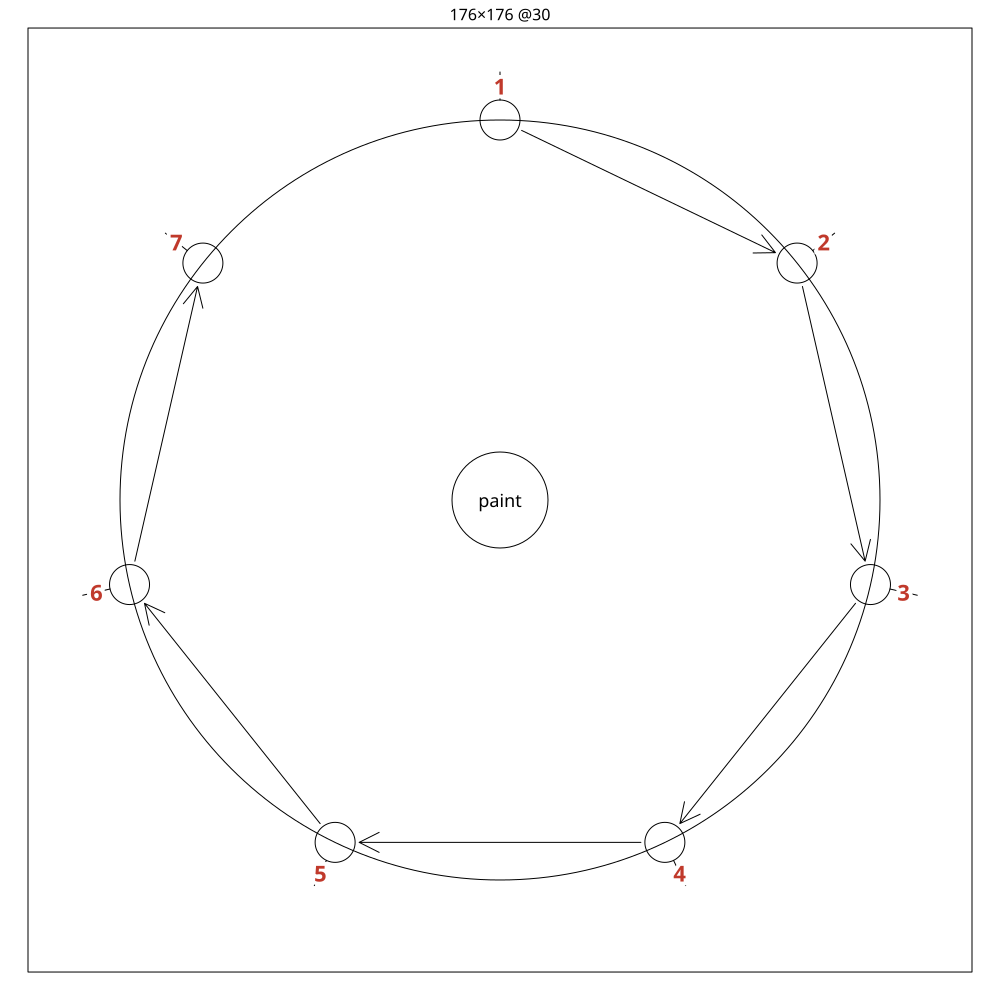

| 番号 | 記号 | Do | 内容 |
|---|---|---|---|
| 1 | 円（外へ線 = 道具） | `cast` | `canvas.clear("#101418")` |
| 2 | 円（外へ線 = 道具） | `cast` | `canvas.ink("#2a3340")` |
| 3 | 円（外へ線 = 道具） | `cast` | `canvas.rect(6, 6, 84, 164)` |
| 4 | 円（外へ線 = 道具） | `cast` | `canvas.ink("#000")` |
| 5 | 円（外へ線 = 道具） | `cast` | `canvas.rect(8, 8, 80, 160)` |
| 6 | 円（外へ線 = 道具） | `cast` | `canvas.ink("#4ce0e6")` |
| 7 | 円（外へ線 = 道具） | `cast` | `canvas.rect(8 + 3 * 8, 8 + 0 * 8, 7, 7)` |
<!-- /figure -->

> [!TIP]
> **図の読み方**（以後の章でも同じです）
> - 中央の円が手順の名前、外側の環に**手順直下のステップ**が並びます。番号は上（12 時の位置）から**時計回り**です
> - `if` や `loop` の中身は、親の弧の内側の環に置かれます。番号は `2.1`（2 番の `loop` の中の 1 番目）、`4t1`（4 番の `if` の then 側の 1 番目）、`4e1`（else 側）のように読みます。図では then が親の弧の前半（反時計回り側）、else が後半です
> - 「記号」列は図の中の形です（`set` は四角、`let` は小さな四角、`cast` は円、`if` は弦、`loop` は多角形、`wait` は環の欠け、`return` / `finish` / `break` は外へ抜ける線）。矢印は実行の順です
> - 「Do」と「内容」は、エディタでそのステップを選ぶと右パネルに出る欄（`Do` / `Target` / `Args` / `Cond` …）をまとめたものです

- **Do = `cast`**: 操作や関数を呼び出すステップです
- **Target**: 呼び出し先です。`canvas.ink` は描画色の指定、`canvas.rect` は塗りつぶし矩形の描画です
- **Args**: 渡す引数の並びです。**要素はすべて「式」として評価されます**。そのため `8 + 3 * 8` と書くと、式が計算されて `32` として渡されます。これは列 3・行 0 のマス、すなわち `(32, 8)` の位置です
- 色の指定は `"#4ce0e6"` のような文字列です。式の中の文字列は二重引用符で囲みます（エディタの `Args` の欄にそのまま `"#4ce0e6"` と入力します）

手順 `paint` の先頭では `canvas.clear` で画面全体を背景色で塗りつぶし、枠線と黒い盤面を描画しています。**画面は tick ごとに初期化（白紙化）される**ため、表示し続けたい要素は毎 tick 描き直す必要があります。そのため `paint` は `on tick` に登録されています。

### 1-3. 核の手順と `wait`

核の手順 `begin` は、2 つのステップだけで構成されています。

<!-- figure: 01-canvas Play/begin -->
<!-- 生成物（scripts/generate_tutorial_figures.py）。手で編集しない -->
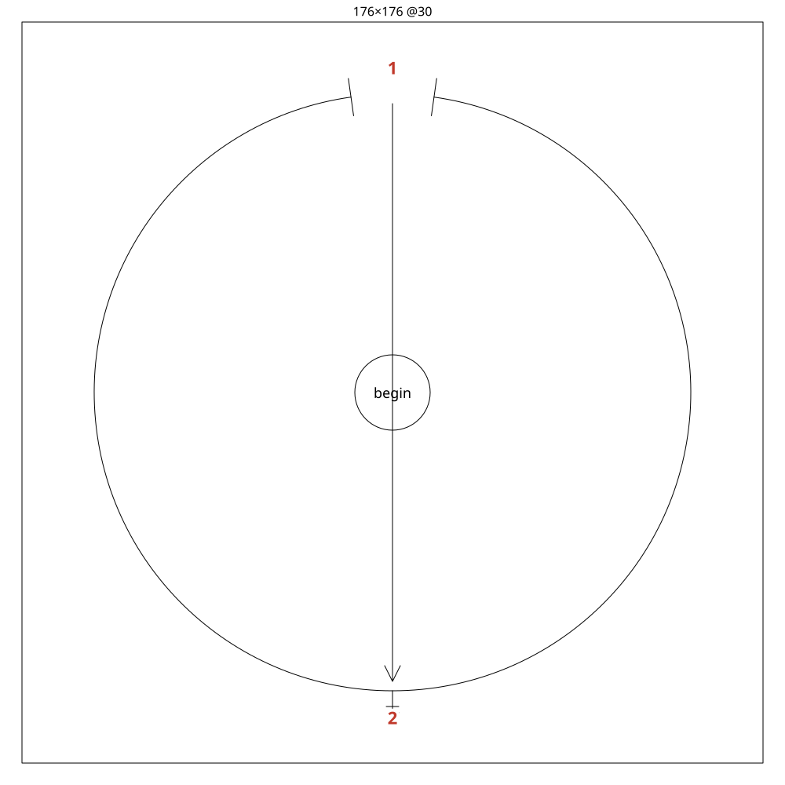

| 番号 | 記号 | Do | 内容 |
|---|---|---|---|
| 1 | 環の欠け | `wait` | `300` tick 待つ |
| 2 | 外へ抜ける線（二重横棒） | `finish` | 陣を終える |
<!-- /figure -->

- **`wait`**: 指定した tick 数だけ処理を一時停止（スリープ）します。図では環の欠けとして描かれます
- **`finish`**: 現在の陣を終了します。図では環の外へ抜ける線（先端に二重横棒）です

`begin` は 300 tick（10 秒）待機した後に `finish` を実行します。この陣は root（最外の親）であるため、陣の終了に伴いゲーム全体が停止し、`on tick` の描画も止まります。10 秒で画面が停止するのはこの仕組みによるものです。

もし `finish` ステップを削除するとどうなるでしょうか？ 核の手順自体は 10 秒で最後まで到達して終了しますが、**陣そのものは生き続けるため、`on tick` の `paint` は毎フレーム呼ばれ続けます**。「核の手順の終了」と「陣の終了」は明確に分離されており、陣を閉じるには必ず `finish` が必要です。

### 練習問題

1. マスの色を黄色（`#f2d541`）に変えてみましょう。「編集」モードで手順環の P（`paint`）をダブルクリック → 色設定ステップ（`canvas.ink`）を選択 → 右パネルの `Args` を書き換えて Enter → 「保存」→「実行」で確認します
2. マスを盤面の右下（列 9・行 19）に配置してください。座標の計算式を書いて狙い通りの位置に描画されるか確認しましょう
3. `wait` の tick 数を 60（2 秒）に変更し、停止するまでの時間が短くなることを確認してください
4. `finish` ステップを削除し、指定 tick を過ぎても描画が停止しなくなる挙動を確かめてみましょう（ステップを選択して Delete キーで削除できます）

---

## 2. 記憶と時間 — マスを落とす

**ファイル**: [`docs/samples/tetris/02-fall.jin`](samples/tetris/02-fall.jin)

マスが 0.5 秒（15 tick）ごとに 1 段ずつ下へ落ち、盤面の底（行 19）に着くと 1 秒後に停止します。

### 2-1. 記憶環（変数）

第 1 段階では、マスの座標を `3` と `0` という固定値で直接記述していました。マスを動かすためには、「現在どこにいるか」という状態を保持する場所が必要です。それが記憶環の **`state`**（変数）です。

<!-- figure: 02-fall Play -->
<!-- 生成物（scripts/generate_tutorial_figures.py）。手で編集しない -->


陣 `Play`: 核 `begin`・道具環 `canvas`・`on` `tick` → `paint`

記憶環（`state`）

| 名前 | 型 | 最初の値 | out |
|---|---|---|---|
| `x` | `num` | `3` | ✓ |
| `y` | `num` | `0` | ✓ |
<!-- /figure -->

- **名前**: 変数名です
- **型**: 変数の**型**です。`num`（数値）のほか、`bool`（真偽値）、`str`（文字列）、`list<...>`（配列）などがあります。静的型付けにより、数値用の変数に誤って文字列を代入するようなバグは、実行前の静的検査（`jin check`）が検知します
- **最初の値**（`init`）: 初期値の式です
- **out**（`out: true`）: 外部公開フラグです。他の陣から値を参照できるようになり、`jin run` の終了ログやデバッグ用の値一覧パネルに表示されます

変数 `x`, `y` を導入したことで、`paint` 内の描画座標の式は `"8 + x * 8"`, `"8 + y * 8"` に置き換わりました。変数の値が更新されると、描画される位置も連動して変化します。

### 2-2. `set` と `loop while` と `wait`

核の手順 `begin` で時間を刻み、落下処理を実行します。

<!-- figure: 02-fall Play/begin -->
<!-- 生成物（scripts/generate_tutorial_figures.py）。手で編集しない -->
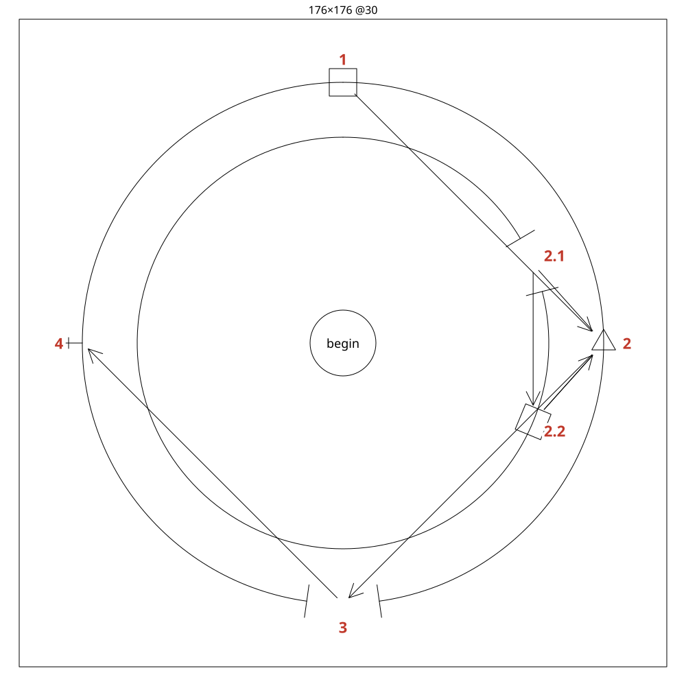

| 番号 | 記号 | Do | 内容 |
|---|---|---|---|
| 1 | 四角 | `set` | `y ← 0` |
| 2 | 多角形（3 角） | `loop` | `y < 19` の間、中を繰り返す |
| 2.1 | 環の欠け | `wait` | `15` tick 待つ |
| 2.2 | 四角 | `set` | `y ← y + 1` |
| 3 | 環の欠け | `wait` | `30` tick 待つ |
| 4 | 外へ抜ける線（二重横棒） | `finish` | 陣を終える |
<!-- /figure -->

各ステップの実行フローは次の通りです：

1. **`set`**（代入）: `y` に `0` を代入します
2. **`loop while`**（条件付き繰り返し）: 条件式 `y < 19` が真である間、内側の環にある 2.1 と 2.2 を繰り返します
   - 2.1 `wait`: 15 tick（0.5 秒）待機します
   - 2.2 `set`: `y` の値を 1 増加させます。右辺の式 `y + 1` が先に評価され、その結果が左辺の `y` に再格納されます
3. `y` が 19 に達するとループを抜け、30 tick（1 秒）待機した後に **`finish`** で陣を終了します

ここで重要なのは、**`begin` が `wait` で待機している間も、`on tick` に登録された `paint` は毎フレーム（毎 tick）呼び出されている**という点です。核の手順は「座標を更新して休止する」ことに専念し、描画手順は「その時点の最新の座標を描く」ことに専念しています。ロジックと描画が疎結合に保たれているため、コードが簡潔で見通しの良い状態を維持できます。

### 2-3. ターミナルで確かめる

```bash
uv run jin run docs/samples/tetris/02-fall.jin --ticks 400
```

```
{"Play.x": 3, "Play.y": 19}
315 tick 走らせました（seed 3、tick 314 で done）
```

最大 400 tick の実行を指定しましたが、315 tick で自動終了しています（19 段 × 15 tick + 最後の 30 tick = 315 tick）。`out: true` を指定した `x` と `y` の最終状態も出力されています。UI 画面を開かずにターミナル上の数値だけで動作検証ができるため、CI やユニットテストを高速に行えます。

### 練習問題

1. マスの落下速度を 2 倍（0.25 秒に 1 段）にしてください。`wait` の値をどう書き換えますか？ 終了までの総 tick 数がどう変化するか予測してから実行してみましょう
2. マスを斜め右下に落としてみましょう（`y + 1` の隣に `x` を増加させる `set` ステップを追加）。列 9 を超えると描画はどうなりますか？
3. ループ条件 `y < 19` を `y < 25` に書き換えると何が起こるか確かめてみましょう

---

## 3. 入力と分岐 — キーで動かす

**ファイル**: [`docs/samples/tetris/03-move.jin`](samples/tetris/03-move.jin)

キーボードの ← / → キーでマスが左右に移動し、↓ キーを押している間は高速に落下します。底に着くと再び上端から落下を繰り返します。「実行」モードに切り替え、ゲーム画面を一度クリックしてフォーカスを当ててからキーを押してください。

### 3-1. `if` — 条件分岐

「特定のキーが押されたら座標を増減する」という制御を行うのが **`if`** ステップです。`on tick` の登録先を `control` という新しい手順に変更し、次のように実装しました。

<!-- figure: 03-move Play/control -->
<!-- 生成物（scripts/generate_tutorial_figures.py）。手で編集しない -->
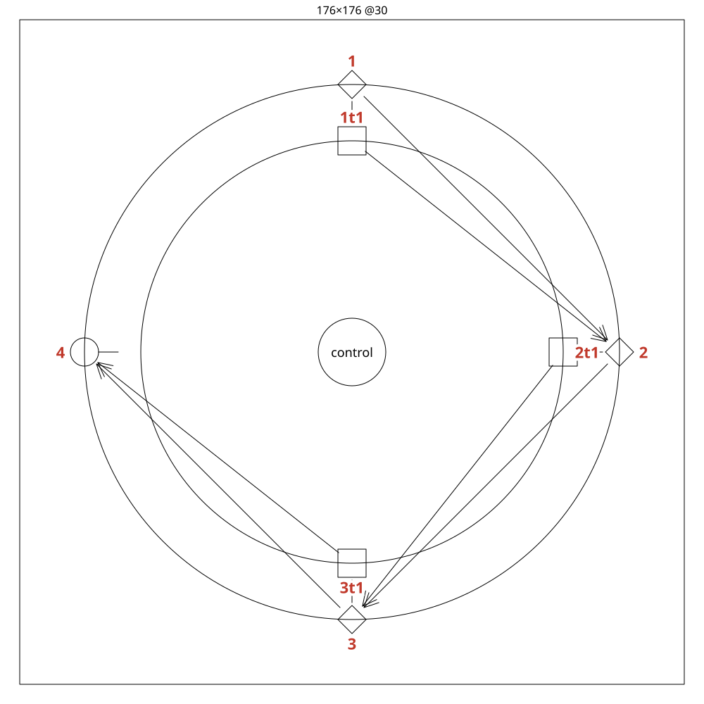

| 番号 | 記号 | Do | 内容 |
|---|---|---|---|
| 1 | 弦（分岐） | `if` | `input.pressed("ArrowLeft") and x > 0` が真なら t の列へ |
| 1t1 | 四角 | `set` | `x ← x - 1` |
| 2 | 弦（分岐） | `if` | `input.pressed("ArrowRight") and x < 9` が真なら t の列へ |
| 2t1 | 四角 | `set` | `x ← x + 1` |
| 3 | 弦（分岐） | `if` | `input.key("ArrowDown") and y < 19` が真なら t の列へ |
| 3t1 | 四角 | `set` | `y ← y + 1` |
| 4 | 円（内へ線 = 自陣の手順） | `cast` | `paint()` |
<!-- /figure -->

- **Do = `if`**: 条件分岐を行うステップです。図では弦（分岐の線）で描かれます
- **Cond**: 評価結果が真偽値（`bool`: `true` または `false`）になる式です
  - 比較演算子: `<`, `>`, `==`, `!=` など
  - 論理演算子: `and`（かつ）、`or`（または）、`not`（否定）
- **then / else**: 条件が真（`true`）のときに実行されるステップが then（一覧では `1t1` のように `t` が付く）、偽のときに実行するステップが else（`e` が付く）です
- ガード条件: `x > 0` や `x < 9` という条件を論理積 `and` で組み合わせることで、マスが盤面の外壁を突き破るのを防いでいます

道具環に `input`（ユーザー入力）が追加されました。**「使用する道具は、その陣自身が明示的に宣言しなければならない」** というのが Jin の基本原則です。宣言されていない道具を呼び出すと、`jin check` が静的エラーを報告します。

### 3-2. `pressed` と `key` の違い

ユーザー入力を取得する API には、用途に応じて 2 種類のメソッドが用意されています。

- `input.pressed("ArrowLeft")`: **キーが押された瞬間の 1 tick だけ** `true` になります。押しっぱなしにしても最初の 1 回しか反応しません。1 回の押下で 1 マスだけ移動させたい操作に適しています
- `input.key("ArrowDown")`: **キーが押されている間、毎 tick 連続して** `true` になります。押しっぱなしによる高速落下（ソフトドロップ）に適しています

キー名は Web 標準の `KeyboardEvent.code` に準拠しています（`ArrowLeft`, `ArrowRight`, `ArrowUp`, `ArrowDown`, `Space`, `KeyA` など）。存在しないキー名を指定すると、エディタ上でエラーとして強調表示されます。

### 3-3. 手順から手順を呼ぶ

手順 `control` の末尾（4 番）にある `cast` の `paint()` に注目してください。図では、道具を呼ぶ `cast` の円が環の**外**へ短い線を出すのに対し、自陣の手順を呼ぶ `cast` の円は**内**へ線を出します。**自陣の中で定義された他の手順も、`cast` ステップによって関数として呼び出すことができます**。「入力判定と状態更新」と「画面描画」を別々の手順に責任分離したまま、1 tick の中で順序立てて実行しています。

また、核の手順 `begin` は `loop while true`（無限ループ）に改修され、マスが底に着いたときは `else` 節で `y` を 0 にリセットして再スタートするように構成されています。

### 練習問題

1. ↑ キー（`ArrowUp`）を押した瞬間に、マスが一瞬で最上段（`y = 0`）に戻る処理を追加してください（`pressed` と `key` のどちらを使うべきでしょうか？）
2. `x > 0` のガード条件を削除すると、左端でキーを押した際に何が起きますか？
3. 「→ キーを押し続けている間、右へ移動し続ける」処理を作ってみましょう。移動速度が速すぎると感じた場合、どのように速度を抑えられるか考えてみてください（ヒント: 第 8 段階で登場するカウンタを使った間引き処理）

---

## 4. 型紙と表 — 7 種のミノ

**ファイル**: [`docs/samples/tetris/04-piece.jin`](samples/tetris/04-piece.jin)

単一のマスから、7 種類のテトリミノ（I, O, T, S, Z, J, L）へと進化します。それぞれの固有色で落下し、↑ キーで 90 度回転します。底に着くと、次のミノがランダムに生成されます。

なお、この段階では意図的に**左右の壁の当たり判定を省略**しています。← キーを押し続けると画面左外へ突き抜けますが、これは第 5 段階で解決します。

### 4-1. 型紙（構造体） — まとまった値

ミノの状態を管理するには、「種類（`kind`）」「向き（`rot`）」「位置 x（`x`）」「位置 y（`y`）」という 4 つの値が必要です。これらを個別の変数として定義する代わりに、**型紙**（`form`）を用いて 1 つの複合データ型にまとめます（TypeScript の `interface` や C 言語の構造体に相当します）。

<!-- figure: 04-piece form Piece -->
<!-- 生成物（scripts/generate_tutorial_figures.py）。手で編集しない -->


型紙 `Piece`

| 欄 | 型 |
|---|---|
| `kind` | `num` |
| `rot` | `num` |
| `x` | `num` |
| `y` | `num` |
<!-- /figure -->

記憶環の変数 `piece` はこの `Piece` 型として定義され、初期値は `Piece{kind: 0, rot: 0, x: 3, y: 0}` というリテラル記法で代入します。各プロパティには `piece.x` のように**ドット演算子**でアクセスでき、`set` の `target` に `piece.y` と指定することで、特定のフィールドだけを直接更新できます。

### 4-2. 表 — 形をリストに入れる

7 種類 × 4 方向のブロック形状を、28 個の `if` 文で分岐させて描画するのは極めて非効率です。そこで、**すべての形状データを 1 本のフラットな数値配列に格納し、添字（インデックス）計算によって必要な座標を取り出すテーブル引き**（ルックアップテーブル）を採用します。これが変数 `shapes`（型 `list<num>`）です。

配列内のデータ配置規則は次の通りです：

- テトリミノは 4 つの正方形ブロックで構成されます。各ブロックの相対座標 `(cx, cy)` を 2 つの数値ペアで表現します
- 1 つの向きの形状 = 4 ブロック × 2 数値 = **8 個の数値**
- 1 種類のミノ = 4 方向 × 8 数値 = **32 個の数値**
- 7 種類のミノ全体 = 7 種類 × 32 数値 = **224 個の数値**

ミノの種類 `kind`（0〜6）、向き `rot`（0〜3）、何番目のブロックか `i`（0〜3）から、配列内のインデックスを求める計算式は次のようになります：

```
((kind * 4 + rot) * 4 + i) * 2        ← x の添字
((kind * 4 + rot) * 4 + i) * 2 + 1    ← y の添字
```

例えば、T 型ミノ（`kind = 2`）の向き 1 における 3 番目のブロック（`i = 2`）の x 座標は、`((2 * 4 + 1) * 4 + 2) * 2 = 76` 番目、y 座標は 77 番目となります。配列は **0 始まり（ゼロインデックス）** です。同様に色データも `colors`（`list<str>`）に 7 色定義され、`colors[kind]` で高速に取り出せます。

### 4-3. 局所変数 `let` と `loop count`

ミノが底に到達したかを判定する手順 `touches` のコードです。

<!-- figure: 04-piece Play/touches -->
<!-- 生成物（scripts/generate_tutorial_figures.py）。手で編集しない -->
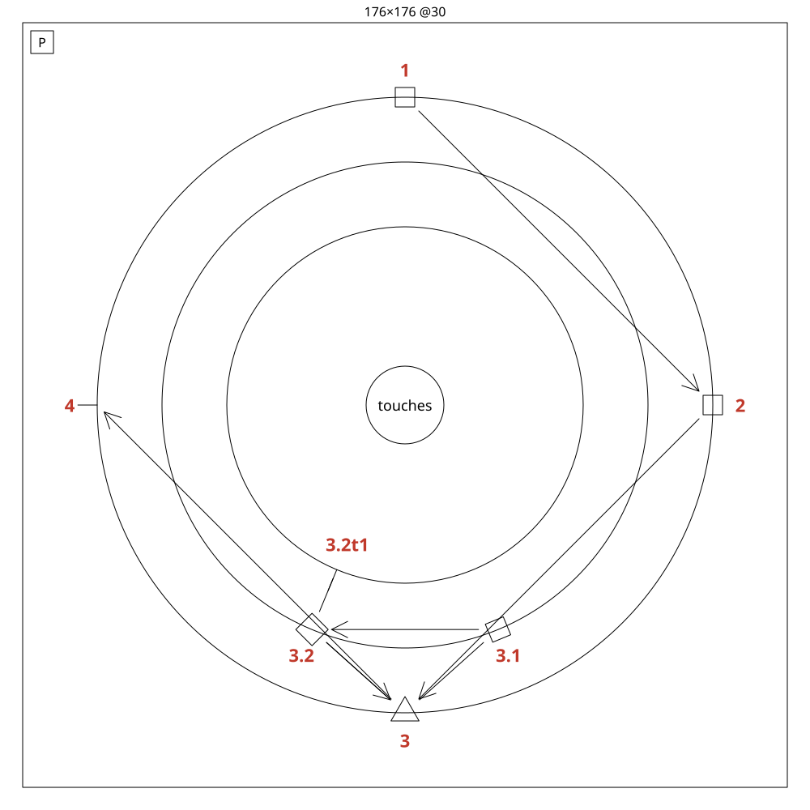

手順 `touches() -> bool`

| 番号 | 記号 | Do | 内容 |
|---|---|---|---|
| 1 | 小さな四角 | `let` | `kind = piece.kind` |
| 2 | 小さな四角 | `let` | `rot = piece.rot` |
| 3 | 多角形（3 角） | `loop` | `4` 回、中を繰り返す（`i` に 0, 1, … が入る） |
| 3.1 | 小さな四角 | `let` | `cy = piece.y + shapes[((kind * 4 + rot) * 4 + i) * 2 + 1]` |
| 3.2 | 弦（分岐） | `if` | `cy >= 19` が真なら t の列へ |
| 3.2t1 | 外へ抜ける線 | `return` | 手順を抜けて `true` を返す |
| 4 | 外へ抜ける線 | `return` | 手順を抜けて `false` を返す |
<!-- /figure -->

- **`let`**: 手順の内部でのみ有効な**局所変数（ローカル変数）** を宣言します。`state` と異なり陣の状態としては保持されず、手順の終了とともに破棄されます。計算結果を一時キャッシュすることで、複雑な計算式を短く整理できます
- **`loop count`**: 指定した回数だけ繰り返すループです。回数 `4` と名前 `i` を指定すると、カウンタ変数 `i` に 0, 1, 2, 3 が順に代入されて 4 回反復されます
- **`returns` と `return`**: 手順の見出し `touches() -> bool` が戻り値の型の宣言で、`return` ステップで値を返してその場で手順を抜けます。4 ブロックのうち 1 つでも底（行 19）に達していれば即座に `true` を返し、すべて下回っていれば末尾の `return false` に到達します

この戻り値を受け取る呼び出し側（核の手順 `begin`）は次のようになっています。

<!-- figure: 04-piece Play/begin -->
<!-- 生成物（scripts/generate_tutorial_figures.py）。手で編集しない -->
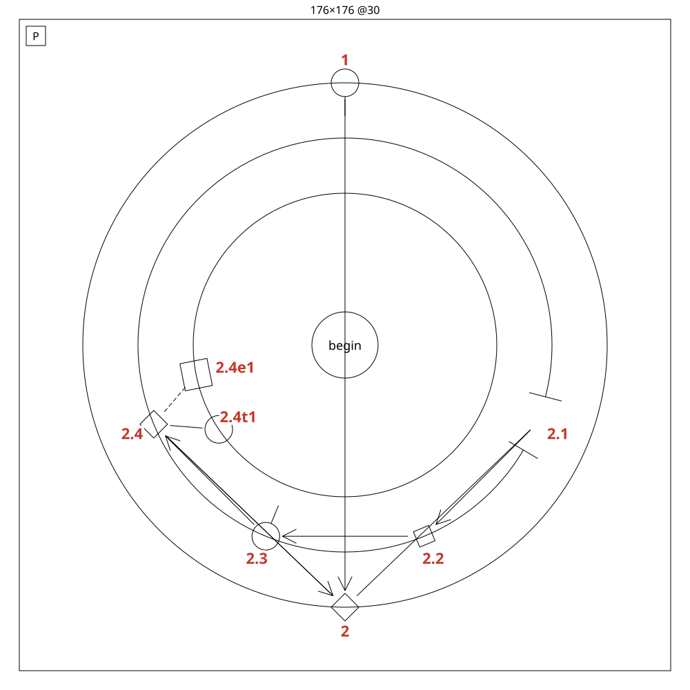

| 番号 | 記号 | Do | 内容 |
|---|---|---|---|
| 1 | 円（内へ線 = 自陣の手順） | `cast` | `spawn()` |
| 2 | 多角形（4 角） | `loop` | `true` の間、中を繰り返す |
| 2.1 | 環の欠け | `wait` | `15` tick 待つ |
| 2.2 | 小さな四角 | `let` | `bottom = false` |
| 2.3 | 円（内へ線 = 自陣の手順） | `cast` | `bottom ← touches()` |
| 2.4 | 弦（分岐） | `if` | `bottom` が真なら t の列、偽なら e の列へ |
| 2.4t1 | 円（内へ線 = 自陣の手順） | `cast` | `spawn()` |
| 2.4e1 | 四角 | `set` | `piece.y ← piece.y + 1` |
<!-- /figure -->

`cast` ステップの **`into`** プロパティに戻り値の格納先変数名を指定します。「`touches` を呼び出し、結果を `bottom` に代入する」という動作になります。**受け皿となる変数は、呼び出し前にあらかじめ `let` などで宣言しておく必要があります**。

### 4-4. 乱数と剰余

ミノの新規出現を行う手順 `spawn` では、道具環の `random` を使用して `Piece{kind: random.range(0, 6), rot: 0, x: 3, y: 0}` を生成しています。`random.range(0, 6)` は **0 以上 6 以下** の整数をランダムに返します（最小値・最大値の両端を含みます）。

↑ キーによる回転処理は、`(piece.rot + 1) % 4` という式で更新されます。`%` は割り算の**余り（剰余演算子）** です。向きが 0 → 1 → 2 → 3 と進み、3 の次は `(3 + 1) % 4 = 0` に戻ります。「N で割った余り」は、限られた範囲の数値を循環させるプログラミングの典型的な手法です。

乱数生成器の種（シード）は `stage.seed`（このファイルでは 3）によって決定論的に固定されています。**シード値が同一であれば常にまったく同じ順序でミノが出現する**ため、不具合の調査や自動テストの再現性を 100% 担保できます。

### 練習問題

1. 回転の方向を反時計回りに変更してください（`+ 1` の代わりに何を足して `% 4` を取れば 1 つ前の向きに戻せますか？ ヒント: `+ 3`）
2. 最初に生成されるミノを常に I 型（`kind: 0`）に固定してみてください
3. `shapes` の先頭 8 個の数値 `0, 1, 1, 1, 2, 1, 3, 1` は I 型ミノの向き 0 を表しています。各マスの相対位置を方眼紙にプロットし、どのような形状か確認してください

---

## 5. 当たり判定 — 手順に名前をつける

**ファイル**: [`docs/samples/tetris/05-fits.jin`](samples/tetris/05-fits.jin)

左右の壁を突き抜けなくなりました。また、壁際で回転したときにブロックが壁にめり込む場合は、回転が無効化されます。

### 5-1. 同じ検査を 4 か所でしたい

第 4 段階では「底に着いたか」の検査しか実装されておらず、左右移動や回転は無制限に行われていました。正しくは、**位置や向きを更新する前に、「動かした先が盤面内に収まっているか」を事前に検証する** 必要があります。

この判定は「左移動」「右移動」「回転」「自然落下」の **4 か所すべてで実行** されなければなりません。同じ検証コードを 4 回コピペすると、修正漏れによるバグの温床になります。そこで、**判定ロジックを引数と戻り値を持つ 1 つの手順として独立させ、必要な場所から呼び出します**。これがプログラミングにおける「関数」の基本原則です。

<!-- figure: 05-fits Play/fits -->
<!-- 生成物（scripts/generate_tutorial_figures.py）。手で編集しない -->
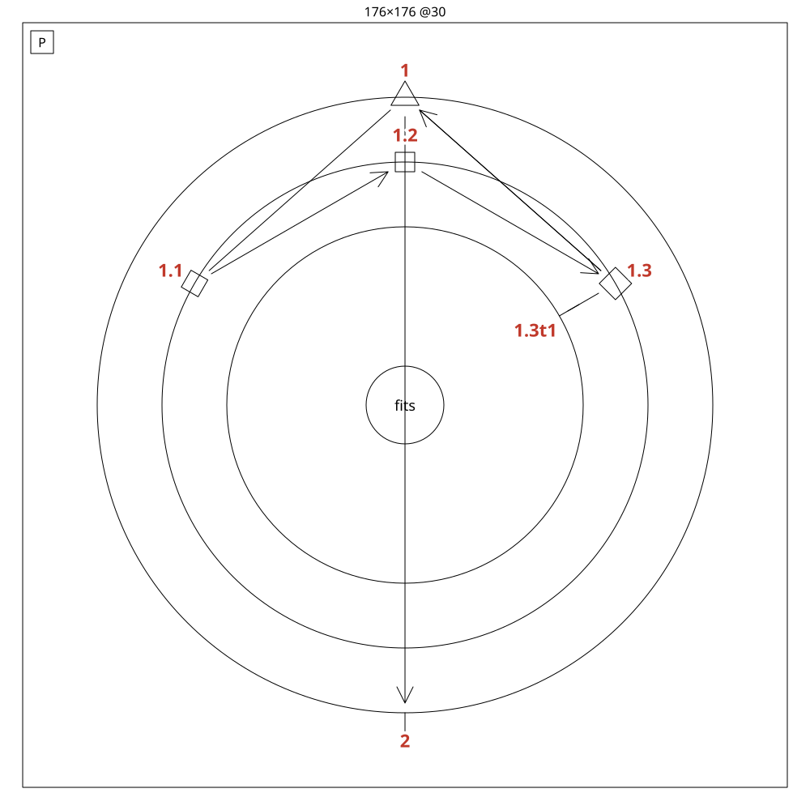

手順 `fits(kind: num, rot: num, x: num, y: num) -> bool`

| 番号 | 記号 | Do | 内容 |
|---|---|---|---|
| 1 | 多角形（3 角） | `loop` | `4` 回、中を繰り返す（`i` に 0, 1, … が入る） |
| 1.1 | 小さな四角 | `let` | `cx = x + shapes[((kind * 4 + rot) * 4 + i) * 2]` |
| 1.2 | 小さな四角 | `let` | `cy = y + shapes[((kind * 4 + rot) * 4 + i) * 2 + 1]` |
| 1.3 | 弦（分岐） | `if` | `cx < 0 or cx >= 10 or cy >= 20` が真なら t の列へ |
| 1.3t1 | 外へ抜ける線 | `return` | 手順を抜けて `false` を返す |
| 2 | 外へ抜ける線 | `return` | 手順を抜けて `true` を返す |
<!-- /figure -->

- **引数**（`params`）: 手順の見出し `fits(kind: num, rot: num, x: num, y: num) -> bool` の括弧の中が、受け取る引数の名前と型です
- **純粋な判定**: `fits` は現在の変数 `piece` を直接参照せず、渡された引数 `(kind, rot, x, y)` に基づいて計算します。これにより、「もし 1 マス左に動かしたら？」「もし回転させたら？」という **未来の仮想的な位置** を、状態を書き換える前に安全に問い合わせることができます
- **早期リターン（Early Return）**: `cx < 0 or cx >= 10 or cy >= 20`（左壁外、右壁外、床下）のいずれかに該当した時点で、即座に `return false` を実行して手順を終了します。4 つのブロックがすべて境界内に収まっていれば、ループ完了後に末尾の `return true` が返されます

### 5-2. 「訊いてから動く」の形

手順 `control` における左移動の処理は、次のように安全な構造に刷新されました。

<!-- figure: 05-fits Play/control -->
<!-- 生成物（scripts/generate_tutorial_figures.py）。手で編集しない -->
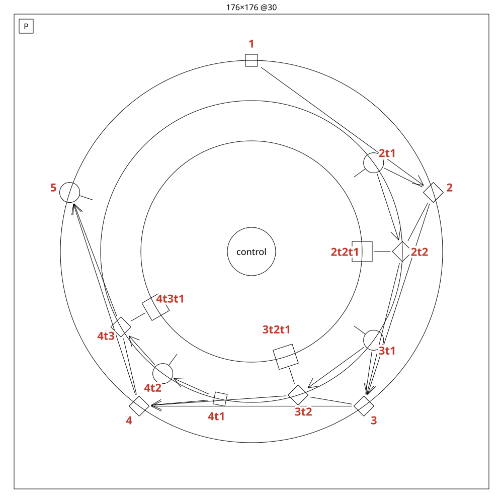

| 番号 | 記号 | Do | 内容 |
|---|---|---|---|
| 1 | 小さな四角 | `let` | `ok = false` |
| 2 | 弦（分岐） | `if` | `input.pressed("ArrowLeft")` が真なら t の列へ |
| 2t1 | 円（内へ線 = 自陣の手順） | `cast` | `ok ← fits(piece.kind, piece.rot, piece.x - 1, piece.y)` |
| 2t2 | 弦（分岐） | `if` | `ok` が真なら t の列へ |
| 2t2t1 | 四角 | `set` | `piece.x ← piece.x - 1` |
| 3 | 弦（分岐） | `if` | `input.pressed("ArrowRight")` が真なら t の列へ |
| 3t1 | 円（内へ線 = 自陣の手順） | `cast` | `ok ← fits(piece.kind, piece.rot, piece.x + 1, piece.y)` |
| 3t2 | 弦（分岐） | `if` | `ok` が真なら t の列へ |
| 3t2t1 | 四角 | `set` | `piece.x ← piece.x + 1` |
| 4 | 弦（分岐） | `if` | `input.pressed("ArrowUp")` が真なら t の列へ |
| 4t1 | 小さな四角 | `let` | `r = (piece.rot + 1) % 4` |
| 4t2 | 円（内へ線 = 自陣の手順） | `cast` | `ok ← fits(piece.kind, r, piece.x, piece.y)` |
| 4t3 | 弦（分岐） | `if` | `ok` が真なら t の列へ |
| 4t3t1 | 四角 | `set` | `piece.rot ← r` |
| 5 | 円（内へ線 = 自陣の手順） | `cast` | `paint()` |
<!-- /figure -->

1. 左キーが押されたか判定する
2. 1 マス左にずらした座標 `piece.x - 1` を引数にして `fits` を呼び出し、結果を `ok` に受け取る
3. `ok` が真であれば、実際に `piece.x` を更新する

右移動、回転、落下もまったく同じ「事前に安全を確認してから状態を更新する」パターンで統一されています。

### 5-3. 手順を分ける理由 — Jin の 3 つの上限

Jin には、コードの品質と可読性を保つために意図的に設定された **3 つの厳格な上限ルール** が存在します。これに違反すると静的検査で警告やエラーが出力されます。

| 上限ルール | 診断コード | 理由と設計思想 |
|---|---|---|
| 1 つの手順直下のステップ数は **最大 12 個** まで | JIN210 | 1 つの手順が長大化すると可読性が著しく低下するため、小さな手順に責務分割させる |
| `if` や `loop` のネスト（入れ子）は **最大 3 段** まで | JIN211 | 深い入れ子は認知負荷を高めてバグの原因となるため、内側の処理を別手順に切り出させる |
| 手順内の局所変数名は **重複不可**、`state` と同名も禁止 | JIN010 | 変数のシャドーイング（隠蔽）による混乱を未然に防ぐ |

「ステップ数が 12 個を超えそう」「4 段階目のネストが必要になった」という状況は、**新しい手順を切り出すべきリファクタリングの合図** です。

また、戻り値（`returns`）を宣言した手順では、すべての分岐の末尾で必ず `return` ステップに到達するように記述しなければなりません（`fits` 末尾の `return true` がこれに該当します）。

### 練習問題

1. 境界判定の条件式 `cy >= 20` を `cy >= 19` に変更するとどうなりますか？ 最下段の 1 行が使えなくなることをエディタ上で確認してください
2. ミノを画面の上端（`y = -1`）から出現させたいとします。`fits` では上端のチェック（`cy < 0`）を行っていません。なぜ上がはみ出しても許可されているのでしょうか？
3. 「回転時に壁にぶつかった場合、1 マス横にずらして回転可能か再判定する」（ウォールキック）処理の構造を考えてみましょう

---

## 6. 盤面はリスト — 積もる

**ファイル**: [`docs/samples/tetris/06-board.jin`](samples/tetris/06-board.jin)

落下したミノが底や他のブロックに着地すると固定（ロック）され、次のミノが出現します。ブロックが上端まで積み上がるとゲームオーバーとなり停止します。

### 6-1. 200 個の数

盤面は横 10 × 縦 20 ＝ 200 マスあります。各マスが「空（`0`）」か「何色のブロックが置かれているか（`1`〜`7`）」を記録する必要があります。200 個の変数を個別に定義する代わりに、**200 要素の 1 本のリスト** `board`（型 `list<num>`）で一括管理します。

- 行 `r`・列 `c` のマスに対応するインデックス: `r * 10 + c`
- 逆にインデックス `i` から行と列を逆算する式: 行は `floor(i / 10)`（小数点以下切り捨ての商）、列は `i % 10`（余り）

ゲーム開始時に核の手順 `begin` で盤面を初期化し、200 個の `0`（空マス）を詰め込みます。

<!-- figure: 06-board Play/begin -->
<!-- 生成物（scripts/generate_tutorial_figures.py）。手で編集しない -->
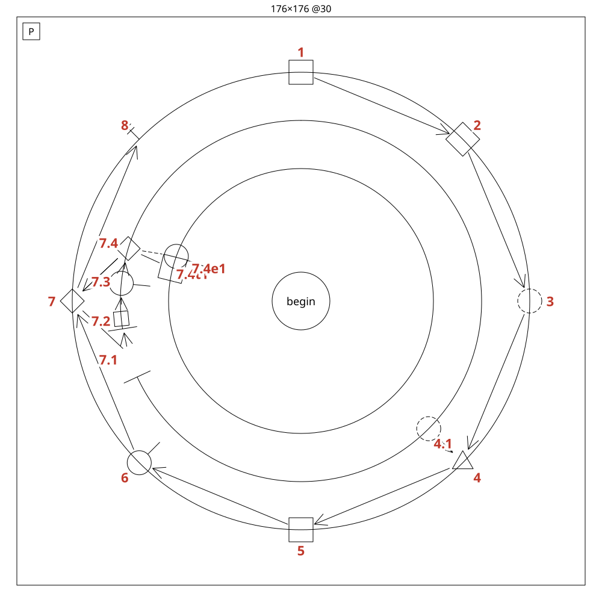

| 番号 | 記号 | Do | 内容 |
|---|---|---|---|
| 1 | 四角 | `set` | `placed ← 0` |
| 2 | 四角 | `set` | `over ← false` |
| 3 | 破線の円（組み込みの効果） | `cast` | `clear(board)` |
| 4 | 多角形（3 角） | `loop` | `200` 回、中を繰り返す（`i` に 0, 1, … が入る） |
| 4.1 | 破線の円（組み込みの効果） | `cast` | `push(board, 0)` |
| 5 | 四角 | `set` | `next ← random.range(0, 6)` |
| 6 | 円（内へ線 = 自陣の手順） | `cast` | `spawn()` |
| 7 | 多角形（4 角） | `loop` | `not over` の間、中を繰り返す |
| 7.1 | 環の欠け | `wait` | `15` tick 待つ |
| 7.2 | 小さな四角 | `let` | `ok = false` |
| 7.3 | 円（内へ線 = 自陣の手順） | `cast` | `ok ← fits(piece.kind, piece.rot, piece.x, piece.y + 1)` |
| 7.4 | 弦（分岐） | `if` | `ok` が真なら t の列、偽なら e の列へ |
| 7.4t1 | 四角 | `set` | `piece.y ← piece.y + 1` |
| 7.4e1 | 円（内へ線 = 自陣の手順） | `cast` | `lock()` |
| 8 | 外へ抜ける線（二重横棒） | `finish` | 陣を終える |
<!-- /figure -->

`clear`（配列を空にする）および `push`（配列末尾に要素を追加する）は、Jin に組み込まれている標準のリスト操作命令です。

### 6-2. 固定する — 添字への代入

着地して動けなくなったミノのブロックを、盤面配列に転記して固定するのが手順 `lock` です。

<!-- figure: 06-board Play/lock -->
<!-- 生成物（scripts/generate_tutorial_figures.py）。手で編集しない -->
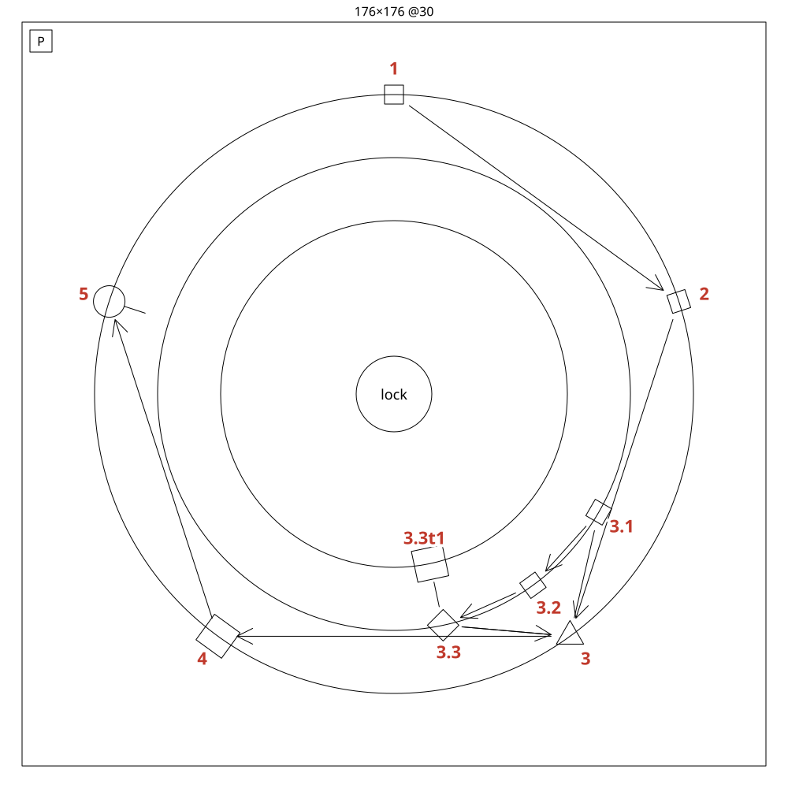

| 番号 | 記号 | Do | 内容 |
|---|---|---|---|
| 1 | 小さな四角 | `let` | `kind = piece.kind` |
| 2 | 小さな四角 | `let` | `rot = piece.rot` |
| 3 | 多角形（3 角） | `loop` | `4` 回、中を繰り返す（`i` に 0, 1, … が入る） |
| 3.1 | 小さな四角 | `let` | `cx = piece.x + shapes[((kind * 4 + rot) * 4 + i) * 2]` |
| 3.2 | 小さな四角 | `let` | `cy = piece.y + shapes[((kind * 4 + rot) * 4 + i) * 2 + 1]` |
| 3.3 | 弦（分岐） | `if` | `cy >= 0` が真なら t の列へ |
| 3.3t1 | 四角 | `set` | `board[cy * 10 + cx] ← kind + 1` |
| 4 | 四角 | `set` | `placed ← placed + 1` |
| 5 | 円（内へ線 = 自陣の手順） | `cast` | `spawn()` |
<!-- /figure -->

`set` ステップの `target` に `board[cy * 10 + cx]` とインデックスを指定することで、**リスト内の特定の位置の要素だけをピンポイントで書き換える** ことができます。4 つのブロックの位置に `kind + 1`（1〜7 のブロック色 ID）を代入することで、ミノが静的な盤面データの一部へと変換されます。

さらに、当たり判定手順 `fits` に次の条件を 1 つ追加しました：

```
cy >= 0 and board[cy * 10 + cx] != 0
```

外壁だけでなく、**「盤面上の該当マスにすでにブロックが存在する場合も衝突（不適合）」** と判定されるようになりました。検査ロジックを `fits` に一元化していたため、落下・左右移動・回転側のコードを一切書き換えることなく、積み上がったブロックへの衝突判定が完璧に機能します。

### 6-3. 終わりを決める

新しいミノを生成する `spawn` では、生成直後に `fits` を呼び出します。出現位置にすでにブロックが存在して収まらない場合、盤面がいっぱいになったと判断して変数 `over` を `true` に設定します。

核のメインループは `loop while not over` としてあるため、`over` が真になった瞬間にループを抜けて `finish` が実行されます。また、入力手順 `control` の先頭にも `if over then return` を配置し、終了後のキー操作を遮断します。

固定された盤面を描画する `paintBoard` は、描画コール回数を最小限に抑えるため、7 色それぞれについて盤面 200 マスを一括走査するサブルーチン `paintColor(c)` を呼び出します。

<!-- figure: 06-board Play/paintColor -->
<!-- 生成物（scripts/generate_tutorial_figures.py）。手で編集しない -->
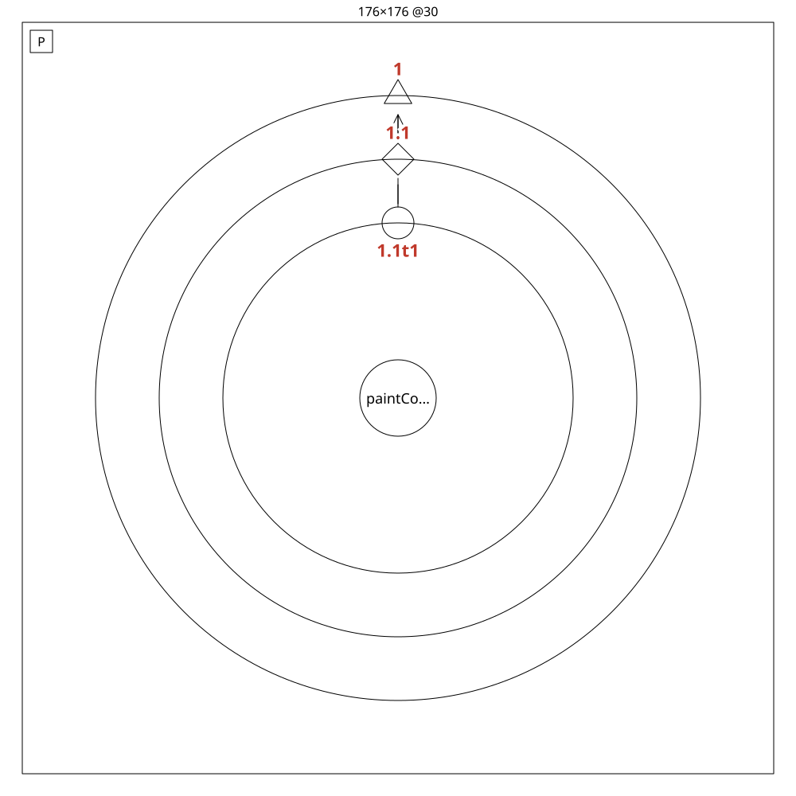

手順 `paintColor(c: num)`

| 番号 | 記号 | Do | 内容 |
|---|---|---|---|
| 1 | 多角形（3 角） | `loop` | `200` 回、中を繰り返す（`i` に 0, 1, … が入る） |
| 1.1 | 弦（分岐） | `if` | `board[i] == c + 1` が真なら t の列へ |
| 1.1t1 | 円（外へ線 = 道具） | `cast` | `canvas.rect(8 + i % 10 * 8, 8 + floor(i / 10) * 8, 7, 7)` |
<!-- /figure -->

マスごとに描画色（`canvas.ink`）を切り替えるのではなく、「色ごとに該当マスをまとめて描く（バッチ描画）」設計にすることで、コンテキストの切り替え回数を劇的に減らし、後述するデバッグトレースの行数を大幅に削減しています。

### 練習問題

1. 置いたミノの総数を数える変数 `placed` が `out: true` で定義されています。`uv run jin run docs/samples/tetris/06-board.jin --ticks 3000` を実行し、キー操作なしで何個のミノが置かれた時点でゲームオーバーになるか確認してください
2. 固定されたブロックの色をすべて灰色に統一してみましょう（`lock` で代入する値と `paintBoard` の処理はどう変わりますか？）
3. 盤面の横幅を 10 列から 12 列に拡張する場合、コード内のどの数値を変更する必要がありますか？

---

## 7. 行を消す — 入れ子の繰り返し

**ファイル**: [`docs/samples/tetris/07-lines.jin`](samples/tetris/07-lines.jin)

横一列がブロックで揃うとその行が消滅し、上のブロック群が 1 段落下します。同時に SCORE（得点）と LINES（消した行数）が加算され、5 行消すごとに落下速度がアップします。

### 7-1. アルゴリズムを言葉で書く

複雑なアルゴリズムを実装する際は、コードを書く前に日本語で手順を整理します。

1. 最上行から最下行に向かって順に各行を検査する：
   1. 行内の 10 マスを走査し、空マス（`0`）が 1 つでもあれば「揃っていない」と判定する
   2. 10 マスすべてが埋まっていれば、その行より上にあるすべての行を 1 段下へシフトし、最上行を空（`0`）にする。消去行カウントを 1 増やす
2. 消去した行数が 1 以上であれば、行数に応じた得点を加算し、落下速度を更新する

これをコード化したのが手順 `clearLines` です。

<!-- figure: 07-lines Play/clearLines -->
<!-- 生成物（scripts/generate_tutorial_figures.py）。手で編集しない -->
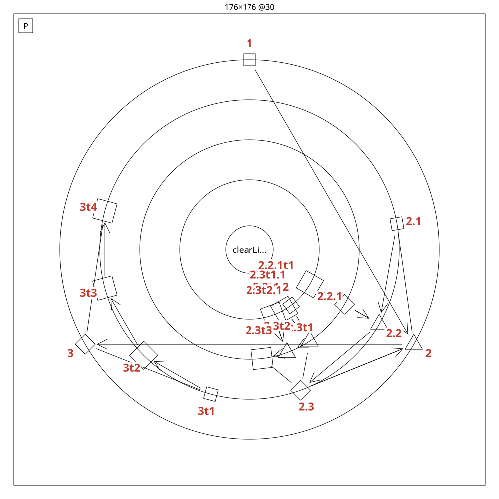

| 番号 | 記号 | Do | 内容 |
|---|---|---|---|
| 1 | 小さな四角 | `let` | `cleared = 0` |
| 2 | 多角形（3 角） | `loop` | `20` 回、中を繰り返す（`r` に 0, 1, … が入る） |
| 2.1 | 小さな四角 | `let` | `full = true` |
| 2.2 | 多角形（3 角） | `loop` | `10` 回、中を繰り返す（`c` に 0, 1, … が入る） |
| 2.2.1 | 弦（分岐） | `if` | `board[r * 10 + c] == 0` が真なら t の列へ |
| 2.2.1t1 | 四角 | `set` | `full ← false` |
| 2.3 | 弦（分岐） | `if` | `full` が真なら t の列へ |
| 2.3t1 | 多角形（3 角） | `loop` | `r * 10` 回、中を繰り返す（`k` に 0, 1, … が入る） |
| 2.3t1.1 | 小さな四角 | `let` | `i = r * 10 - 1 - k` |
| 2.3t1.2 | 四角 | `set` | `board[i + 10] ← board[i]` |
| 2.3t2 | 多角形（3 角） | `loop` | `10` 回、中を繰り返す（`c2` に 0, 1, … が入る） |
| 2.3t2.1 | 四角 | `set` | `board[c2] ← 0` |
| 2.3t3 | 四角 | `set` | `cleared ← cleared + 1` |
| 3 | 弦（分岐） | `if` | `cleared > 0` が真なら t の列へ |
| 3t1 | 小さな四角 | `let` | `bonus = [0, 100, 300, 500, 800]` |
| 3t2 | 四角 | `set` | `score ← score + bonus[cleared]` |
| 3t3 | 四角 | `set` | `lines ← lines + cleared` |
| 3t4 | 四角 | `set` | `speed ← max(4, 15 - floor(lines / 5))` |
<!-- /figure -->

この実装には 3 つの重要な設計技法が含まれています：

1. **論理の反転フラグ**: 「すべてのマスが埋まっているか」を判定するために、初期値を `full = true` とし、空マス（`0`）を 1 つでも発見したら `full = false` に倒すパターンを採用しています
2. **シフト処理の逆順走査**: 上のブロックを 1 段下（インデックス `+ 10`）へ複製する際、`i = r * 10 - 1 - k` として**下から上に向かって逆順にコピー** しています。上から順にコピーすると、直前にコピーした値が次の複製の読み出し元になってしまい、同じ行が下まで複製される「破壊的データ上書き」が発生するためです
3. **ネスト 3 段制限の遵守**: `r` のループ（1 段目） → `if full`（2 段目） → `k` のループ（3 段目）と、Jin のネスト上限（3 段）を厳格に守っています。また、JIN010 ルールに従い、列ループのカウンタ変数名も `c` と `c2` で重複を回避しています

### 7-2. 表引きと速さ

消去した行数に応じた得点計算には、多段の `if` 文ではなく配列によるテーブル引き（ルックアップテーブル）を利用します。

```
let bonus = [0, 100, 300, 500, 800]
score = score + bonus[cleared]
```

1 行消去なら 100 点、2 行なら 300 点、4 行（テトリス）なら 800 点が加算されます。

また、落下間隔（フレーム数）は次の式で動的に算出されます：

```
speed = max(4, 15 - floor(lines / 5))
```

5 行消去するごとに `speed` が 1 tick ずつ短縮され、最短でも 4 tick（限界速度）より速くはならないよう `max` 関数で下限を保証しています。核の `wait` で使用する値を固定値の `15` から変数 `speed` に切り替えることで、ゲームの進行に応じた難易度上昇が実現されています。

### 練習問題

1. 得点テーブルを初代テトリス仕様（`[0, 40, 100, 300, 1200]`）に変更してください
2. 行シフト処理の計算式 `i = r * 10 - 1 - k` を誤って `i = k`（正順）に変更するとどのような異常が発生するか、実際に試して観察してください
3. 「消去した行数（`lines`）」ではなく「設置したミノの数（`placed`）」に応じて落下速度が上がるように計算式を変更してみましょう

---

## 8. 操作の仕上げ

**ファイル**: [`docs/samples/tetris/08-controls.jin`](samples/tetris/08-controls.jin)

↓ キーによるソフトドロップ（3 tick に 1 段落下）、Space キーによるハードドロップ（一瞬で最下段まで落下して即時固定）、右側のパネルに NEXT（次に出現するミノ）の表示、そして着地・行消去時の効果音が実装されます。

### 8-1. 押しっぱなしを間引く

第 3 段階で導入した `input.key` はキーが押されている間毎フレーム `true` になるため、そのまま落下処理を呼ぶと毎秒 30 段という制御不能な猛スピードで落下してしまいます。そこで、カウンタ変数 `soft` を用いて 3 tick に 1 回だけ落下を発火させる**スロットリング処理**を実装します。

<!-- figure: 08-controls Play/control -->
<!-- 生成物（scripts/generate_tutorial_figures.py）。手で編集しない -->
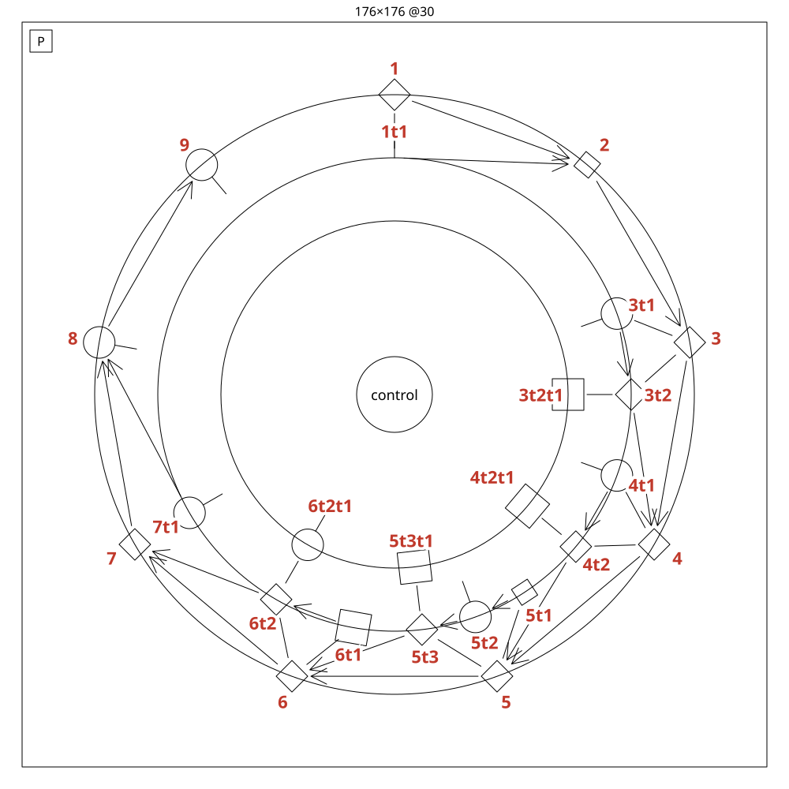

| 番号 | 記号 | Do | 内容 |
|---|---|---|---|
| 1 | 弦（分岐） | `if` | `over` が真なら t の列へ |
| 1t1 | 外へ抜ける線 | `return` | 手順を抜ける |
| 2 | 小さな四角 | `let` | `ok = false` |
| 3 | 弦（分岐） | `if` | `input.pressed("ArrowLeft")` が真なら t の列へ |
| 3t1 | 円（内へ線 = 自陣の手順） | `cast` | `ok ← fits(piece.kind, piece.rot, piece.x - 1, piece.y)` |
| 3t2 | 弦（分岐） | `if` | `ok` が真なら t の列へ |
| 3t2t1 | 四角 | `set` | `piece.x ← piece.x - 1` |
| 4 | 弦（分岐） | `if` | `input.pressed("ArrowRight")` が真なら t の列へ |
| 4t1 | 円（内へ線 = 自陣の手順） | `cast` | `ok ← fits(piece.kind, piece.rot, piece.x + 1, piece.y)` |
| 4t2 | 弦（分岐） | `if` | `ok` が真なら t の列へ |
| 4t2t1 | 四角 | `set` | `piece.x ← piece.x + 1` |
| 5 | 弦（分岐） | `if` | `input.pressed("ArrowUp")` が真なら t の列へ |
| 5t1 | 小さな四角 | `let` | `r = (piece.rot + 1) % 4` |
| 5t2 | 円（内へ線 = 自陣の手順） | `cast` | `ok ← fits(piece.kind, r, piece.x, piece.y)` |
| 5t3 | 弦（分岐） | `if` | `ok` が真なら t の列へ |
| 5t3t1 | 四角 | `set` | `piece.rot ← r` |
| 6 | 弦（分岐） | `if` | `input.key("ArrowDown")` が真なら t の列へ |
| 6t1 | 四角 | `set` | `soft ← soft + 1` |
| 6t2 | 弦（分岐） | `if` | `soft % 3 == 0` が真なら t の列へ |
| 6t2t1 | 円（内へ線 = 自陣の手順） | `cast` | `fall()` |
| 7 | 弦（分岐） | `if` | `input.pressed("Space")` が真なら t の列へ |
| 7t1 | 円（内へ線 = 自陣の手順） | `cast` | `hardDrop()` |
| 8 | 円（内へ線 = 自陣の手順） | `cast` | `paintBoard()` |
| 9 | 円（内へ線 = 自陣の手順） | `cast` | `paintPanel()` |
<!-- /figure -->

`soft % 3 == 0`（3 の倍数の tick）でのみ、落下処理手順 `fall` を呼び出します。「1 段落下し、底に着いていたら固定する」という処理は核の自然落下でもまったく同じものが使われるため、共通手順 `fall` として切り出すことでコードの重複を完全に排除しています。

### 8-2. `break` — 途中で抜ける

ハードドロップは「落ちられる限界まで一気に落下させ、その場で即座に固定する」操作です。何段落下できるかは盤面の状態によって事前に分からないため、無限ループ `loop while true` を回し、進めなくなった瞬間に **`break`** で脱出します。

<!-- figure: 08-controls Play/hardDrop -->
<!-- 生成物（scripts/generate_tutorial_figures.py）。手で編集しない -->
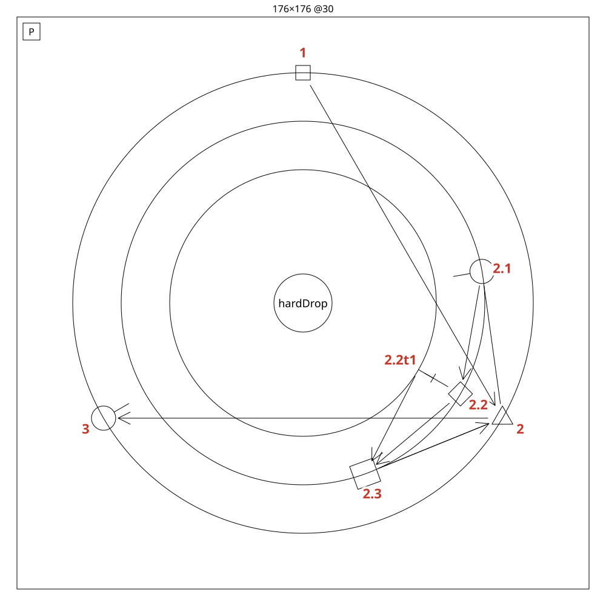

| 番号 | 記号 | Do | 内容 |
|---|---|---|---|
| 1 | 小さな四角 | `let` | `ok = false` |
| 2 | 多角形（3 角） | `loop` | `true` の間、中を繰り返す |
| 2.1 | 円（内へ線 = 自陣の手順） | `cast` | `ok ← fits(piece.kind, piece.rot, piece.x, piece.y + 1)` |
| 2.2 | 弦（分岐） | `if` | `not ok` が真なら t の列へ |
| 2.2t1 | 外へ抜ける線（横棒） | `break` | いちばん近い繰り返しを抜ける |
| 2.3 | 四角 | `set` | `piece.y ← piece.y + 1` |
| 3 | 円（内へ線 = 自陣の手順） | `cast` | `lock()` |
<!-- /figure -->

- **`break`**: 最も内側の `loop` を直ちに中断してループ外へ脱出するステップです。図では環の外へ抜ける線（先端に横棒）です
- 盤面には必ず底（行 19 または蓄積ブロック）が存在するため、`fits` は有限回で必ず `false` を返し、安全にループを抜けます（万が一終了条件を満たさない無限ループを記述した場合でも、Jin のランタイムは 1 tick あたりの最大実行ステップ数上限で安全に強制停止します）

### 8-3. 次のミノの予告

次に落ちてくるミノの種類を変数 `next` に保持し、右側の情報パネル（`paintPanel`）に描画します。描画のインデックス計算式は `(next * 16 + i) * 2` です（第 4 段階の式において `rot = 0` とした簡略形です）。

また、道具環に `audio`（音響機能）を追加しました：

- `audio.tone(220, 30)`: 220 Hz の低音を 30 ミリ秒鳴らす（ブロック着地時）
- `audio.tone(660, 60)`: 660 Hz の高音を 60 ミリ秒鳴らす（行消去時）

手順 `control` のステップ数はこれで 9 個となりました。12 個の上限（JIN210）に近づいており、適切な関数分割が行われていることがわかります。

### 練習問題

1. ↓ キーを押した瞬間（`pressed`）にも即座に 1 段落下するように処理を追加してみてください。押下時と長押し時の両方のハンドリングが必要な理由を考察しましょう
2. 4 行同時消去（テトリス）を達成したときだけ、特別な高い音を鳴らすように条件分岐を追加してください
3. ハードドロップで一気に落下させた段数 × 2 点のボーナススコアが入るように改造してみましょう

---

## 9. 結果画面 — 陣の流れ

**ファイル**: [`docs/samples/tetris/09-tetris.jin`](samples/tetris/09-tetris.jin)（= [`examples-v2/tetris/tetris.jin`](../examples-v2/tetris/tetris.jin)）

ブロックが上まで積み上がると GAME OVER 画面に切り替わり、RETRY ボタンで最初からやり直し、QUIT ボタンでゲームを終了できます。これがテトリスの完成形です。

### 9-1. 陣を並べる — `flow`

これまでの段階では、すべての処理が `Play` という単一の陣の中に書かれていました。しかし、「ゲームプレイ画面」と「ゲームオーバー結果画面」のように**責務や画面遷移が異なる場面は、別の陣に分割する** のが優れた設計です。

複数の陣を管理する場合、トップレベルに手順を持たない**核なし陣（Root Circle）** を配置し、画面の流れ（ライフサイクル）を定義します。

<!-- figure: 09-tetris flow Game -->
<!-- 生成物（scripts/generate_tutorial_figures.py）。手で編集しない -->


核なし陣 `Game` の `flow`

| 欄 | 値 |
|---|---|
| `kind` | `loop` |
| `steps` | `Play`, `Result` |
| `exit` | `Result.quit` |
<!-- /figure -->

ルート陣 `Game` は、「`Play` 陣が終了したら `Result` 陣を開始し、`Result` 陣が終了したら再び `Play` 陣を開始する」というループフローを定義しています。このループは `Result.quit` が真になるまで繰り返されます。`Play` 陣が `finish` すると、自動的に `Result` 画面へと遷移します。

### 9-2. 他の陣の値を読む

結果画面である `Result` 陣は、暗転したゲーム盤面を背景に敷いた上で「GAME OVER」の文字と最終スコアを描画します。盤面データや得点は `Play` 陣が保持している状態ですが、**`out: true` が指定された変数は、`陣名.変数名` という構文で他の陣から読み取り専用（Read-only）で参照できます**。

`Result` 陣の手順 `menu` では、`Play.board[i]` や `Play.score` を読み取って描画しています（他の陣の状態を直接書き換えることはできません。各陣の状態変更権は自分自身のみが持ちます）。これまで `board`, `score`, `lines` に `out: true` を指定していたのは、この画面間共有のためでした。

### 9-3. ボタン

道具環の `ui` を用いて、クリック可能な GUI ボタンを配置します。

<!-- figure: 09-tetris Result/menu -->
<!-- 生成物（scripts/generate_tutorial_figures.py）。手で編集しない -->
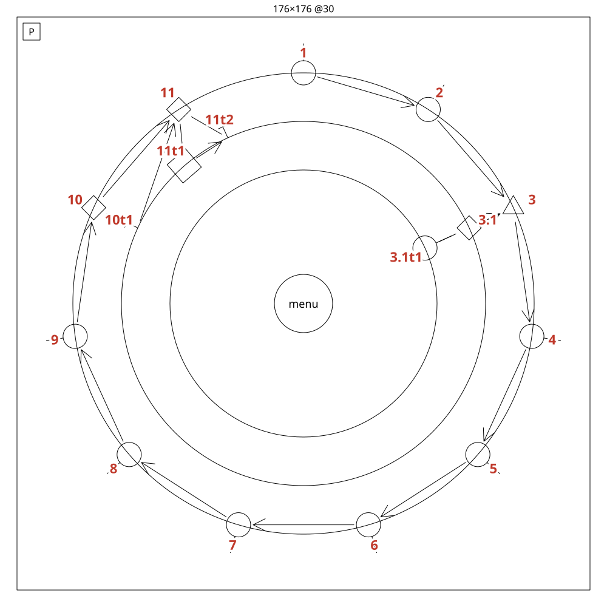

| 番号 | 記号 | Do | 内容 |
|---|---|---|---|
| 1 | 円（外へ線 = 道具） | `cast` | `canvas.clear("#101418")` |
| 2 | 円（外へ線 = 道具） | `cast` | `canvas.ink("#3a4250")` |
| 3 | 多角形（3 角） | `loop` | `200` 回、中を繰り返す（`i` に 0, 1, … が入る） |
| 3.1 | 弦（分岐） | `if` | `Play.board[i] != 0` が真なら t の列へ |
| 3.1t1 | 円（外へ線 = 道具） | `cast` | `canvas.rect(8 + i % 10 * 8, 8 + floor(i / 10) * 8, 7, 7)` |
| 4 | 円（外へ線 = 道具） | `cast` | `canvas.ink("#c8d0dc")` |
| 5 | 円（外へ線 = 道具） | `cast` | `canvas.text("GAME OVER", 100, 8)` |
| 6 | 円（外へ線 = 道具） | `cast` | `canvas.text("SCORE", 100, 28)` |
| 7 | 円（外へ線 = 道具） | `cast` | `canvas.text(str(Play.score), 100, 38)` |
| 8 | 円（外へ線 = 道具） | `cast` | `canvas.text("LINES", 100, 56)` |
| 9 | 円（外へ線 = 道具） | `cast` | `canvas.text(str(Play.lines), 100, 66)` |
| 10 | 弦（分岐） | `if` | `ui.button("RETRY", 100, 96, 64, 20)` が真なら t の列へ |
| 10t1 | 外へ抜ける線（二重横棒） | `finish` | 陣を終える |
| 11 | 弦（分岐） | `if` | `ui.button("QUIT", 100, 124, 64, 20)` が真なら t の列へ |
| 11t1 | 四角 | `set` | `quit ← true` |
| 11t2 | 外へ抜ける線（二重横棒） | `finish` | 陣を終える |
<!-- /figure -->

- `ui.button(label, x, y, width, height)`: ボタンを描画し、**その tick にクリックされた瞬間にのみ `true` を返す即時モード（Immediate Mode）GUI** です。`if` の条件式に直接組み込むことができます
- **RETRY の動作**: `Result` 陣を `finish` します。するとルート陣 `Game` の `flow` により次の `Play` 陣が開始されます。`Play` の核の手順 `begin` の冒頭で得点や盤面を初期化していたのは、この 2 周目以降のリスタートを正しく成立させるためでした
- **QUIT の動作**: 変数 `quit` を `true` に設定してから `finish` します。これにより `flow` の脱出条件 `Result.quit` が満たされ、ゲーム全体が完全に終了します

### 9-4. 検査 — `assert`

境界環に **`guards`**（不変条件アサーション）を追加しました。

<!-- figure: 09-tetris guards Play -->
<!-- 生成物（scripts/generate_tutorial_figures.py）。手で編集しない -->


陣 `Play` の境界環の検査

| assert | message |
|---|---|
| `len(board) == 0 or len(board) == 200` | 盤面は 10 × 20 |
| `score >= 0 and lines >= 0` | 得点と消した行数は負にならない |
<!-- /figure -->

`assert` は「実行中、常に真でなければならない不変条件」を宣言します。毎 tick 自動的に検証され、もし偽になった場合は「実行」モードのエディタ上に警告バッジが表示されます。プログラムを強制クラッシュさせるためではなく、**「開発者が前提としている前提条件」をコード化し、思わぬバグに即座に気づくための防衛策** です。

### 練習問題

1. `Result` の背景色を調整し、`Play` の盤面が暗く透けて見える演出の仕組みを確認してください
2. ゲームオーバー画面に「設置したミノの総数（`Play.placed`）」を追加表示してみましょう
3. ルート陣 `Game` の `flow` を改修し、リトライなしで 1 度ゲームオーバーになったら即座に終了する設定に変更してみてください

---

## 10. デバッグ — 動きを目で追う

プログラムは意図した通りではなく、記述された通りに動作します。不具合の原因を特定するための 3 つのデバッグ手法を紹介します。

### 10-1. トレース — 全部の記録

ターミナル実行時に `--debug` と `--trace` オプションを付与することで、すべての実行ログを JSON Lines（JSONL）形式でファイルに出力できます。

```bash
uv run jin run docs/samples/tetris/09-tetris.jin --ticks 60 --debug --trace /tmp/t.jsonl
head -3 /tmp/t.jsonl
```

```
{"seq":0,"tick":-1,"circle":"Play","kind":"enter","name":"Play","pointer":"/circles/1", … }
{"seq":1,"tick":-1,"circle":"Play","kind":"rite","name":"begin","pointer":"/circles/1/rites/0", … }
{"seq":2,"tick":-1,"circle":"Play","kind":"set","name":"score","pointer":"/circles/1/rites/0/steps/0", … "output":0}
```

1 行が 1 つの出来事（ステップの実行、変数の代入、関数の呼び出し）を克明に記録しています。`grep` コマンド等と組み合わせることで、「どの瞬間に変数の値が不正になったか」を特定できます。

### 10-2. 録画と再生

キーボード入力を記録した録画ファイル（`.jinrec`）を利用すれば、**過去のプレイ展開を何度でも 100% 同一に再現できます**。乱数のシード値が固定されているため、入力ログさえあれば完全に決定論的なリプレイが可能です。

```
{"jinrec": 1, "file": "tetris.jin", "seed": 3, "fps": 30, "ticks": 60}
{"tick": 2, "kind": "key", "name": "Space", "down": true}
{"tick": 3, "kind": "key", "name": "Space", "down": false}
```

エディタの実行パネルで **「録画」** を押してプレイし、**「録画を止めて書き出す」** をクリックすると、この `.jinrec` ファイルがダウンロードされます。CLI で入力として渡すことも可能です：

```bash
uv run jin run docs/samples/tetris/08-controls.jin --input space.jinrec
```

### 10-3. エディタでスクラブする

エディタの **「実行」モード** では、実行パネルで **「録画」** を押して操作し、**「録画を止めて書き出す」** で停止した後に「この録画を再生」をクリックすると、そのプレイの全トレースがエディタ内に読み込まれます。

下部に表示されるタイムラインスライダー（`upto`）をドラッグして動かすと：

- 魔法陣の上で、その瞬間に実行されていたステップがハイライト表示される
- 右側パネルに、その時点における記憶環の変数（`board` の中身、`score`、`piece` など）の正確な値が表示される
- ゲーム画面がその tick の描画状態にタイムトラベルする

「行が消えたはずなのに得点が増えない」「壁際で予期せぬ挙動をした」といった難解なバグも、問題が発生した瞬間にスライダーを巻き戻すことで、即座に原因を突き止められます。

---

## 11. 発展課題と用語対応表

### 発展課題

完成したテトリスをベースに、自分だけの新機能を追加してみましょう。

- **ゴースト表示**: ハードドロップした際の着地予想地点を半透明の枠で描画する（`hardDrop` の落下計算ロジックを別手順に切り出し、`paintBoard` から呼び出す）
- **ホールド機能**: Shift キーで現在のミノを一時キープし、後で入れ替えられるようにする（変数 `hold` の追加と `spawn` の分岐）
- **レベル表示**: 消去行数に応じたレベル `floor(lines / 5)` を情報パネルに表示する
- **ハイスコア保存**: ブラウザを閉じても記録が残る道具 `storage` を使って最高得点をローカル保存する（[`docs/spec/v2/abilities.md` §8](spec/v2/abilities.md) を参照）
- **本格的なウォールキック**: 回転時に壁やブロックと衝突した場合、左右や上下に数マスずらして回転可能か試行する（SRS: Super Rotation System の実装）
- **7-bag 乱数**: 7 種類のミノが偏りなく均等に出現するよう、7 個のミノを 1 セットとしてシャッフルして配分する

### 用語対応表

| プログラミング一般・Web開発概念 | Jin v2 の言語要素 | 初出段階 |
|---|---|:---:|
| 画面・`<canvas>` | 舞台 `stage`、道具 `canvas` | 1 |
| 関数・API の呼び出し | `cast`（`target` と `args`） | 1 |
| ゲームループ・フレーム（`requestAnimationFrame`） | tick、境界環 `on tick` | 1 |
| 状態管理・変数（State） | 記憶環 `state`（`name`, `type`, `init`） | 2 |
| 代入演算 | `set`（`target` と `expr`） | 2 |
| 静的型（Type） | `num`, `bool`, `str`, `list<...>`, 型紙名 | 2, 4 |
| 条件ループ（`while`） | `loop` `kind: while`（`cond`, `steps`） | 2 |
| スリープ・待機処理 | `wait`（`ticks`） | 2 |
| 条件分岐（`if` / `else`） | `if`（`cond`, `then`, `else`） | 3 |
| 真偽値・論理演算子 | `bool`、`and` / `or` / `not` | 3 |
| イベントリスナー | 境界環の `on`（`event` と `rite`） | 3 |
| 構造体・オブジェクト型（Interface） | 型紙 `form`、`Piece{...}`、ドット参照 `piece.x` | 4 |
| 配列・インデックス参照 | リスト `list<num>`、`shapes[i]`（0 始まり） | 4 |
| スコープ内ローカル変数 | `let`（`name`, `expr`） | 4 |
| カウントループ（`for`） | `loop` `kind: count`（`name`, `times`） | 4 |
| 乱数生成 | 道具 `random`、`random.range(lo, hi)` | 4 |
| 関数の引数・戻り値・早期リターン | `params`, `returns`, `return`, `cast ... into` | 5 |
| 配列の要素書き換え・配列メソッド | `set` の `Target` に `board[i]`、`push` / `clear` / `removeAt` | 6 |
| 二重ループ（入れ子） | `loop` のネスト（最大 3 段まで） | 7 |
| ルックアップテーブル（表引き） | `bonus[cleared]`, `colors[kind]` | 7, 4 |
| ループ中断（`break`） | `break` | 8 |
| シーン管理・状態機械（State Machine） | ルート陣の `flow`、`finish` | 9 |
| 公開プロパティ（Read-only State） | `out: true`、`陣名.変数名` | 9 |
| 不変条件アサーション（Contract） | 境界環の `guards`（`assert`, `message`） | 9 |
| トレースログ・タイムトラベルデバッガ | `--trace`、録画 `.jinrec`、エディタのスクラブ再生 | 10 |

言語の完全な仕様定義は [`docs/spec/v2/`](spec/v2/)（[モデル定義](spec/v2/model.md)・[式構文](spec/v2/expr.md)・[標準道具一覧](spec/v2/abilities.md)・[ランタイム実行モデル](spec/v2/runtime.md)）に記載されています。チュートリアルで紹介しきれなかった詳細仕様（`each` ループ、陣間通信の `emit` / `transfer`、条件待機 `wait until`、陣の動的生成 `summon` など）を学ぶ際にご活用ください。
