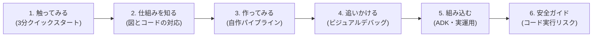
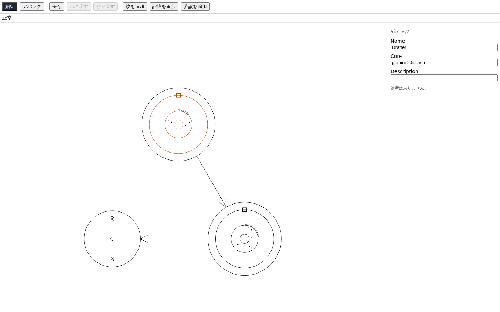
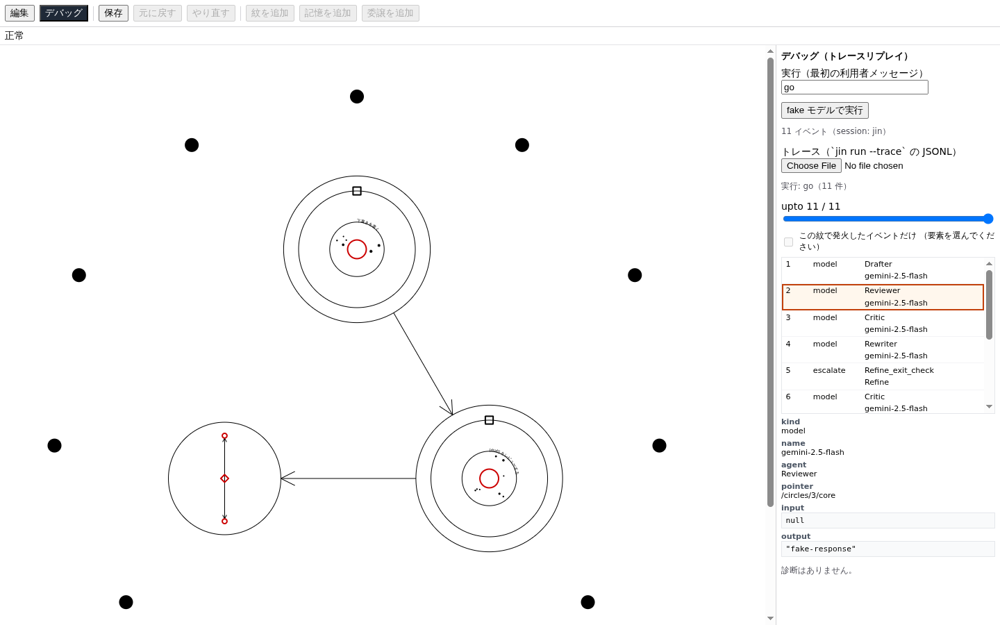
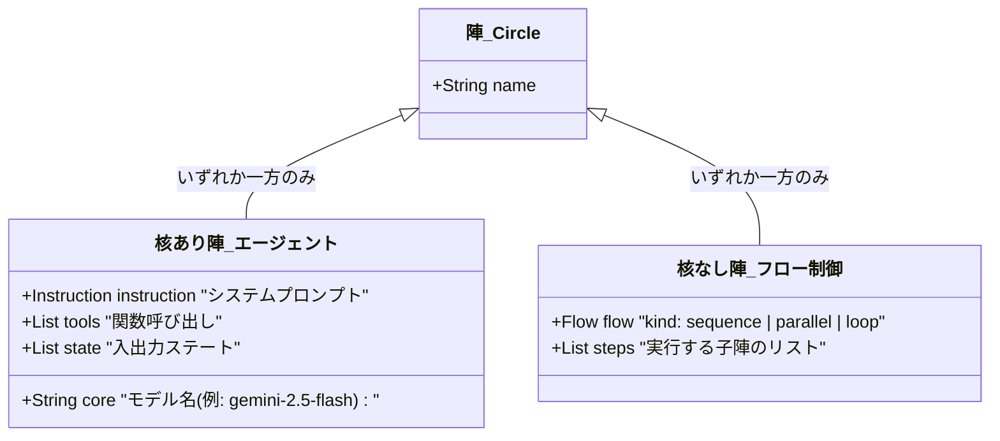
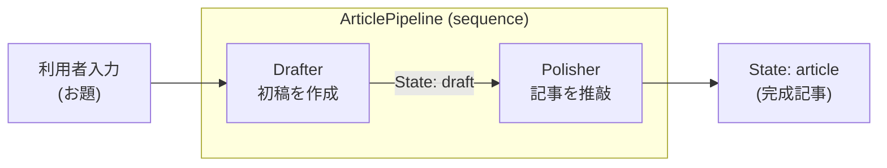
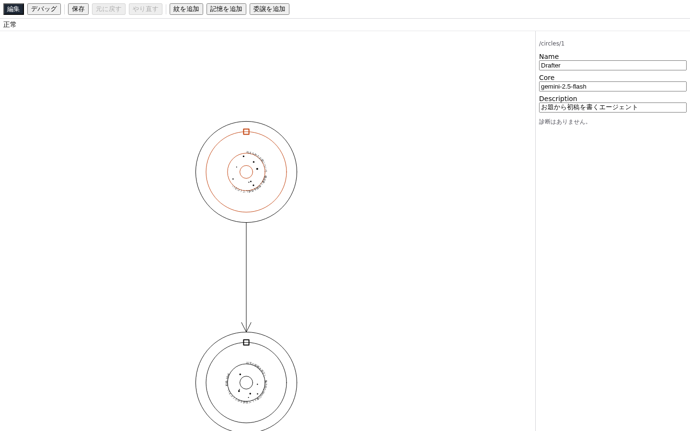
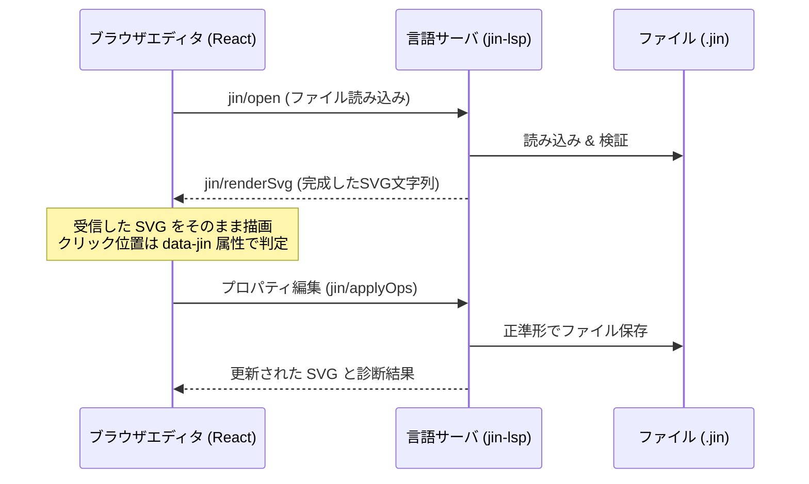

# Jin ガイド：魔法陣で作るビジュアル AI エージェント

[README に戻る](../README.md)

Jin（陣）は、AI エージェントの構成と連携フローを**「魔法陣」という幾何学的な図**で設計・実行できるビジュアルプログラミング言語です。

複数のエージェントが協調するパイプラインやループ処理は、コードだけでは依存関係やデータの流れが見えにくくなりがちです。Jin では、プロンプト、ツール、状態（State）、そして制御フローをグラフィカルに可視化し、ブラウザ上で直感的に編集・デバッグできます。

---

## このガイドのゴールと進め方

このガイドのゴールは、**「エディタを立ち上げて魔法陣に触れ、自分だけのマルチエージェントパイプラインを作って動かせるようになること」** です。

Web 制作の基礎（JSON / HTML / CLI 操作）や、計算機科学の初歩（グラフ構造 / 状態遷移 / 関数呼び出し）があれば、AI エージェントフレームワーク（Google ADK など）の事前知識は不要です。

必要な情報が段階的に手に入るよう（**Progressive Disclosure**）、以下のステップで進めます。



| セクション | 内容 | 対象 |
|---|---|---|
| [1. まずは触ってみよう](#1-まずは触ってみよう--3分クイックスタート) | サンプルをブラウザで開き、画面上で動かす（API キー不要） | まず体験したいとき |
| [2. 魔法陣の仕組みを理解する](#2-魔法陣の仕組みを理解する--図とコードの対応関係) | 図の各パーツがプログラムの何に相当するかを整理する | 概念を掴みたいとき |
| [3. 作ってみよう：自作パイプライン](#3-作ってみよう--自作パイプラインのハンズオン) | 2 つのエージェントをつなぐパイプラインを自作・実行する | **実際に作りたいとき** |
| [4. 実行を追いかける：ビジュアルデバッグ](#4-実行を追いかける--トレースとビジュアルデバッグ) | 実行履歴（トレース）を魔法陣に重ねてステップ再生する | 動作確認・デバッグ |
| [5. プロダクトへ組み込む](#5-プロダクトへ組み込む--python-コード生成と実モデル実行) | Python / Google ADK プロジェクトとして書き出す | 実サービスへ載せるとき |
| [6. 安全上の注意](#6-安全上の注意--任意コード実行のリスクを避ける) | `ref` 解決と任意コード実行のリスク管理 | 必須の安全知識 |
| [7〜12. リファレンス・詳細](#7-コマンド逆引き) | コマンド逆引き、LSP 仕様、付属サンプル、用語集 | 辞書・深掘り用 |

---

## 1. まずは触ってみよう — 3分クイックスタート

まずは動くものを見てみましょう。**LLM の API キーは不要**です。

### 1-1. エディタを起動する

ターミナルで次のコマンドを実行します（初回は [README](../README.md) のセットアップが完了している必要があります）。

```bash
uv run jin editor examples/pipeline/pipeline.jin
```

ブラウザが自動的に開き、同心円が並んだ「魔法陣」が表示されます。

> [!TIP]
> ブラウザが自動で開かない場合は、ターミナルに表示された URL（例: `http://localhost:...`）を手動で開いてください。終了するときはターミナルで `Ctrl + C` を押します。

#### 画面の見方



- **上部ツールバー**: モード切替（編集／デバッグ）、保存、元に戻す（Undo）、要素の追加などの操作を行います。
- **中央キャンバス**: 魔法陣（エージェントと制御フローの有向グラフ）。拡大・縮小やドラッグ移動が可能です。
- **右側プロパティパネル**: キャンバス上の要素（円や核）をクリックすると、プロンプト、モデル名、入出力状態（State）が表示され、その場で直接編集できます。

### 1-2. エディタ上で fake 実行してみる

画面上部のツールバーにあるモードを**「編集」から「デバッグ（トレースリプレイ）」**に切り替えてみましょう。

1. 入力欄に任意のメッセージ（例: `go` や `記事を書いて`）を入力します。
2. **「fake モデルで実行」** ボタンを押します。
3. 魔法陣の各ノードが順に**朱色（赤色）に光り**、処理が進む様子がアニメーション表示されます。
4. 下部のスライダ（スクラバ）を動かすと、各ステップでどのエージェントが何を出力したかを振り返ることができます。



### 1-3. 魔法陣を SVG 画像として書き出してみる

エディタだけでなく、CLI から静的な画像（SVG）としても書き出せます。

```bash
uv run jin render examples/pipeline/pipeline.jin -o pipeline.svg
```

書き出された `pipeline.svg` をブラウザで開いてみてください。
Jin のレンダラは、乱数や現在時刻を一切使わない**決定的（Deterministic）**な設計になっています。そのため、同じ `.jin` ファイルからは**環境を問わずバイト単位で完全一致する SVG** が生成され、Git で図の差分を正確にコードレビューできます。

---

## 2. 魔法陣の仕組みを理解する — 図とコードの対応関係

「魔法陣」というファンタジーな見た目をしていますが、その実態は**エージェントの有向グラフ（DAG / 状態遷移機械）を幾何学的に表現した明確な構文体系**です。

`.jin` ファイルの実体はシンプルな **JSON** です。エディタでの視覚的編集と、テキストエディタでの JSON 直接編集は完全に相互同期します。

### 2-1. 概念の対応表

Web 開発のコンポーネントや計算機科学の概念と、Jin の魔法陣の語彙は以下のように 1 対 1 で対応しています。

| 魔法陣の語彙 | 図での見た目 | プログラミングの概念 | JSON のキー | Google ADK クラス |
|---|---|---|---|---|
| **陣（Circle）** | 同心円 | エージェント / ワークフロー単位 | `circles[]` | `LlmAgent` / ワークフロー |
| **核（Core）** | 円の中心核 | 使用する LLM モデル（Gemini 等） | `core` | `LlmAgent.model` |
| **指示（Rune）** | 指示環の文字列 | システムプロンプト / 指示文 | `instruction.rune` | `LlmAgent.instruction` |
| **紋（Tool）** | 道具環のアイコン | ツール（関数 / 外部 API 呼び出し） | `tools[]` | `FunctionTool` 等 |
| **記憶（State）** | 記憶環の四角 | 共有ステート / 入出力コンテキスト | `state[]` | `session.state` |
| **弦（Flow）** | 円同士を結ぶ線 | 制御フロー（順次・並列・ループ） | `flow` | `SequentialAgent` 等 |
| **委譲（Delegate）** | 内側の破線矢印 | 他エージェントへの自律ルーティング | `delegate[]` | `LlmAgent.sub_agents` |
| **境界環（Boundary）**| 円の外周 | ライフサイクルガード / 承認待ち | `boundary` | `before_/after_*_callback` |
| **最外の陣（Root）** | 全体を包む陣 | プログラムのエントリポイント | `root` | `root_agent` |

### 2-2. 陣の 2 つの役割（核あり / 核なし）

Jin の陣には、用途に応じて明確な 2 種類が存在します。



1. **核あり陣（LLM エージェント）**:
   `core`（モデル名）と `instruction`（プロンプト）を持ちます。入力を受け取り、思考してツールを呼び出したりテキストを出力します。
2. **核なし陣（制御フロー）**:
   `core` を持たず、代わりに `flow`（制御構造）を持ちます。子エージェントたちを「順番に動かす（`sequence`）」「並列に動かす（`parallel`）」「条件を満たすまで繰り返す（`loop`）」といったオーケストレーションを担当します。

> [!NOTE]
> 1 つの陣が `core` と `flow` を両方持つことや、どちらも持たないことは文法違反（診断エラー）になります。エージェント（実行者）とフロー（指揮者）の関心は明確に分離されます。

---

## 3. 作ってみよう — 自作パイプラインのハンズオン

ここからは実際に、自分でマルチエージェントパイプラインを作ってみましょう。
作るものは**「記事作成パイプライン」**です。

1. **Drafter（執筆者）**: お題を受け取り、初稿（`draft`）を書く。
2. **Polisher（校正者）**: 初稿（`draft`）を読み、洗練された記事（`article`）に仕上げる。
3. **ArticlePipeline（親フロー）**: 上記 2 つを順番（`sequence`）に実行する。



### ステップ 3-1: `.jin` ファイルを作成する

プロジェクトルートに `article_pipeline.jin` を新規作成し、以下の JSON を貼り付けます。

```json
{
  "$schema": "https://xtone.internal/jin/schemas/jin.schema.json",
  "version": 1,
  "root": "ArticlePipeline",
  "circles": [
    {
      "name": "ArticlePipeline",
      "flow": {
        "kind": "sequence",
        "steps": [
          "Drafter",
          "Polisher"
        ]
      }
    },
    {
      "name": "Drafter",
      "core": "gemini-2.5-flash",
      "description": "お題から初稿を書くエージェント",
      "instruction": {
        "rune": "与えられたお題について、構成案と初稿を作成してください。"
      },
      "state": [
        {
          "name": "draft",
          "type": "str",
          "out": true
        }
      ]
    },
    {
      "name": "Polisher",
      "core": "gemini-2.5-flash",
      "description": "初稿を推敲して完成させるエージェント",
      "instruction": {
        "rune": "以下の初稿を校正し、魅力的なWeb記事として完成させてください。\n\n初稿:\n{draft}"
      },
      "state": [
        {
          "name": "article",
          "type": "str",
          "out": true
        }
      ]
    }
  ]
}
```

#### ポイント：State によるデータのバトンパス
- `Drafter` の `state` に `"name": "draft", "out": true` が宣言されています。これは「このエージェントの出力が `draft` というキーに書き込まれる」という意味です。
- `Polisher` の `instruction.rune` の中で `{draft}` と書くことで、前段のエージェントが出力した内容をプロンプトに変数値として注入できます。

### ステップ 3-2: 構文と型をチェックする（`jin check`）

作成したファイルが正しいか、CLI の診断ツールで静的チェックします。

```bash
uv run jin check article_pipeline.jin
```

何もエラーが出ずに終了すれば合格です！

もしタイポや未定義の参照があると、コンパイラのように親切なエラーと修正ヒントが出ます。
（例: `steps` の名前に打ち間違いがある場合）:
```text
article_pipeline.jin:11:11: error JIN031: flow 'ArticlePipeline' の step 'Draftr' は定義されていません
  hint: 近い名前: Drafter
  pointer: /circles/0/flow/steps/0
```

### ステップ 3-3: 正準形に整形する（`jin fmt`）

コードのインデントやキーの並び順を、プロジェクト標準の「正準形（Canonical Format）」に整えます。

```bash
uv run jin fmt article_pipeline.jin
```

> [!TIP]
> `jin fmt` はチーム開発でフォーマット差分を出さないための公式フォーマッタです。エディタで「保存」ボタンを押した際にも自動的にこの正準形でファイルへ書き戻されます。

### ステップ 3-4: エディタで開いてビジュアルに編集してみる

作成したファイルをビジュアルエディタで開いてみましょう。

```bash
uv run jin editor article_pipeline.jin
```

ブラウザにあなたの作った魔法陣が表示されます！



- 外側の円が親の `ArticlePipeline`（順次実行フロー）、内部の `Drafter` と `Polisher` が矢印で直線的につながっていることが視覚的に確認できます。
- `Polisher` をクリックし、右パネルの「プロンプト（Rune）」を「**Web制作の初学者に向けてわかりやすく解説してください。**」などと書き換えて「保存」を押してみてください。
- 手元の `article_pipeline.jin` をテキストエディタで見ると、GUI で行った変更がそのまま JSON に反映されていることがわかります。

### ステップ 3-5: 実行してみる（fake モデル）

作成したパイプラインを手元で動かしてみましょう。まずは API キー不要の `--model fake` で全体の配線を検証します。

```bash
uv run jin run article_pipeline.jin "Webアクセシビリティの重要性" --model fake
```

ターミナルに各エージェントのイベントが順番に出力され、`Drafter` → `Polisher` と処理がリレーされて終了すれば成功です！

---

## 4. 実行を追いかける — トレースとビジュアルデバッグ

AI エージェントの実行は非同期で分岐も多く、「いまどのエージェントが、どのようなデータを受け取って動いているのか」を追うのが困難になりがちです。
Jin では、**実行履歴（トレース）を魔法陣の上に重ねて可視化**できます。

### 4-1. トレースログを記録する

`jin run` に `--trace` オプションを渡すと、実行時のイベントが JSONL 形式で記録されます。

```bash
uv run jin run article_pipeline.jin "Webアクセシビリティの重要性" \
  --model fake \
  --trace /tmp/article_trace.jsonl
```

生成されたトレースファイル（1 行 1 イベント）には、発火した要素の **JSON Pointer**（例: `/circles/1`）が記録されています。これが図上のノードとイベントを紐付けるキーになります。

### 4-2. エディタ上でタイムトラベル再生する

`jin editor` を起動し、ツールバーの**「デバッグ（トレースリプレイ）」**を開きます。

1. 「トレース（JSONL）」ファイル選択で、先ほど保存した `/tmp/article_trace.jsonl` を選びます。
2. 画面下部にタイムラインスクラバが現れます。
3. スライダを動かすと、**そのステップまでに発火した陣や接続線が朱色に点灯**します。
4. イベントリストから特定のイベントをクリックすると、その瞬間の入出力データやプロンプトの展開結果が右パネルに表示されます。

```text
[タイムライン] ───●───────────────────▶ (Step 2: Drafter 完了)
                      ↓
              [魔法陣キャンバス]
              ・Drafter が朱色に光る
              ・右パネルに入力と出力 state (draft) が表示される
```

### 4-3. fake モデルで確認できること・できないこと

| 検証できること（API キー不要） | 実モデルが必要なこと |
|---|---|
| 陣の順序やフロー（順次・並列・ループ）の遷移 | LLM による自然言語の生成クオリティ |
| State の受け渡しキーが整合しているか | LLM の判断による動的なツール呼び出し（紋の発火） |
| ループの終了条件（`exit`）が正しく評価されるか | LLM による動的な委譲（Delegate）の判断 |

> [!TIP]
> 開発時はまず `--model fake` でパイプラインの結合テストを済ませ、構造のバグを潰してから実モデルへ進むのが最も効率的でお金もかからないアプローチです。

---

## 5. プロダクトへ組み込む — Python コード生成と実モデル実行

完成した魔法陣は、実際の Python アプリケーションやバックエンドサービスに組み込むことができます。

### 5-1. 実モデル（Gemini 等）で動かす

本物の LLM で動かすには、モデルの API キーを環境変数にセットし、`--model fake` を外して実行します。

```bash
# Gemini API キーを設定
export GOOGLE_API_KEY="your-gemini-api-key"

# 実モデルでパイプラインを実行
uv run jin run article_pipeline.jin "Webアクセシビリティの重要性"
```

### 5-2. Google ADK プロジェクトとしてコード生成する（`jin build`）

Jin は単なるおもちゃのエディタではありません。`.jin` ファイルから **Google ADK（Agent Development Kit）に完全準拠した本番用 Python コード** をワンコマンドで書き出せます。

```bash
uv run jin build article_pipeline.jin --out ./dist
```

`./dist` ディレクトリに以下のファイルが生成されます：
- `ArticlePipeline/agent.py`: ADK の `LlmAgent` や `SequentialAgent` を組み合わせた実行可能コード
- `ArticlePipeline/__init__.py`: パッケージ定義
- `.env.example`: 必要な環境変数の一覧

これで、標準的な ADK の実行コマンド（`adk run ./dist/ArticlePipeline` や `adk web ./dist`）を使って、Web API やチャット UI のバックエンドとしてそのまま配備できます。

> [!IMPORTANT]
> **生成された Python コード（`agent.py`）は直接編集しないでください。**
> 仕様の変更やプロンプトの調整は必ず元の `.jin` ファイル（またはビジュアルエディタ）で行い、再ビルドします。`.jin` を**唯一の信頼できる情報源（Single Source of Truth）**として保つためです。

---

## 6. 安全上の注意 — 任意コード実行のリスクを避ける

Jin は強力なツール連携機能を備えており、`.jin` ファイル内に Python の関数を指定（`ref` キー: `module.path:callable`）してカスタムツールやガードを呼び出すことができます。

これに伴い、**セキュリティ上必ず守るべきルール**があります。

### 基本原則：信頼できない `.jin` ファイルは実行しない

Python では、モジュールを `import` すると**そのモジュールのトップレベルにあるコードが即座に実行されます**。
悪意を持って作成された `.jin` ファイルを不用意に実行すると、あなたのアカウントの権限で任意のコードが実行されてしまう危険性があります。

> [!CAUTION]
> **人から受け取ったファイル、出所不明のファイル、LLM が自動生成した未確認の `.jin` ファイル**に対して、以下のコマンドを安易に実行しないでください。

| コマンド | コード実行のタイミングと内容 | 安全のためのルール |
|---|---|---|
| `jin check` (通常) | **コード実行なし**（AST 解析とスキーマ検証のみ） | 安全。CI や未検証ファイルにも自由に使えます。 |
| `jin check --resolve` | 指定された `ref` のモジュールを実際に `import` して実在判定する | **信頼できるファイルにのみ使用する**（子プロセスで 30 秒タイムアウト制限あり）。 |
| `jin run` | 一時コードを生成して `import` し、エージェントを実行する | **中身を確認したファイルのみ実行する**。`--model fake` を付けていても `import` は行われます。 |
| `jin editor` | ローカルに WebSocket と実行エンドポイント（`POST /run`）を開く | 信頼できないディレクトリで起動しない。 |
| `jin render` | **コード実行なし**（`.jin` とトレース JSONL のみ読む） | 安全。画像書き出しで任意コードが動くことはありません。 |

---

## 7. コマンド逆引き

「〜したいとき」に引けるコマンドの一覧です。

```bash
# 【検証】構文や参照のミスがないかチェックしたい
uv run jin check <file.jin>

# 【整形】インデントやキーの順序を公式スタイルに揃えたい
uv run jin fmt <file.jin>

# 【画像】魔法陣を SVG ベクター画像として出力したい
uv run jin render <file.jin> -o output.svg

# 【GUI】ブラウザで視覚的に編集・デバッグしたい
uv run jin editor <file.jin>

# 【実行】モデルを呼ばずに配線だけテスト実行したい
uv run jin run <file.jin> "最初のメッセージ" --model fake

# 【デバッグ】実行イベントをトレースファイルに保存したい
uv run jin run <file.jin> "最初のメッセージ" --model fake --trace trace.jsonl

# 【実運用】実際の LLM で実行したい（要 API キー）
uv run jin run <file.jin> "最初のメッセージ"

# 【出力】本番用の Python (Google ADK) プロジェクトを書き出したい
uv run jin build <file.jin> --out <出力先ディレクトリ>

# 【補完】VS Code 等で補完を効かせるための JSON Schema が欲しい
uv run jin schema

# 【言語サーバ】LSP サーバを起動したい（VS Code や Claude Code 連携用）
uv run jin lsp
```

---

## 8. アーキテクチャ解説 — エディタと言語サーバ（LSP）

Jin のエディタ（`apps/editor`）とバックエンドは、Web フロントエンドやコンパイラ設計の観点から非常に興味深い設計になっています。

### なぜエディタは「1本の線も描かない」のか？

通常、ビジュアルプログラミング環境を作ると、フロントエンド側に SVG のパス描画ロジックや状態管理が肥大化しがちです。しかし Jin のエディタは**自分自身では 1 本の線も描画していません**。



1. **完全な Single Source of Truth**:
   エディタは独自の内部モデルを持ちません。常にディスク上の `.jin` ファイルが唯一の状態です。
2. **決定論的レイアウトエンジン**:
   Python 側の `jin-render` パッケージが幾何学的な計算を行い、完成した SVG 文字列を返します。エディタはそれを `dangerouslySetInnerHTML` 相当で表示しているだけです。
3. **要素の特定は `data-jin` 属性**:
   生成された SVG の各 `<g>` や `<path>` 要素には、`data-jin="/circles/0/instruction"` のように **JSON Pointer** が埋め込まれています。ブラウザでクリックされた要素の JSON Pointer を拾うだけで、どのプロパティを開けばいいかが即座に判別できます。
4. **スキーマ駆動のフォーム生成**:
   右パネルの入力フォームはハードコードされておらず、`schemas/jin.schema.json`（JSON Schema）から動的に自動生成されています。

### Claude Code プラグインとの連携

Claude Code を使っている場合、`plugins/claude-code/jin/` を導入することで、AI と対話しながら `.jin` の構文チェックや定義ジャンプを行うことができます。詳細なセットアップは [プラグインの README](../plugins/claude-code/jin/README.md) を参照してください。

---

## 9. 付属サンプル集

リポジトリの `examples/` ディレクトリには、実践的な 3 本のサンプルが用意されています。

| サンプル | 構成 | 見どころ・学習ポイント |
|---|---|---|
| **[Pipeline](file:///home/wisteria/jin-lang/examples/pipeline/pipeline.jin)** | 順次 + ループ（6 陣） | **最初におすすめ。** 下書き執筆 → レビュー → ループ推敲（Critic & Rewriter）という実践的な文書推敲パイプライン。 |
| **[Researcher](file:///home/wisteria/jin-lang/examples/researcher/researcher.jin)** | 核あり 2 陣 | 外部検索ツールの利用、State による調査結果の蓄積、`summon`（別陣の直接呼び出し）のサンプル。 |
| **[Showcase](file:///home/wisteria/jin-lang/examples/showcase/showcase.jin)** | 全要素入り 5 陣 | Jin で表現できる**全 9 種類の要素**（陣・核・紋・記憶・弦・境界環・護符・保留・委譲）がすべて登場するデモ。 |

```bash
# Showcase をエディタで開いて、すべての要素を触ってみる
uv run jin editor examples/showcase/showcase.jin
```

---

## 10. 用語集

| 用語 | 読み | 意味 |
|---|---|---|
| **陣** | じん（Circle） | エージェント単体、または複数のエージェントを束ねる制御構造の単位。 |
| **核** | かく（Core） | 陣の中心にある LLM モデル名。これを持つ陣は自律思考エージェントになる。 |
| **紋** | もん（Tool） | エージェントが使える道具。Python 関数、組み込みツール、他エージェント召喚の 3 種類。 |
| **記憶** | きおく（State） | セッション内で共有される状態変数。`out: true` に指定した変数が出力先となる。 |
| **弦** | げん（Flow） | 陣と陣を結ぶ制御線。順番（順次）、同時（並列）、繰り返し（ループ）を表す。 |
| **境界環** | きょうかいかん（Boundary） | 陣の外周。処理の前後に挟むフック（護符）や、ユーザー入力待ち（保留）を配置する。 |
| **護符** | ごふ（Guard） | エージェントの実行前後に自動実行されるコールバック関数。入力バリデーション等に使う。 |
| **保留** | ほりゅう（Await） | 処理を一時停止し、人間の確認や承認（Human-in-the-Loop）を待つチェックポイント。 |
| **委譲** | いじょう（Delegate） | どのエージェントに次の処理を渡すかを、LLM 自身が自律的に判断して切り替える仕組み。 |
| **正準形** | せいじゅんけい（Canonical form） | `jin fmt` が出力する、キー順序やインデントが厳密に規格化された唯一の書式。 |
| **トレース** | Trace | エージェントの実行記録。1 行 1 イベントの JSONL 形式で、各イベントに JSON Pointer が付与される。 |

---

## 11. リポジトリの構成

プロジェクト全体のディレクトリ構造です。

```text
schemas/jin.schema.json   JSON Schema 正典（Pydantic から自動生成）
docs/spec/                詳細仕様書（モデル / ADK 対応 / レイアウト / 診断 / 操作）
examples/                 実践サンプル (.jin)
packages/jin-core/        コアロジック（パーサ、静的解析、診断、フォーマッタ）
packages/jin-adk/         Google ADK コード生成（Jinja2 テンプレート）と実行エンジン
packages/jin-render/      幾何学的レイアウト計算、SVG 生成、トレース重ね合わせ
packages/jin-lsp/         LSP サーバ（stdio / WebSocket 対応）
packages/jin-cli/         CLI コマンド群（check, fmt, editor, run, render 等）
apps/editor/              ブラウザ版ビジュアルエディタ（Vite + React + TypeScript）
plugins/claude-code/jin/  Claude Code 用プラグイン
tests/                    ユニットテスト、仕様突合テスト、フィクスチャ
```

---

## 12. さらに詳しく・困ったときは

Jin のより深い仕様や内部設計について知りたいときは、以下のドキュメントを参照してください。

- **モデルとキーの完全な仕様**: [`docs/spec/model.md`](spec/model.md)
- **Google ADK とのマッピング詳細**: [`docs/spec/adk-mapping.md`](spec/adk-mapping.md)
- **診断エラーコード（JINxxx）の一覧と解決策**: [`docs/spec/diagnostics.md`](spec/diagnostics.md)
- **SVG レンダラのレイアウト計算アルゴリズム**: [`docs/spec/layout.md`](spec/layout.md)
- **エディタ操作と WebSocket プロトコル仕様**: [`docs/spec/ops.md`](spec/ops.md)
- **設計判断の背景と意思決定記録**: [`jin-requirements.md`](../jin-requirements.md) / [`docs/adr/`](adr/)

バグ報告や機能提案は、[GitHub Issues](https://github.com/rswisteria/jin-lang/issues) までお気軽にお寄せください。
